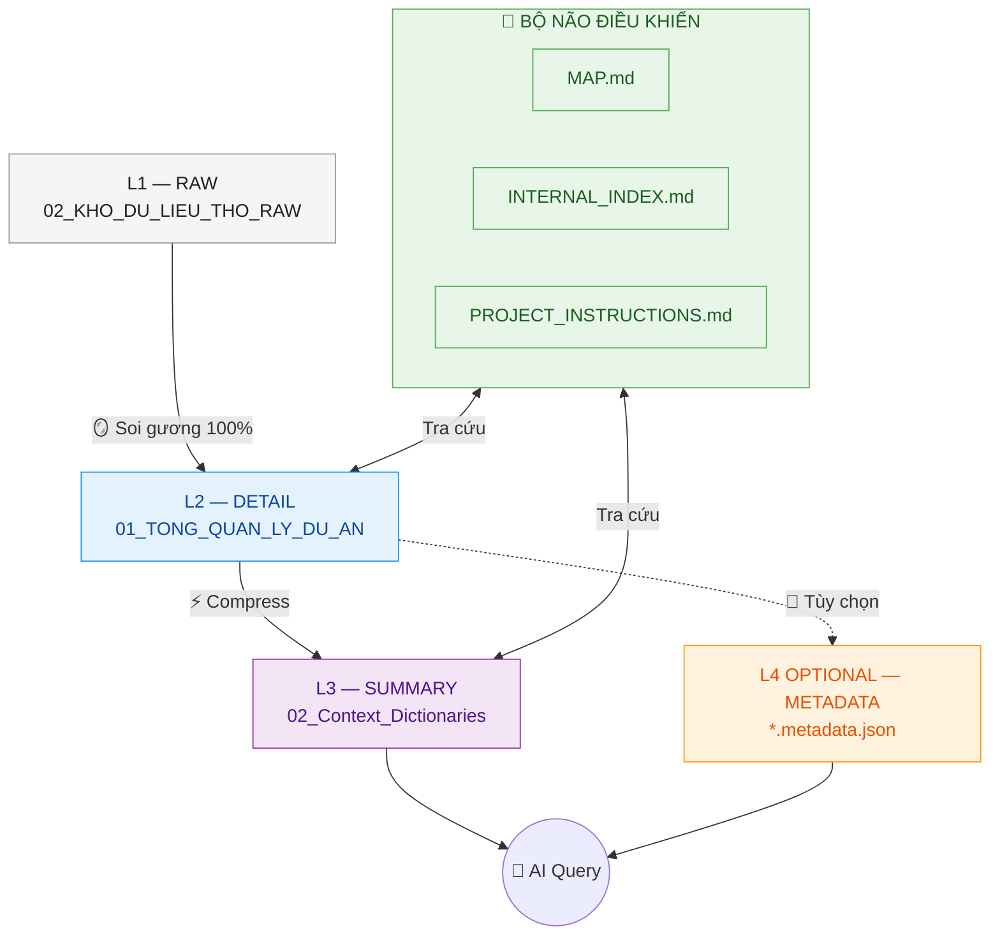

---
{"dg-publish":true,"permalink":"/00-bo-nao-ai-internal/00-backups-he-thong/readme-he-thong-v10-1/","title":"🌊 README — Trung tâm điều khiển Web ETZ","dg-note-properties":{"title":"🌊 README — Trung tâm điều khiển Web ETZ","version":"10.1","last_updated":"2026-05-07"}}
---

# 🌊 README — TRUNG TÂM ĐIỀU KHIỂN HỆ THỐNG LLM-WIKI ETZ

> Chào mừng Sếp đã trở lại **Trung tâm điều khiển** của Trí não AI Antigravity.
> Hệ thống đang vận hành theo **kiến trúc Hybrid 3+1 v10.1** — tích lũy tri thức bền vững.

<!-- DASHBOARD_START -->
### 📊 THÔNG SỐ HỆ THỐNG (REAL-TIME)

| Thành phần | Trạng thái / Số lượng |
| :--- | :--- |
| 📜 **Triết lý vận hành** | ✅ LLM-WIKI Hybrid 3+1 |
| 🏛️ **Phiên bản Bộ luật** | v10.1 (2026-05-07) |
| 🗺️ **Bản đồ hệ thống** | ✅ MAP |
| 📂 **Phòng ban WIKI (L2)** | 12 thư mục |
| 🧠 **Entity SUMMARY (L3)** | 3 file (Freelancer, KeToan, Viettel Post) |
| 🐍 **Bộ Script ingest** | 7 script |
| 💾 **Backup version** | v9.5, v10.0 (đã lưu trữ) |
| 🕒 **Cập nhật lần cuối** | 2026-05-07 |
<!-- DASHBOARD_END -->

---

## 🏛️ KIẾN TRÚC HYBRID 3+1

---

## 🛠️ QUY TRÌNH 5 BƯỚC INGEST

Khi Sếp dùng lệnh `@Antigravity /tiêu-hóa [file]`, AI thực thi:

| Bước | Hành động | Đầu ra |
| :---: | :--- | :--- |
| **B1** | Verify file tại Layer 01 | Xác nhận file hợp lệ |
| **B2** | Trích 100% văn bản → Layer 02 | File `.md` "Soi gương" |
| **B3** | Compress → Layer 03 (Entity) | Tóm tắt ≤ 250 từ |
| **B4** | *(Tùy chọn)* Sinh `.metadata.json` → L4 | JSON thẻ số |
| **B5** | Update `INTERNAL_INDEX.md` + `log.md` | Chỉ mục cập nhật |

---

## 🛡️ NGƯỜI GÁC CỔNG (Gatekeeper)

| Loại file | Hành động AI |
| :--- | :--- |
| `.md` `.txt` `.json` | ✅ Tự động đọc |
| `.xlsx` `.csv` `.docx` `.pdf` | ⚠️ **Phải xin phép Sếp** trước khi đọc |
| Ảnh | ⚠️ Phải xin phép trước khi OCR |
| File chứa OTP/Mật khẩu/CCCD | 🚫 Tuyệt đối không đọc |

---

## 🎯 BỘ CÂU LỆNH NHANH

| Lệnh | Mô tả ngắn |
| :--- | :--- |
| `/tiêu-hóa [file]` | Chạy đầy đủ Pipeline Hybrid 3+1 |
| `/query [từ_khóa]` | Tra cứu tri thức nhanh |
| `/lint` | Bảo trì link gãy & mâu thuẫn |
| `/reindex` | Rebuild `INTERNAL_INDEX.md` |
| `/backup [v]` | Sao lưu file lõi |
| `/dashboard` | Cập nhật `index.md` cho Sếp |
| `/status` | In trạng thái hệ thống |

> 📖 Xem đầy đủ tại PROJECT_INSTRUCTIONS § III.

---

## 📂 SCHEMA HỆ THỐNG

| Thành phần | Đường dẫn | Vai trò |
| :--- | :--- | :--- |
| 🏛️ **Luật tối cao** | PROJECT_INSTRUCTIONS | Quy chuẩn vận hành |
| 🗺️ **Bản đồ** | MAP | Cây thư mục + ánh xạ |
| 📋 **Mục lục AI** | INTERNAL_INDEX | FLAT list cho AI quét |
| 📊 **Dashboard Sếp** | index | Giao diện báo cáo |
| 📝 **Nhật ký** | log | Log thao tác |
| 💾 **Backup** | `00_BO_NAO_AI_INTERNAL/00_Backups_He_Thong/` | Bản cũ `_v[X.X]` |
| 🐍 **Scripts** | `.agents/skills/tieu-hoa/scripts/` | 7 Python helpers |

---

## 🛡️ QUY TẮC SAO LƯU (v10.1)

Trước khi cập nhật **bất kỳ file lõi nào**, AI **PHẢI**:
1. Copy bản cũ → `00_Backups_He_Thong/[Tên]_v[X.X].md` (hoặc chạy `backup_core_files.py`)
2. Ghi đè bản chính
3. Đồng bộ đồng thời 3 file: `PROJECT_INSTRUCTIONS.md` + `MAP.md` + `README_HE_THONG.md`
4. Ghi 1 dòng vào `log.md`

---

## 💡 NGUYÊN LÝ VÀNG

> **"PC làm Cơ bắp — AI làm Trí tuệ"**
>
> Ưu tiên viết Python script xử lý dữ liệu nặng thay vì bắt AI đọc file lớn trực tiếp.

---

## 📍 THÔNG TIN

- **Dự án:** Khotot.vn — Web ETZ
- **Phiên bản hệ thống:** v10.1 Hybrid 3+1 (2026-05-07)
- **Triết lý:** LLM-WIKI Compounding Knowledge
- **Tác giả:** AI Antigravity (theo lệnh Sếp baba — aihomevietnam@gmail.com)

*Cập nhật: 2026-05-07 — by ANTIGRAVITY (LLM-WIKI HYBRID 3+1 EDITION)*
