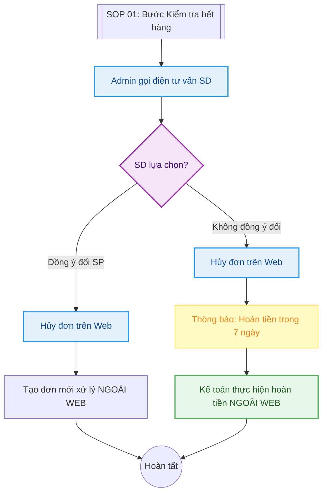

---
{"dg-publish":true,"permalink":"/01-tong-hanh-dinh-quan-ly/2-phong-van-hanh/2026-03-30-sop-huy-don-het-hang/","title":"SOP 02 — QUY TRÌNH HỦY ĐƠN VÌ HẾT HÀNG THỰC TẾ","dg-note-properties":{"title":"SOP 02 — QUY TRÌNH HỦY ĐƠN VÌ HẾT HÀNG THỰC TẾ"}}
---

# 📦 SOP 02 -QUY TRÌNH HỦY ĐƠN VÌ HẾT HÀNG THỰC TẾ

> **Dự án:** Web ETZ — Khotot.vn
> **Phiên bản:** 1.0 | **Cập nhật:** 2026-03-30
> **Tác giả:** Antigravity AI
> **Phòng ban:** Phòng Vận Hành
> **Vùng dữ liệu:** Zone 01 — Tổng Hành Dinh

---

## 🎯 MỤC TIÊU
Hướng dẫn xử lý các tình huống tồn kho thực tế lệch so với Web, nhằm giữ chân khách hàng hoặc thực hiện hoàn tiền đúng quy định 7 ngày làm việc.

---

## 🔄 SƠ ĐỒ XỬ LÝ NGOẠI LỆ (FLOWCHART)

---

## 👁️ CHI TIẾT CÁC BƯỚC THỰC HIỆN

### 1. BƯỚC 1: XÁC MINH & LIÊN HỆ (ADMIN)
- Sau khi Kho báo hết hàng thực tế, Admin tuyệt đối không tự ý hủy đơn ngay.
- Admin gọi điện trực tiếp cho SD để báo tình trạng và tư vấn:
    - Tìm sản phẩm tương đương về tính năng/giá tiền.
    - Đề xuất giải pháp thay thế.

### 2. BƯỚC 2: PHÂN NHÁNH XỬ LÝ THEO Ý KHÁCH (SD)

#### **Trường hợp A: SD đồng ý đổi sản phẩm khác**
- **Thao tác Web:** Admin nhấn **Hủy đơn** cũ với lý do *"Đổi sang sản phẩm khác"*.
- **Vận hành:** Mọi giao dịch sau đó (chênh lệch tiền, đóng gói SP mới) sẽ được trao đổi và xử lý **ngoài luồng Web** (qua Zalo/Điện thoại) để đảm bảo linh hoạt.

#### **Trường hợp B: SD không đồng ý và muốn hủy đơn**
- **Thao tác Web:** Admin nhấn **Hủy đơn** chính thức. Hệ thống gửi thông báo hủy cho SD.
- **Cam kết hoàn tiền:** Admin thông báo rõ: *"Tiền đã chuyển khoản sẽ được hoàn trả vào số tài khoản của quý khách trong vòng 7 ngày làm việc"*.

### 3. BƯỚC 3: HOÀN TIỀN (KẾ TOÁN)
- Admin gửi thông báo hủy đơn kèm thông tin tài khoản SD cho bộ phận Kế toán.
- Kế toán thực hiện lệnh chuyển khoản hoàn tiền cho SD.
- Chụp ảnh biên lai gửi cho SD qua Zalo OA để hoàn tất quy trình.

---

## 📊 KPI & LƯU Ý QUAN TRỌNG
- **Thời gian xử lý:** CS phải gọi điện cho SD trong vòng **< 1 giờ** kể từ khi Kho báo hết hàng.
- **Tính đồng bộ:** Mọi đơn hủy trên Web phải được phản ánh ngay vào báo cáo ngày của Kế toán để tránh quên hoàn tiền.
- **Mong muốn tương lai:** Ưu tiên phát triển API kết nối trực tiếp tồn kho thực tế từ ERP lên Web để giảm thiểu quy trình hủy đơn này xuống **< 1%**.

---
