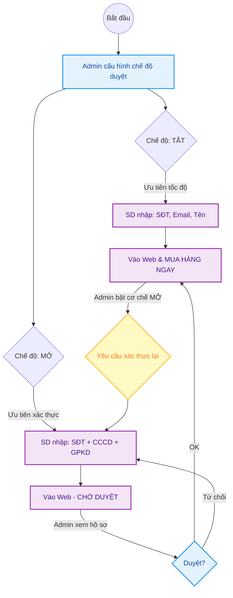

---
{"dg-publish":true,"permalink":"/01-tong-hanh-dinh-quan-ly/2-phong-van-hanh/2026-03-30-sop-quy-trinh-dang-ky-xac-thuc-sd/","title":"SOP QUY TRÌNH ĐĂNG KÝ & XÁC THỰC TÀI KHOẢN SD","dg-note-properties":{"title":"SOP QUY TRÌNH ĐĂNG KÝ & XÁC THỰC TÀI KHOẢN SD"}}
---

# 📦 SOP QUY TRÌNH ĐĂNG KÝ & XÁC THỰC TÀI KHOẢN SD

> **Dự án:** Web ETZ — Khotot.vn
> **Phiên bản:** 1.0 | **Cập nhật:** 2026-03-30
> **Tác giả:** Antigravity AI
> **Phòng ban:** Phòng Vận Hành
> **Vùng dữ liệu:** Zone 01 — Tổng Hành Dinh

---

## 🎯 MỤC TIÊU
Quy định rõ hai chế độ đăng ký tài khoản Sub‑Dealer (SD) nhằm linh hoạt giữa việc "Mở rộng nhanh" (Dễ dàng) và "Kiểm soát chặt" (Chuyên nghiệp), đồng thời hướng dẫn xử lý các tài khoản cũ khi hệ thống thắt chặt quản lý.

---

## 🔄 SƠ ĐỒ LUỒNG ĐĂNG KÝ (FLOWCHART)

---

## 👁️ CHI TIẾT CÁC BƯỚC THỰC HIỆN

### 1. CHẾ ĐỘ 1: ĐĂNG KÝ DỄ DÀNG (Admin set Duyệt = TẮT)
*   **Đối với SD:** Chỉ cần nhập các thông tin cơ bản (**Số điện thoại, Email, Thông tin cá nhân**). **Không cần** CCCD hay Chứng chỉ hành nghề.
*   **Quyền lợi:** SD được vào website và đặt mua hàng như khách hàng bình thường ngay lập tức.
*   **Mục tiêu:** Thu hút đại lý mới nhanh chóng, giảm rào cản tham gia hệ thống.

### 2. CHẾ ĐỘ 2: KIỂM SOÁT CHẶT CHẼ (Admin set Duyệt = MỞ)
*   **Đối với SD:** Yêu cầu bắt buộc cung cấp:
    1.  Căn cước công dân (CCCD).
    2.  Giấy phép đăng ký kinh doanh (GPKD) / Chứng chỉ hành nghề.
*   **Trạng thái sau đăng ký:** SD vẫn vào được website nhưng **KHÔNG THỂ mua hàng**. Các sản phẩm có thể bị ẩn giá hoặc không có nút "Thanh toán".
*   **Quy trình duyệt:** Admin phải vào Dashboard quản trị, kiểm tra tính hợp lệ của giấy tờ rồi mới nhấn "Duyệt". Khi đó SD mới thấy nút đặt hàng.

### 3. QUY TẮC XÁC THỰC LẠI (Dành cho tài khoản cũ hoặc chuyển đổi)
Trong trường hợp hệ thống đang ở Chế độ 1 (Tắt) và Admin chuyển sang Chế độ 2 (Mở):
*   Các SD đã có tài khoản trước đó (nhưng chưa cung cấp CCCD/GPKD) sẽ bị hệ thống tạm khóa chức năng đặt hàng.
*   **Cơ chế nhắc nhở:** Khi SD bấm vào giỏ hàng hoặc mua hàng, hệ thống sẽ tự động điều hướng (Redirect) trở về trang **Thông tin cá nhân** kèm thông báo: *"Vui lòng cung cấp CCCD để tiếp tục mua hàng"*.
*   Sau khi SD cung cấp đủ thông tin và được Admin duyệt, chức năng mua hàng sẽ được phục hồi vĩnh viễn.

---

## 📊 GHI CHÚ VẬN HÀNH CHO ADMIN
Admin phải làm 1 trong 2 việc tùy theo chiến lược kinh doanh:
1.  **Chế độ Mở (OFF):** Giúp SD vào web mua hàng dễ dàng, tăng doanh số tức thì.
2.  **Chế độ Chặt (ON):** Bắt buộc SD đăng ký mới phải cung cấp thông tin xác thực ngay từ đầu. Tài khoản cũ chưa có thông tin cũng phải bổ sung mới được mua hàng.

---

## 📎 TÀI LIỆU LIÊN QUAN
- `DAI_TU_DIEN_SOP_ETZ.md` — Quy chuẩn xác thực đại lý.
- `index.md` — Dashboard quản trị.

---
