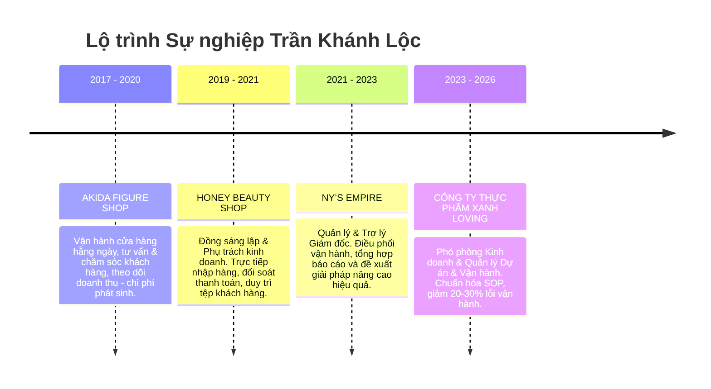

# 👤 PHÂN TÍCH CHI TIẾT HỒ SƠ: TRẦN KHÁNH LỘC

> **Mã hồ sơ:** 2026-03-30-LOC-OP-ETZ
> **Vị trí đề xuất:** Trưởng Nhóm Vận Hành / Điều Phối SOP
> **Đánh giá sơ bộ:** **9.5/10** (Rất khớp với mô hình Sapo/Haravan và SOP của ETZ)

---

## 🎯 1. TỐM TẮT NĂNG LỰC THỰC CHIẾN
Trần Khánh Lộc là chuyên gia quản lý vận hành đa điểm với kinh nghiệm thực tế trong việc chuẩn hóa quy trình và điều phối liên phòng ban.
- **Khả năng tải (Throughput):** Duy trì vận hành ổn định **5 điểm bán - 2 kho**, xử lý **300+ đơn hàng/ngày**.
- **Quản lý danh mục:** Kiểm soát **800+ mã sản phẩm (SKUs)**, điều phối 7-10 nhân sự theo ca/kíp.
- **Giá trị dự án tiêu biểu:** Làm đầu mối theo dõi tiến độ dự án xưởng quy mô **35–40 tỷ VNĐ**.

---

## 🔄 2. LỘ TRÌNH KINH NGHIỆM CHI TIẾT

---

## 👁️ 3. BÓC TÁCH KINH NGHIỆM TẠI GREEN LOVING (2023 - 2026)
*Đây là kinh nghiệm quan trọng nhất, thể hiện tư duy hệ thống của ứng viên:*

- **Chuẩn hóa quy trình (SOP):** Thiết lập checklist và SOP cho kho/điểm bán. Kết quả: Giảm **20–30% lỗi vận hành**, tối ưu chi phí phát sinh **5–20%**.
- **Quản lý đơn hàng:** Kiểm soát luồng xử lý, tồn kho, luân chuyển hàng hóa. Phối hợp xử lý triệt để các trường hợp trễ đơn, thiếu hàng hoặc sai thông tin.
- **Triển khai dự án:** Tham gia triển khai **10+ dự án**; mở mới thành công **02 siêu thị** và ổn định vận hành ngay sau khai trương.
- **Quản lý nhân sự:** Trực tiếp quản lý 7–10 người, phân công ca kíp, xử lý điểm nghẽn (bottleneck) và hỗ trợ ổn định nhịp làm việc liên bộ phận.

---

## 🛠️ 4. KỸ NĂNG CỐT LÕI & CÔNG CỤ

### 💎 Kỹ năng chuyên môn:
1.  **Vận hành chuỗi/đa điểm:** Tư duy hệ thống và kiểm soát hiệu quả thực thi.
2.  **SOP & Checklist:** Năng lực chuẩn hóa quy trình (Cực kỳ hiếm ở ứng viên vận hành thông thường).
3.  **Báo cáo & Phân tích:** Tổng hợp dữ liệu thực tế để đề xuất tối ưu.
4.  **Điều phối nhân sự:** Kỹ năng xử lý linh hoạt các tình huống phát sinh trong ca kíp.

### 💻 Công cụ & Ngoại ngữ:
- **Hệ thống chuyên dụng:** Sapo, Haravan (Đây là lợi thế lớn vì ETZ/Khotot đang chạy trên nền tảng này).
- **Văn phòng:** Excel, Google Sheets thành thạo.
- **Ngoại ngữ:** Tiếng Anh giao tiếp cơ bản, đủ năng lực đọc hiểu tài liệu chuyên môn.

---

## 💡 5. ĐÁNH GIÁ MỨC ĐỘ PHÙ HỢP VỚI ETZ (KHOTOT.VN)

> [!TIP]
> **TẠI SAO NÊN CHỌN TRẦN KHÁNH LỘC?**
> 1. **Khớp hệ thống:** Am hiểu Sapo/Haravan giúp ứng viên bắt nhịp ngay với Web ETZ.
> 2. **Tư duy SOP:** Có kinh nghiệm "đẻ" quy trình để giảm sai sót - Đây là điều sếp đang rất cần để xây dựng hệ thống Second Brain cho nhân viên.
> 3. **Chịu tải đơn hàng:** Kinh nghiệm xử lý 300+ đơn/ngày cho thấy ứng viên có khả năng quản lý tốt áp lực khi dự án ETZ bùng nổ đơn hàng.

---

## 📎 6. THÔNG TIN THAM CHIẾU & LIÊN HỆ
- **Ứng viên:** 0353 603 453 | tnitsme@gmail.com
- **Người tham chiếu:** Vũ Văn Huân (PGĐ Điều hành - Green Loving). SĐT: 0372 150 230.

---
*Phòng Nhân Sự - Second Brain ETZ AI*

---
*Hệ thống Second Brain - Phòng Nhân Sự ETZ*
