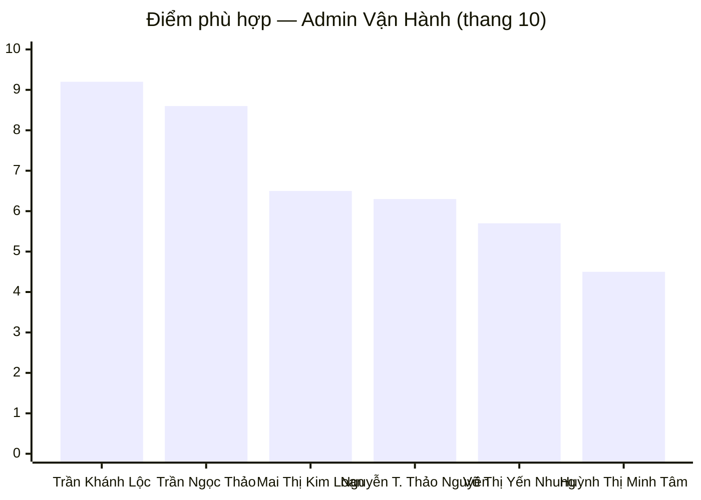

---
{"dg-publish":true,"permalink":"/01-tong-hanh-dinh-quan-ly/6-phong-nhan-su/01-ds-ung-vien/bcdg-admin-van-hanh-2026-03-30/","title":"BÁO CÁO ĐÁNH GIÁ ỨNG VIÊN — ADMIN VẬN HÀNH WEBSITE ETZ (KHOTOT.VN)","dg-note-properties":{"title":"BÁO CÁO ĐÁNH GIÁ ỨNG VIÊN — ADMIN VẬN HÀNH WEBSITE ETZ (KHOTOT.VN)","loai":"Báo cáo Nhân sự","cap_nhat":"2026-03-30","vi_tri":"Admin Vận Hành Website ETZ","so_ung_vien":6}}
---

# 📊 BÁO CÁO ĐÁNH GIÁ ỨNG VIÊN
## Vị trí: Admin Vận Hành Website ETZ (Khotot.vn) — Full-time, TP.HCM

> **Ngày phân tích:** 30/03/2026 | **Tổng ứng viên:** 6 | **Người phân tích:** AI Nhân Sự ETZ

> [!note] Lưu ý quan trọng
> Vị trí **Admin Vận Hành** khác với vị trí **Nhân viên Vận hành Website**:
> - Admin tập trung vào **xử lý đơn hàng hàng ngày**, duyệt tài khoản SD, phối hợp Kho–Kế toán–IT theo SOP chặt chẽ.
> - Yêu cầu **tối thiểu 1 năm** (thấp hơn vị trí kia), nhưng đòi hỏi **phản xạ xử lý nhanh** và **kỷ luật quy trình cao**.

---

## 🏆 I. XẾP HẠNG TỔNG THỂ

| Hạng | Ứng viên | Điện thoại | Kinh nghiệm / Tuổi | Điểm | Khuyến nghị |
|:---:|---|---|---|:---:|---|
| 🥇 1 | **Trần Khánh Lộc** | 0353 603 453 | **9 năm** thực chiến / (—) | **9.2/10** | ✅ Mời phỏng vấn ngay |
| 🥈 2 | **Trần Ngọc Thảo** | 0356 944 595 | **Dày dặn** (BPO quốc tế) / (—) | **8.6/10** | ✅ Mời phỏng vấn ngay |
| 🥉 3 | **Mai Thị Kim Loan** | 0379 063 217 | Sàn TMĐT cơ bản / (~22t) | **6.5/10** | ⚠️ Dự phòng — tiềm năng tốt |
| 4 | Nguyễn Thị Thảo Nguyên| 077 892 2296 | Admin Marketing, SEO / Trẻ | **6.3/10** | ⚠️ Dự phòng — cần định hướng lại |
| 5 | Võ Thị Yến Nhung | 0388 394 658 | **9 tháng** Admin / Trẻ | **5.7/10** | 🔄 Lưu hồ sơ |
| 6 | Huỳnh Thị Minh Tâm | 09355634111 | Chưa có KN quy trình / (2003 - 23t)| **4.5/10** | ❌ Chưa phù hợp |

---

## 📋 II. TIÊU CHÍ ĐÁNH GIÁ (Theo MTCV Admin Vận Hành)

| # | Tiêu chí | Trọng số | Mô tả |
|---|---|:---:|---|
| **TC1** | Kinh nghiệm xử lý đơn hàng trực tiếp ≥ 1 năm | 25% | Xử lý đơn trên hệ thống, không chỉ content/marketing |
| **TC2** | Hiểu quy trình đặt hàng → xác nhận → giao hàng → hoàn tất | 20% | Nắm rõ luồng end-to-end bao gồm hủy đơn, hoàn tiền, bảo hành |
| **TC3** | Excel/Google Sheet + biết dùng AI; tiếng Anh đọc dashboard | 15% | Công cụ làm việc hàng ngày |
| **TC4** | Phối hợp liên phòng ban: Kho – Kế toán – Kinh doanh – IT | 15% | Giao tiếp rõ ràng, báo cáo kịp thời |
| **TC5** | Cẩn thận, kỷ luật SOP, tư duy kiểm tra dữ liệu chéo | 15% | Không để sai giá, sai tồn kho; đúng quy trình từng bước |
| **TC6** | Chịu áp lực, học hỏi nhanh, giao tiếp chủ động | 10% | Phản xạ xử lý, không ém thông tin |

---

## 🔢 III. MA TRẬN ĐIỂM CHI TIẾT

| Ứng viên | TC1 (25%) | TC2 (20%) | TC3 (15%) | TC4 (15%) | TC5 (15%) | TC6 (10%) | **Tổng** |
|---|:---:|:---:|:---:|:---:|:---:|:---:|:---:|
| Trần Khánh Lộc | **9.5** | **9.0** | 9.0 | 9.0 | **10** | 8.5 | **9.2** |
| Trần Ngọc Thảo | 8.0 | **9.0** | **9.5** | 8.0 | 8.5 | **9.0** | **8.6** |
| Mai Thị Kim Loan | 7.0 | 6.5 | 5.5 | 6.0 | 6.5 | 7.5 | **6.5** |
| Nguyễn T. Thảo Nguyên | 5.0 | 5.0 | **8.5** | 6.5 | 7.0 | 7.5 | **6.3** |
| Võ Thị Yến Nhung | 5.0 | 5.5 | 6.0 | 5.5 | 6.5 | 6.5 | **5.7** |
| Huỳnh Thị Minh Tâm | 2.5 | 2.5 | 7.0 | 3.5 | 7.0 | 7.5 | **4.5** |

---

## 📊 IV. SO SÁNH 2 BẢNG XẾP HẠNG: ADMIN vs NHÂN VIÊN VẬN HÀNH

> Bảng này giúp sếp thấy ngay ứng viên nào phù hợp hơn với vai trò nào.

| Ứng viên | Điểm Admin VH | Điểm NV VH | Phù hợp hơn với |
|---|:---:|:---:|---|
| **Trần Khánh Lộc** | **9.2** | 9.0 | Cả 2 vị trí — ưu tiên **NV VH** (tư duy hệ thống, SOP cao hơn) |
| **Trần Ngọc Thảo** | **8.6** | 8.5 | Cả 2 vị trí — ưu tiên **Admin** (xử lý dữ liệu website chuyên sâu) |
| **Mai Thị Kim Loan** | **6.5** | 5.8 | **Admin VH** — kinh nghiệm xử lý đơn trực tiếp tốt hơn |
| **Nguyễn T. Thảo Nguyên** | 6.3 | **6.5** | **NV VH** — AI tools & SEO phù hợp hơn |
| **Võ Thị Yến Nhung** | 5.7 | 5.0 | **Admin VH** — đã xử lý đơn hàng cơ bản |
| **Huỳnh Thị Minh Tâm** | 4.5 | 4.0 | Chưa phù hợp cả 2 — phù hợp Content hơn |

---

## 👤 V. PHÂN TÍCH CHI TIẾT — VỊ TRÍ ADMIN VẬN HÀNH

---

### 🥇 1. TRẦN KHÁNH LỘC — 9.2/10
> 📞 0353 603 453 | ✉️ tnitsme@gmail.com

| Tiêu chí | Bằng chứng cụ thể | Điểm |
|---|---|:---:|
| **TC1 – Xử lý đơn hàng** | Xử lý **300+ đơn/ngày** tại Green Loving, kiểm soát 5 điểm bán – 2 kho | **9.5** |
| **TC2 – Hiểu quy trình** | Quản lý luồng: tồn kho → đóng gói → giao hàng → đối soát; xử lý trễ đơn, thiếu hàng, sai thông tin | **9.0** |
| **TC3 – Công cụ** | Thành thạo Excel, Google Sheets, Sapo, Haravan *(hệ thống ETZ đang dùng)* | **9.0** |
| **TC4 – Phối hợp** | Điều phối 7–10 nhân sự, phối hợp Kho – KT – KD – IT trong mở mới 2 siêu thị | **9.0** |
| **TC5 – Kỷ luật SOP** | Thiết lập SOP & checklist → **giảm 20–30% lỗi vận hành**, tối ưu chi phí **5–20%** | **10** |
| **TC6 – Áp lực & Giao tiếp** | 9 năm KN thực chiến, có số liệu đo lường, có người tham chiếu PGĐ | **8.5** |

**✅ Phù hợp Admin vì:** Đã xử lý khối lượng đơn hàng cực lớn (300+/ngày), am hiểu Sapo/Haravan, kỷ luật SOP cao nhất pool.

**⚠️ Câu hỏi cần hỏi:**
1. Anh đã từng trực tiếp thao tác duyệt tài khoản đại lý / quản lý portal B2B chưa?
2. Khi có nhiều đơn hàng lỗi đồng thời (sai giá, hết hàng, lỗi thanh toán), anh ưu tiên xử lý theo thứ tự nào?
3. Kỳ vọng lương và lộ trình khi vào vai trò Admin (không phải quản lý)?

---

### 🥈 2. TRẦN NGỌC THẢO — 8.6/10
> 📞 0356 944 595 | ✉️ thaot5072@gmail.com

| Tiêu chí | Bằng chứng cụ thể | Điểm |
|---|---|:---:|
| **TC1 – Xử lý đơn hàng** | Vận hành 1.000+ SKUs Shopify/Wayfair — xử lý listing, backend admin, Post QA, bulk import/export | **8.0** |
| **TC2 – Hiểu quy trình** | Quy trình từ nhập liệu → kiểm tra → publish → báo cáo; có Workflow Planning với ETD | **9.0** |
| **TC3 – Công cụ** | Excel Advanced, AI tools, Shopify Admin, Matrixify; Tiếng Anh đọc dashboard tốt | **9.5** |
| **TC4 – Phối hợp** | Cross-team với Design, IT; báo cáo tiến độ thực thời với US client qua Outlook | **8.0** |
| **TC5 – Kỷ luật SOP** | Kinh nghiệm BPO quốc tế → deadline nghiêm ngặt, quy trình chặt, không bỏ sót bước | **8.5** |
| **TC6 – Áp lực & Giao tiếp** | Làm việc BPO chuẩn quốc tế, báo cáo minh bạch, xử lý ticket chuẩn | **9.0** |

**✅ Phù hợp Admin vì:** Kinh nghiệm backend website chuyên sâu nhất pool, quen với việc xử lý dữ liệu lớn chính xác, kỷ luật cao theo chuẩn BPO.

**⚠️ Câu hỏi cần hỏi:**
1. Tại Cennos, chị có trực tiếp xử lý đơn hàng của khách (order management) hay chỉ quản lý catalog sản phẩm?
2. Chị đã từng phối hợp với bộ phận Kho / Logistics để xác nhận tồn kho trước khi confirm đơn chưa?
3. Kỳ vọng lương? (Lưu ý BPO quốc tế thường kỳ vọng cao hơn mặt bằng nội địa)

---

### 🥉 3. MAI THỊ KIM LOAN — 6.5/10
> 📞 0379 063 217 | ✉️ kimloann0411@gmail.com

| Tiêu chí | Bằng chứng cụ thể | Điểm |
|---|---|:---:|
| **TC1 – Xử lý đơn hàng** | Xử lý đơn hàng, CSKH, bảo hành tại VNET Media và MOCHA; chạy Ads và theo dõi doanh thu | **7.0** |
| **TC2 – Hiểu quy trình** | Quy trình đặt hàng → xử lý → bảo hành trên sàn TikTok/Shopee — đủ hiểu luồng cơ bản | **6.5** |
| **TC3 – Công cụ** | Excel/Google Sheet cơ bản, phân tích dữ liệu, không đề cập AI | **5.5** |
| **TC4 – Phối hợp** | Phối hợp phòng Content, booking KOL/KOC, xử lý khiếu nại | **6.0** |
| **TC5 – Kỷ luật SOP** | Theo dõi KPI, lập báo cáo định kỳ, đề xuất cải thiện chi phí vận hành | **6.5** |
| **TC6 – Áp lực & Giao tiếp** | GPA 3.34, học bổng, số liệu doanh thu cụ thể, chủ động | **7.5** |

**✅ Phù hợp Admin vì:** Đã trực tiếp xử lý đơn hàng và bảo hành trên sàn TMĐT, hiểu luồng khách hàng, có kinh nghiệm CSKH và xử lý khiếu nại.

**⚠️ Điểm cần lưu ý:**
- Chưa từng vào backend website (Sapo/Haravan) để thao tác đơn hàng
- Excel mức cơ bản — cần nâng lên để đáp ứng báo cáo hàng ngày
- Mục tiêu dài hạn là Marketing → cần xác nhận cam kết với vị trí vận hành

**🎯 Câu hỏi phỏng vấn:**
1. Khi có đơn hàng bị lỗi (sai sản phẩm, thiếu hàng), em xử lý từng bước cụ thể như thế nào?
2. Em đã từng vào backend hệ thống quản lý đơn hàng (không phải app Shopee Seller) chưa?
3. Nếu giao em theo dõi dashboard đơn hàng hàng ngày và tổng hợp báo cáo cuối ngày, em cần bao lâu để làm quen?

---

### 4. NGUYỄN THỊ THẢO NGUYÊN — 6.3/10
> 📞 077 892 2296 | ✉️ Nttnguyen14.cv@gmail.com

| Tiêu chí | Bằng chứng cụ thể | Điểm |
|---|---|:---:|
| **TC1 – Xử lý đơn hàng** | Role là Marketing Executive — vận hành sàn ở góc độ marketing, không phụ trách đơn hàng chính | **5.0** |
| **TC2 – Hiểu quy trình** | Phối hợp kho vận triển khai khuyến mãi, phân phối hàng đại lý — biết luồng nhưng không phụ trách | **5.0** |
| **TC3 – Công cụ** | **Xuất sắc AI** (GPT-4, Gemini, Claude, AI Studio), Excel, SEO thực chiến | **8.5** |
| **TC4 – Phối hợp** | Phối hợp Sales + Kho vận + phân phối đại lý | **6.5** |
| **TC5 – Kỷ luật SOP** | Hoàn thành >95% KPI 3 tháng liên tiếp, có số liệu kết quả rõ | **7.0** |
| **TC6 – Áp lực & Giao tiếp** | Tiếng Trung 4 kỹ năng, năng động, nhiều thành tích đo lường được | **7.5** |

**⚠️ Hạn chế với Admin:** Chưa từng trực tiếp xử lý đơn hàng hay vào backend hệ thống vận hành → rủi ro onboarding dài.

**💡 Phù hợp hơn với:** Vị trí **Nhân viên Vận hành Website** (SEO, AI tools, nội dung) hơn là Admin xử lý đơn hàng hàng ngày.

---

### 5. VÕ THỊ YẾN NHUNG — 5.7/10
> 📞 0388 394 658 | ✉️ yennhung.work@gmail.com

| Tiêu chí | Bằng chứng cụ thể | Điểm |
|---|---|:---:|
| **TC1 – Xử lý đơn hàng** | ~9 tháng cập nhật sản phẩm, xử lý đơn cơ bản tại LC Baby & IPP Group | **5.0** |
| **TC2 – Hiểu quy trình** | Cập nhật tồn kho, xử lý đơn hàng cơ bản, tìm NCC | **5.5** |
| **TC3 – Công cụ** | MOS Excel, TOEIC 615 *(lợi thế đọc dashboard tiếng Anh)*, Chứng chỉ Digital Marketing | **6.0** |
| **TC4 – Phối hợp** | Phối hợp Kho và team Design | **5.5** |
| **TC5 – Kỷ luật SOP** | Chủ động học thêm chứng chỉ, có định hướng rõ | **6.5** |
| **TC6 – Áp lực & Giao tiếp** | TOEIC 615 — lợi thế đọc hiểu giao diện dashboard, trẻ và học nhanh | **6.5** |

**💡 Tiềm năng:** Nếu ETZ có vị trí **Junior Admin**, Yến Nhung phù hợp hơn. TOEIC 615 là lợi thế khi thao tác giao diện dashboard tiếng Anh.
🔄 **Khuyến nghị:** Lưu hồ sơ, xét lại khi tích lũy thêm ~1 năm kinh nghiệm.

---

### 6. HUỲNH THỊ MINH TÂM — 4.5/10
> 📞 09355634111 | ✉️ minhtamm14122003@gmail.com

| Tiêu chí | Bằng chứng cụ thể | Điểm |
|---|---|:---:|
| **TC1 – Xử lý đơn hàng** | Kiểm duyệt nội dung Shopee (BPO) — **không phải xử lý đơn hàng** | **2.5** |
| **TC2 – Hiểu quy trình** | Không có kinh nghiệm trực tiếp với luồng đơn hàng, tồn kho, thanh toán | **2.5** |
| **TC3 – Công cụ** | Chứng chỉ Tin học Xuất sắc (Word, Excel, PPT), biết dùng AI cho content | **7.0** |
| **TC4 – Phối hợp** | Làm việc độc lập theo ca, ít phối hợp liên phòng ban | **3.5** |
| **TC5 – Kỷ luật SOP** | Tốt nghiệp Loại Giỏi, học bổng 100% × 2 → tinh thần kỷ luật cao | **7.0** |
| **TC6 – Áp lực & Giao tiếp** | Chủ động học hỏi, năng lực học tập tốt | **7.5** |

❌ **Không phù hợp vị trí Admin** — Thiếu kinh nghiệm xử lý đơn hàng và phối hợp liên phòng ban.
Phù hợp hơn với: **Content / Kiểm duyệt nội dung sàn TMĐT**.

---

## 📊 VI. BẢNG SO SÁNH KỸ NĂNG THEO YÊU CẦU ADMIN

| Kỹ năng yêu cầu                  | Khánh Lộc | Ngọc Thảo | Kim Loan | Thảo Nguyên | Yến Nhung | Minh Tâm |
| -------------------------------- | :-------: | :-------: | :------: | :---------: | :-------: | :------: |
| Xử lý đơn hàng trực tiếp         |  **XS**   |    Tốt    |   Tốt    |      —      |    ⚠️     |    —     |
| Duyệt tài khoản / Quản lý đại lý |  **XS**   |    ⚠️     |    —     |      —      |     —     |    —     |
| Phối hợp Kho – Kế toán           |  **XS**   |    Tốt    |    ⚠️    |     ⚠️      |    Tốt    |    —     |
| Xử lý hủy đơn / hoàn tiền        |  **XS**   |    ⚠️     |   Tốt    |      —      |    ⚠️     |    —     |
| Hỗ trợ bảo hành sau bán          |    Tốt    |    ⚠️     |   Tốt    |      —      |     —     |    —     |
| Quản lý dữ liệu sản phẩm         |  **XS**   |  **XS**   |   Tốt    |     ⚠️      |    Tốt    |    ⚠️    |
| Sapo / Haravan                   |  **XS**   |     —     |    —     |      —      |     —     |    —     |
| Shopify / Wayfair Backend        |     —     |  **XS**   |    —     |      —      |     —     |    —     |
| Excel / Google Sheet             |  **XS**   |  **XS**   |   Tốt    |     Tốt     |    Tốt    |   Tốt    |
| Công cụ AI                       |    Tốt    |    Tốt    |    —     |   **XS**    |     —     |   Tốt    |
| Tiếng Anh đọc dashboard          |    ⚠️     |  **XS**   |    —     |      —      |  **XS**   |    —     |
| Báo cáo số liệu hàng ngày        |  **XS**   |  **XS**   |   Tốt    |     Tốt     |    ⚠️     |    ⚠️    |
| Kỷ luật SOP / quy trình          |  **XS**   |  **XS**   |   Tốt    |     Tốt     |    ⚠️     |    ⚠️    |
| Chịu áp lực cao điểm đơn         |  **XS**   |    Tốt    |   Tốt    |     ⚠️      |    ⚠️     |    —     |

***XS** = Xuất sắc | Tốt | ⚠️ Cơ bản / Cần xác nhận | — Chưa có*

---

## 🎯 VII. KẾT LUẬN & HÀNH ĐỘNG ĐỀ XUẤT

> [!success] ✅ HÀNH ĐỘNG NGAY — Liên hệ mời phỏng vấn:
>
> **1. Trần Khánh Lộc** — 📞 0353 603 453
> Ưu tiên #1. Xử lý 300+ đơn/ngày, Sapo/Haravan, SOP thực chiến, kỷ luật vận hành cao nhất pool. Cần xác nhận sẵn sàng làm Admin (không phải quản lý).
>
> **2. Trần Ngọc Thảo** — 📞 0356 944 595
> Ưu tiên #2. Backend website chuyên sâu, Excel Advanced, kỷ luật BPO quốc tế. Cần xác nhận có kinh nghiệm xử lý order (không chỉ catalog) và kỳ vọng lương.

> [!warning] ⚠️ DỰ PHÒNG — Liên hệ nếu 2 UV trên không pass:
>
> **3. Mai Thị Kim Loan** — 📞 0379 063 217
> Xử lý đơn hàng & bảo hành trực tiếp trên sàn, có kinh nghiệm CSKH, doanh thu thực chiến tốt. Cần đào tạo thêm về backend website và Excel nâng cao.
>
> **4. Nguyễn Thị Thảo Nguyên** — 📞 077 892 2296
> AI tools mạnh, có phối hợp kho vận. Tuy nhiên role chính là Marketing — rủi ro onboarding lâu hơn.

> [!note] 🔄 LƯU HỒ SƠ — Xét đợt tuyển dụng sau:
>
> **5. Võ Thị Yến Nhung** — 📞 0388 394 658 | Tiềm năng Admin Junior, TOEIC 615 là lợi thế.
>
> **6. Huỳnh Thị Minh Tâm** — 📞 09355634111 | Phù hợp Content/Kiểm duyệt hơn.

---

## 📌 VIII. GHI CHÚ & ĐỀ XUẤT CHIẾN LƯỢC NHÂN SỰ

1. **Nếu ETZ cần 1 người:** Chọn **Khánh Lộc** cho Admin, hoặc **Ngọc Thảo** nếu ưu tiên kỹ năng website thuần hơn kinh nghiệm đơn hàng offline.

2. **Nếu ETZ cần 2 người (cả Admin + NV VH):**
   - Admin: **Trần Khánh Lộc** (xử lý đơn hàng hàng ngày, Sapo/Haravan)
   - NV VH: **Trần Ngọc Thảo** (tối ưu hệ thống, dữ liệu sản phẩm, báo cáo)

3. **Kim Loan** là ứng viên dự phòng phù hợp nhất cho Admin (kinh nghiệm đơn hàng & bảo hành thực tế), đặc biệt nếu ETZ chấp nhận đào tạo thêm về backend.

4. Người tham chiếu **Trần Khánh Lộc:** Vũ Văn Huân (PGĐ Green Loving) – 0372 150 230.

---

*📌 Báo cáo được tạo bởi AI Nhân Sự ETZ — 30/03/2026*
*[[01_TONG_HANH_DINH_QUAN_LY/6_PHONG_NHAN_SU/MTCV_Admin_Van_Hanh_Web_ETZ\|Xem MTCV Admin Vận Hành đầy đủ]] | [[01_TONG_HANH_DINH_QUAN_LY/6_PHONG_NHAN_SU/01_DS_Ung_Vien/BCDG_Ung_Vien_VanHanhWebsite_2026-03-30\|Xem Báo cáo NV Vận Hành Website]]*
