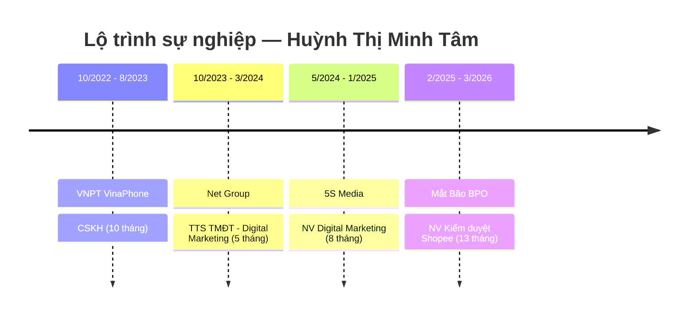

---
{"dg-publish":true,"permalink":"/01-tong-hanh-dinh-quan-ly/6-phong-nhan-su/01-ds-ung-vien/cv-27-03-2026-huynh-thi-minh-tam/","title":"CV — HUỲNH THỊ MINH TÂM","tags":["ung-vien","kiem-duyet","content","tmdt"],"dg-note-properties":{"title":"CV — HUỲNH THỊ MINH TÂM","ngay_nop":"2026-03-27","vi_tri":"Nhân viên Thương Mại Điện Tử","trang_thai":"Chờ xét duyệt","diem_danh_gia":"4.0/10","uu_tien_pv":"Không phù hợp vị trí này","tags":["ung-vien","kiem-duyet","content","tmdt"]}}
---

# HUỲNH THỊ MINH TÂM
**Nhân viên Thương Mại Điện Tử**

> ⚠️ **Lưu ý xác minh:** Tên file gốc là **"PHẠM THỊ MINH TÂM"** nhưng nội dung CV ghi **"HUỲNH THỊ MINH TÂM"**. Cần xác nhận lại tên chính xác khi liên hệ ứng viên.

---

## 📇 THÔNG TIN CÁ NHÂN

| Trường | Thông tin |
|---|---|
| **Ngày sinh** | 14/12/2003 |
| **Giới tính** | Nữ |
| **Điện thoại** | 09355634111 |
| **Email** | minhtamm14122003@gmail.com |
| **Địa chỉ** | 497 Phan Văn Trị, Phường 5, Quận Gò Vấp, TP.HCM |
| **Ngày nộp CV** | 27/03/2026 |
| **Nguồn CV** | TopCV.vn |

---

## 🎯 MỤC TIÊU NGHỀ NGHIỆP

Mong muốn được tham gia làm việc tại Công ty. Nỗ lực hết mình để cống hiến, không ngừng học tập & nâng cao tri thức, sẵn sàng nắm bắt mọi cơ hội phát triển nghề nghiệp. Học hỏi kinh nghiệm, rèn luyện kỹ năng & đóng góp nhiều hơn nữa vào những thành công của Công ty. Tiếp cận với môi trường thực tế, được áp dụng kiến thức đã học trên ghế nhà trường.

---

## 💼 KINH NGHIỆM LÀM VIỆC

---

### ✦ Nhân viên Kiểm duyệt Sàn Shopee
**Công ty Mắt Bão BPO** | 02/2025 – 03/2026 *(13 tháng)*

**Kiểm duyệt nội dung sản phẩm:**
- Kiểm tra tên sản phẩm, mô tả, hình ảnh, video của người bán.
- Đảm bảo nội dung không vi phạm chính sách của Shopee.
- Xử lý hàng loạt sản phẩm theo ca làm việc.

**Kiểm tra thông tin đăng bán:**
- Xem xét giá bán, thông tin sản phẩm, danh mục có khớp với danh mục chính của Shopee.
- Kiểm tra xem sản phẩm có thuộc danh mục hàng cấm/hàng hạn chế kinh doanh trên Shopee hay không.
- Đảm bảo tính nhất quán giữa thông tin sản phẩm và hình ảnh đính kèm.

---

### ✦ Nhân viên Digital Marketing
**Công ty 5S MEDIA** | 05/2024 – 01/2025 *(8 tháng)*

- Viết content giới thiệu địa điểm du lịch tại Việt Nam.
- Quản lý các Fanpage Facebook của Công ty.
- Làm hình ảnh, banner phục vụ đăng tải truyền thông.
- Viết bài chuẩn SEO theo từ khóa.
- Đăng bài và quản lý nội dung trên WordPress.
- Viết và quản lý bài đăng trên nền tảng Blogger.

---

### ✦ Thực tập sinh TMĐT – Digital Marketing
**Công ty Net Group** | 10/2023 – 03/2024 *(5 tháng)*

- Viết bài content đăng bán sản phẩm cho Công ty.
- Đặt backlink trên các hội nhóm chợ để quảng bá sản phẩm.
- Sản xuất hình ảnh và video sản phẩm.
- Thực hiện chiến dịch Seeding trên Facebook, Instagram.

---

### ✦ Nhân viên Chăm sóc Khách hàng
**Tổng Công ty Dịch vụ Viễn thông (VNPT VinaPhone)** | 10/2022 – 08/2023 *(10 tháng)*

- Hỗ trợ tra cứu cước phí, đăng ký gói dữ liệu, đổi SIM 4G/5G, thanh toán hóa đơn.
- Giải đáp thắc mắc của khách hàng trên đa kênh: Zalo OA (VNPT VinaPhone), Fanpage Facebook, Website chính thức.
- Xử lý các yêu cầu và khiếu nại của khách hàng.

---

## 🎓 HỌC VẤN

| Trường | Đại học Công Nghiệp TP. Hồ Chí Minh |
|---|---|
| **Thời gian** | 2021 – 2025 |
| **Chuyên ngành** | Thương Mại Điện Tử |
| **Xếp loại tốt nghiệp** | **Loại Giỏi** (2025) |
| **Khoa** | Thương Mại Du Lịch |

---

## 🛠️ KỸ NĂNG

### Kỹ năng chuyên môn
- ✅ Kiểm duyệt nội dung sản phẩm trên sàn TMĐT (Shopee).
- ✅ Viết content chuẩn SEO.
- ✅ Quản lý Fanpage Facebook.
- ✅ Thiết kế đồ hoạ: Photoshop, Canva.
- ✅ Dựng video ngắn: CapCut.
- ✅ Ứng dụng AI trong sản xuất nội dung.

### Kỹ năng tin học
- ✅ Microsoft Word — Thành thạo (Chứng chỉ Xuất sắc).
- ✅ Microsoft Excel — Thành thạo (Chứng chỉ Xuất sắc).
- ✅ Microsoft PowerPoint — Thành thạo (Chứng chỉ Xuất sắc).

### Kỹ năng mềm
- ✅ Giao tiếp và chăm sóc khách hàng.
- ✅ Làm việc nhóm.
- ✅ Tư duy sáng tạo nội dung.

---

## 📜 CHỨNG CHỈ

| Chứng chỉ | Năm | Xếp loại |
|---|---|---|
| Chứng chỉ Tin học (Word, Excel, PowerPoint) | 2022 | **Xuất sắc** |

---

## 🏆 THÀNH TÍCH & GIẢI THƯỞNG

- 🎓 **Học bổng trường 100%** — Đạt 2 lần (2024).
- 🎓 **Tốt nghiệp loại Giỏi** ngành Thương Mại Điện Tử — ĐH Công Nghiệp TP.HCM (2025).

---

## 📝 GHI CHÚ ĐÁNH GIÁ (ETZ Internal)

> **Điểm phù hợp MTCV Vận hành Website:** 4.0/10
>
> **Điểm mạnh:** Học vấn xuất sắc (Loại Giỏi + học bổng), chứng chỉ tin học xuất sắc, biết dùng AI và Photoshop.
>
> **Điểm yếu:** Toàn bộ kinh nghiệm thiên về **Content/Kiểm duyệt**, không có kinh nghiệm vận hành đơn hàng, tồn kho, hay hệ thống website bán hàng thực tế. Mục tiêu CV còn mang tính "xin thực tập".
>
> **Khuyến nghị:** ❌ Chưa phù hợp vị trí Vận hành Website. Phù hợp hơn với vị trí **Content/Kiểm duyệt nội dung** hoặc **Digital Marketing** nếu ETZ có nhu cầu.
