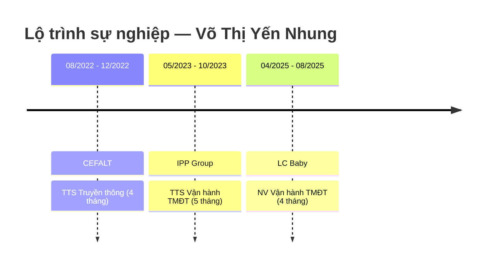

---
{"dg-publish":true,"permalink":"/01-tong-hanh-dinh-quan-ly/6-phong-nhan-su/01-ds-ung-vien/cv-27-03-2026-vo-thi-yen-nhung/","title":"CV — VÕ THỊ YẾN NHUNG","tags":["ung-vien","van-hanh","tmdt","thiet-ke"],"dg-note-properties":{"title":"CV — VÕ THỊ YẾN NHUNG","ngay_nop":"2026-03-27","vi_tri":"Chuyên viên Vận hành Ứng dụng","trang_thai":"Chờ xét duyệt","diem_danh_gia":"5.0/10","uu_tien_pv":"Lưu hồ sơ – xét đợt sau","tags":["ung-vien","van-hanh","tmdt","thiet-ke"]}}
---

# VÕ THỊ YẾN NHUNG
**Chuyên viên Vận hành Ứng dụng**

---

## 📇 THÔNG TIN CÁ NHÂN

| Trường | Thông tin |
|---|---|
| **Ngày sinh** | 14/05/2002 |
| **Điện thoại** | 0388 394 658 |
| **Email** | yennhung.work@gmail.com |
| **Địa chỉ** | Phường Hiệp Bình, TP. Hồ Chí Minh |
| **Ngày nộp CV** | 27/03/2026 |

---

## 🎯 MỤC TIÊU NGHỀ NGHIỆP

Được làm việc trong môi trường chuyên nghiệp, năng động, được tiếp xúc với những mô hình quản lý hiện đại với mong muốn được phát triển bản thân, hướng tới những cơ hội phát triển cao hơn.

---

## 💼 KINH NGHIỆM LÀM VIỆC

---

### ✦ Nhân viên Vận hành Sàn TMĐT
**Công ty TNHH Đầu tư & Thương mại LC Baby** | 04/2025 – 08/2025 *(4 tháng)*

**Vận hành đa kênh:**
- Vận hành và quản lý Fanpage Facebook, Website và các kênh TMĐT của công ty.
- Cập nhật thông tin sản phẩm: tên, mô tả, hình ảnh, giá bán, khuyến mãi, voucher, tồn kho, nội dung gian hàng.
- Thiết kế hình ảnh, banner phục vụ đăng tải trên các sàn TMĐT.

**Phát triển nguồn hàng:**
- Tìm kiếm, đánh giá và lựa chọn nhà cung cấp phù hợp nhằm mở rộng nguồn hàng phân phối.

**Xử lý đơn hàng & CSKH:**
- Giải quyết các vấn đề liên quan đến đơn hàng (sai thông tin, giao trễ, đổi trả).
- Hỗ trợ và chăm sóc khách hàng trên sàn.

---

### ✦ Thực tập sinh Vận hành Sàn TMĐT
**Công ty Cổ phần IPP Group** | 05/2023 – 10/2023 *(5 tháng)*

- Quản lý và vận hành gian hàng trên sàn TMĐT.
- Brief hình ảnh và phản hồi thiết kế cho team Design.
- Tham gia các campaign khuyến mãi của sàn.
- Phối hợp với bộ phận kho đảm bảo đơn hàng được giao đúng hạn, đúng đơn.
- Xử lý các vấn đề phát sinh trong quá trình vận hành.
- Phản hồi và xử lý khiếu nại từ khách hàng.

---

### ✦ Thực tập sinh Truyền thông
**Trung tâm Đào tạo, Bồi dưỡng kiến thức Ngoại giao và Ngoại ngữ (CEFALT)** | 08/2022 – 12/2022 *(4 tháng)*

**Tổ chức sự kiện:**
- Phối hợp với đội ngũ tổ chức các sự kiện, hội thảo và chương trình ngoại khóa do CEFALT chủ trì/đồng tổ chức.

**Thiết kế truyền thông:**
- Thiết kế ấn phẩm truyền thông sự kiện: backdrop, poster, standee, bandroll.
- Thiết kế hình ảnh quảng cáo Facebook cho các sự kiện đào tạo.
- Thiết kế trọn bộ ấn phẩm nhận diện hệ thống quà tặng giáo viên: thiệp mời, thiệp chúc mừng và các phụ kiện đồ họa.

---

## 🎓 HỌC VẤN

| Trường | Đại học Ngoại Ngữ – Tin học TP. Hồ Chí Minh (HUFLIT) |
|---|---|
| **Chuyên ngành** | Marketing |
| **Trạng thái** | Đã tốt nghiệp |

---

## 🛠️ KỸ NĂNG

### Kỹ năng chuyên môn
- ✅ Vận hành và quản lý sàn TMĐT (Shopee, TikTok Shop, Lazada).
- ✅ Cập nhật và quản lý dữ liệu sản phẩm (giá, tồn kho, mô tả, hình ảnh).
- ✅ Xử lý đơn hàng và khiếu nại khách hàng.
- ✅ Thiết kế hình ảnh, banner: Canva.
- ✅ Dựng video cơ bản: CapCut.

### Kỹ năng tin học
- ✅ Microsoft Word — Chứng chỉ MOS.
- ✅ Microsoft Excel — Chứng chỉ MOS.
- ✅ Microsoft PowerPoint.

### Kỹ năng mềm
- ✅ Giao tiếp và hỗ trợ đồng đội hiệu quả.
- ✅ Làm việc độc lập và chủ động.
- ✅ Phối hợp với bộ phận kho và team Design.

---

## 📜 CHỨNG CHỈ

| Chứng chỉ | Đơn vị cấp | Ghi chú |
|---|---|---|
| MOS Word | Microsoft | Đạt |
| MOS Excel | Microsoft | Đạt |
| TOEIC | IIG Vietnam | **615 điểm** |
| Ứng dụng Digital Marketing trong Kinh doanh | Đại học Kinh tế TP.HCM | Đạt |

---

## 🌐 NGÔN NGỮ

| Ngôn ngữ | Chứng chỉ | Trình độ |
|---|---|---|
| Tiếng Anh | TOEIC 615 | Trung cấp |

---

## 📝 GHI CHÚ ĐÁNH GIÁ (ETZ Internal)

> **Điểm phù hợp MTCV Vận hành Website:** 5.0/10
>
> **Điểm mạnh:** Nền tảng TMĐT rõ ràng (vận hành sàn, cập nhật sản phẩm, xử lý đơn hàng). TOEIC 615 là lợi thế. Chứng chỉ MOS và Digital Marketing thể hiện sự chủ động học tập.
>
> **Điểm yếu:** Tổng kinh nghiệm vận hành thực tế chỉ ~9 tháng (chưa đủ yêu cầu 2 năm). Chưa có kinh nghiệm vận hành website bán hàng. Chưa thể hiện tư duy SOP/hệ thống.
>
> **Khuyến nghị:** 🔄 Lưu hồ sơ — tiềm năng tốt nhưng cần thêm ~1 năm kinh nghiệm thực tế. Có thể xét lại trong đợt tuyển dụng tiếp theo hoặc nếu có vị trí junior phù hợp hơn.
