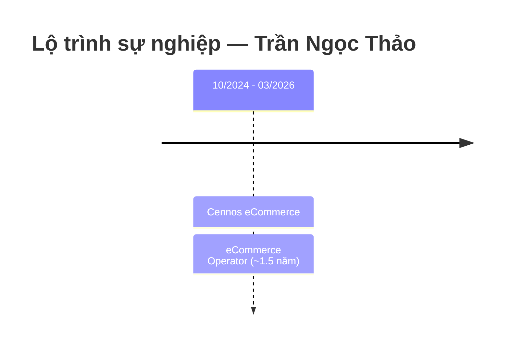

---
{"dg-publish":true,"permalink":"/01-tong-hanh-dinh-quan-ly/6-phong-nhan-su/01-ds-ung-vien/cv-28-03-2026-tran-ngoc-thao/","title":"CV — TRẦN NGỌC THẢO","tags":["ung-vien","van-hanh-website","shopify","seo","ecommerce","it"],"dg-note-properties":{"title":"CV — TRẦN NGỌC THẢO","ngay_nop":"2026-03-28","vi_tri":"Ecommerce Operator / Vận hành Website","trang_thai":"Chờ xét duyệt","diem_danh_gia":"8.5/10","uu_tien_pv":"Mời phỏng vấn ngay — Ưu tiên","tags":["ung-vien","van-hanh-website","shopify","seo","ecommerce","it"]}}
---

# TRẦN NGỌC THẢO
**Ecommerce Operator**

---

## 📇 THÔNG TIN CÁ NHÂN

| Trường | Thông tin |
|---|---|
| **Điện thoại** | +0356-944-595 |
| **Email** | thaot5072@gmail.com |
| **Địa chỉ** | 3 Trần Não, Quận 2, TP.HCM |
| **Ngày nộp CV** | 28/03/2026 |

---

## 🎯 PROFILE

Ecommerce Operator với hơn **1.5 năm kinh nghiệm** trong các dự án BPO phục vụ khách hàng Mỹ, làm việc linh hoạt cả môi trường văn phòng và remote. Có kinh nghiệm quản lý và vận hành website quy mô lớn **(1.000+ SKUs)** trên Shopify và Wayfair, am hiểu sâu về templates, backend features và quy trình xử lý dữ liệu hàng loạt. Có kiến thức cơ bản về HTML, CSS và UX/UI để hỗ trợ tối ưu cấu trúc front-end và trải nghiệm người dùng. Chủ động, cẩn thận, có trách nhiệm cao, tuân thủ nghiêm ngặt hướng dẫn và quy trình.

---

## 💼 KINH NGHIỆM LÀM VIỆC

---

### ✦ eCommerce Operator
**Cennos eCommerce** | 10/2024 – 03/2026 *(~17 tháng — BPO cho khách hàng US)*

#### 🔹 Project Responsibilities (Trách nhiệm dự án)

| Hạng mục | Mô tả chi tiết |
|---|---|
| **Client Communication** | Trao đổi trực tiếp qua Outlook để làm rõ nhiệm vụ, giải quyết vấn đề phát sinh và báo cáo tiến độ với khách hàng US |
| **Workflow Planning** | Tổ chức và ưu tiên nhiệm vụ hàng ngày với ước tính ETD (Expected Time of Delivery) chính xác để đảm bảo deadline |
| **Data Framework Design** | Phát triển tài sản dữ liệu có cấu trúc bằng Figma: patterns, tearsheets, sizing guides theo yêu cầu khách hàng |
| **Progress Tracking** | Gửi báo cáo tuần và cập nhật trạng thái thời gian thực để duy trì tính minh bạch với client |
| **Cross-team Coordination** | Phối hợp với team Photoshop và IT để đảm bảo tuân thủ đầy đủ hướng dẫn và tiêu chuẩn khách hàng |

---

#### 🔹 Shopify Operations (Vận hành Shopify)

**Product Listing & Management:**
- **Product Listing:** Tạo mới và hoàn thiện sản phẩm bằng cách điền đầy đủ templates (metafields, variants, attributes, etc.).
- **Backend Administration:** Vận hành nội dung sản phẩm và cấu trúc site để đảm bảo hiển thị front-end chính xác.
- **Product Description (SEO):** Tạo mô tả sản phẩm chuẩn SEO bằng công cụ AI — đảm bảo tối ưu từ khóa và trải nghiệm đọc.
- **Image Optimization:** Thêm và tối ưu hóa Alt Text cho toàn bộ hình ảnh sản phẩm.

**Collections & Catalog:**
- **Collections Management:** Xây dựng collections thủ công và tự động theo logic phân loại sản phẩm.
- **Sales Channels:** Quản lý tính khả dụng của sản phẩm trên các kênh bán hàng khác nhau.

**Bulk Operations:**
- **Matrixify Tool:** Thực hiện export/import hàng loạt để cập nhật thông tin sản phẩm với số lượng lớn (1.000+ SKUs).

---

#### 🔹 Wayfair Operations (Vận hành Wayfair)

**Product Catalog Management:**
- Xử lý attributes, variations, pricing và cập nhật tồn kho theo hướng dẫn của khách hàng.

**Bulk Data Processing:**
- Thực hiện export/import dữ liệu và cập nhật hàng loạt: new builds, add options, composites theo danh mục sản phẩm bằng template systems.

**Ticket Management:**
- Tạo, theo dõi và xử lý toàn bộ vòng đời (full lifecycle) của Wayfair support tickets qua cả Portal và Email.

**Product Image Management:**
- Upload hình ảnh sản phẩm, sắp xếp thứ tự ưu tiên và thiết lập lead image.

**Post QA (Quality Assurance):**
- Thực hiện front-end validation sau khi cập nhật sản phẩm.
- Phát hiện và giải quyết các vấn đề hiển thị dữ liệu sau khi launch.

---

## 🎓 HỌC VẤN

| Trường | Đại học Cần Thơ |
|---|---|
| **Thời gian** | 2019 – 2023 |
| **Chuyên ngành** | Công nghệ Thông tin |
| **GPA** | **3.2 / 4.0** |
| **Ghi chú** | Nền tảng IT giúp hiểu sâu logic hệ thống và backend website |

---

## 🛠️ KỸ NĂNG

### Technical Skills (Kỹ năng kỹ thuật)

| Kỹ năng | Mức độ | Chi tiết |
|---|---|---|
| **Shopify Admin** | ✅ Thành thạo | Backend, metafields, collections, bulk ops |
| **Wayfair Platform** | ✅ Thành thạo | Catalog, tickets, image mgmt |
| **Matrixify (Bulk Tool)** | ✅ Thành thạo | Import/export hàng loạt |
| **Figma** | ✅ Sử dụng được | UX/UI, data framework design |
| **Canva** | ✅ Sử dụng được | Thiết kế cơ bản |
| **HTML & CSS** | ⚠️ Cơ bản | Hỗ trợ front-end structure |
| **Technical SEO** | ✅ Tốt | SEO content, Alt Text, product description |
| **Microsoft Excel** | ✅ **Advanced** | Data analysis, bulk processing |
| **AI Tools** | ✅ Tốt | Dùng AI viết SEO description, tối ưu nội dung |

### Core Skills (Kỹ năng cốt lõi)

- ✅ **Proactive** — Tinh thần trách nhiệm cao, tự quản lý công việc hiệu quả.
- ✅ **Data Analysis** — Phân tích, thu thập và tổng hợp dữ liệu sản phẩm quy mô lớn.
- ✅ **Self-Management & Discipline** — Quen làm việc remote với deadline nghiêm ngặt của US client.
- ✅ **Planning & Reporting** — Báo cáo tuần, ước tính ETD, tracking tiến độ.
- ✅ **Cross-team Collaboration** — Phối hợp Photoshop, IT, client.
- ✅ **Process Optimization** — Tối ưu quy trình xử lý dữ liệu hàng loạt.

---

## 🌐 NGÔN NGỮ

| Ngôn ngữ | Trình độ | Ứng dụng thực tế |
|---|---|---|
| **Tiếng Anh** | Intermediate | Trao đổi email với US client hàng ngày qua Outlook |

---

## 📝 GHI CHÚ ĐÁNH GIÁ (ETZ Internal)

> **Điểm phù hợp MTCV Vận hành Website:** **8.5/10** ⭐⭐⭐
>
> **Điểm mạnh nổi bật:**
> - **Kỹ năng website chuyên sâu nhất trong pool** — Shopify backend, bulk operations, technical SEO, HTML/CSS.
> - Kinh nghiệm BPO cho US client → quen áp lực deadline cao và tiêu chuẩn chất lượng nghiêm ngặt.
> - Excel Advanced + AI tools → phù hợp hoàn hảo với định hướng vận hành hiện đại của ETZ.
> - Background IT (ĐH Cần Thơ) → hiểu sâu logic hệ thống, có thể phối hợp tốt với bộ phận IT.
> - Làm việc remote độc lập với client nước ngoài → kỷ luật và tự quản lý cao.
>
> **Điểm cần làm rõ khi phỏng vấn:**
> - Kinh nghiệm ~1.5 năm, chưa đủ 2 năm theo yêu cầu — cần đánh giá chất lượng để bù đắp.
> - Toàn bộ kinh nghiệm với nền tảng quốc tế (Shopify/Wayfair) — cần hỏi về khả năng adapt với hệ thống Việt Nam (Sapo/Haravan/WooCommerce).
> - Kỳ vọng mức lương.
>
> **Câu hỏi phỏng vấn gợi ý:**
> 1. Anh/chị đã từng làm việc với hệ thống Sapo hoặc Haravan chưa? Nếu chưa, thời gian tự học khoảng bao lâu?
> 2. Trong quá trình vận hành 1.000+ SKUs, anh/chị gặp vấn đề dữ liệu lớn nhất là gì và xử lý thế nào?
> 3. Kỳ vọng mức lương cho vị trí này?
>
> **Khuyến nghị:** ✅ **Mời phỏng vấn ngay — Ưu tiên #2**
