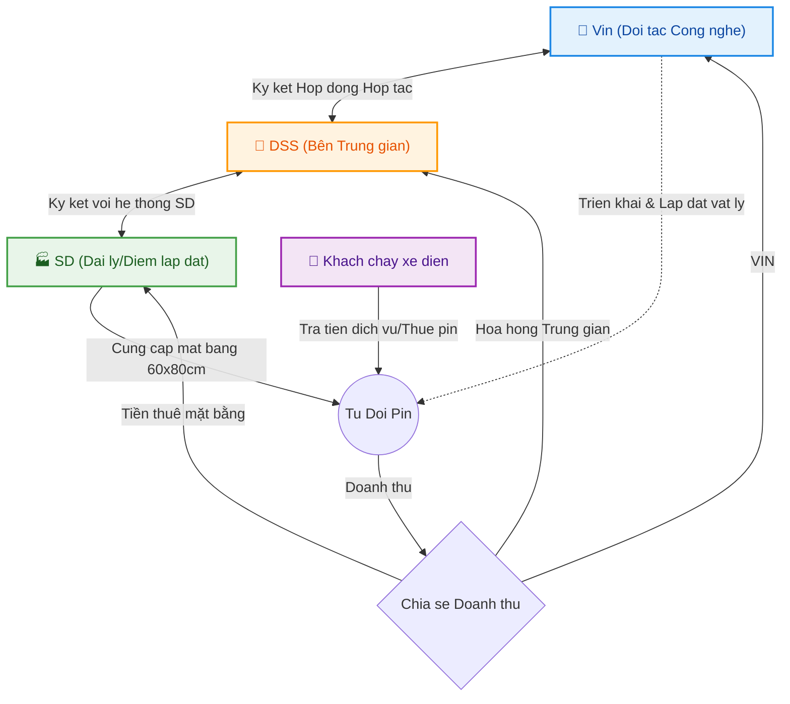
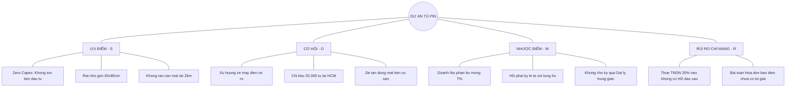
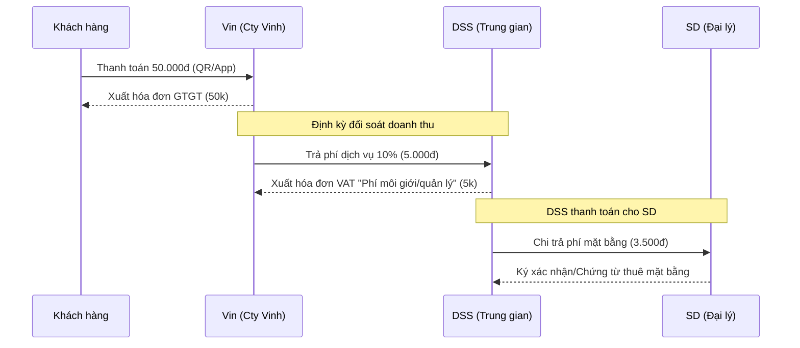

---
{"dg-publish":true,"permalink":"/01-tong-quan-ly-du-an/10-meeting/2026-04-03-bao-cao-nghien-cuu-kha-thi-du-an-tu-pin/","title":"Báo Cáo Phân Tích Tính Khả Thi - Dự Án Tủ Đổi Pin Xin Máy Điện","tags":["report","phan_tich"],"dg-note-properties":{"title":"Báo Cáo Phân Tích Tính Khả Thi - Dự Án Tủ Đổi Pin Xin Máy Điện","tags":["report","phan_tich"]}}
---

# 📊 BÁO CÁO NHANH: TÍNH KHẢ THI DỰ ÁN TỦ PIN
**Tóm tắt trực quan dành cho Ban Lãnh Đạo (Cập nhật 03/04/2026)**

---

## 🏗️ 1. MÔ HÌNH VẬN HÀNH (ZERO-CAPEX)

---

## 📈 2. PHÂN BỔ TỶ LỆ DOANH THU

Có sư chênh lệch giữa chính sách chuẩn và điểm rơi lý tưởng (1.000 điểm).

| Thành phần | Tỷ lệ | Ghi chú |
| :--- | :---: | :--- |
| **Công ty Vinh (Thu hồi vốn)** | 90% | Chịu mọi rủi ro đầu tư |
| **Thu nhập Đối Tác (Hiện tại)** | **7%** | Tương đương 600k-800k/tháng |
| **Khoản chênh lệch (Cần xin)** | 3% | Để tăng tính hấp dẫn B2B |

> [!important] VẤN ĐỀ TÀI CHÍNH
> Mức **7%** mang tính chất "tiền thuê mặt bằng thụ động" chứ chưa đủ hấp dẫn để tạo thành động lực tự phát triển một mô hình kinh doanh B2B quy mô lớn. 

---

## ⚖️ 3. MA TRẬN SWOT (TỔNG QUAN)

---

## 🚦 4. ĐÁNH GIÁ CHUNG VÀ LỜI KHUYÊN

### 📌 THANG ĐIỂM ĐÁNH GIÁ:
- 🟢 **Khả năng triển khai:** `Rất cao (9/10)` -> Quá dễ, ai có mặt bằng là lắp được.
- 🟡 **Khả năng lợi nhuận:** `Thấp (4/10)` -> Một điểm thu 600K là quá ít cho mô hình công ty phân phối.
- 🔴 **Khả năng kiểm soát pháp lý/kế toán:** `Rất rủi ro (2/10)` -> Vướng Thuế TNDN vì dòng tiền ảo, khó chứng minh chi phí đầu vào.

### 💡 LỜI KHUYÊN HÀNH ĐỘNG (NEXT STEPS):
1. 🛡️ **MÔ HÌNH TRUNG GIAN (INTERMEDIARY):** DSS tập trung vào vai trò cầu nối ký kết. Đây là lựa chọn tối ưu vì:
   - **Không rủi ro Thuế:** Chúng ta nhận "Phí môi giới/phát triển" từ Vin thay vì nhận toàn bộ doanh thu pin rồi phải đi mua hóa đơn điện lẻ tẻ từ người dân.
   - **Không rủi ro Vận hành:** Toàn bộ khâu kỹ thuật, lắp đặt, bảo hành Vin tự triển khai trực tiếp với SD.
2. 🔬 **CHỌN LỌC 10 ĐIỂM TEST:** Hãy hỗ trợ Vin ký kết thử với **10 SD (Đại lý thân thiết nhất)** để kiểm chứng: Dòng tiền hoa hồng cho DSS và tiền thuê cho SD có trả về đúng hạn và minh bạch hay không.
3. 📝 **CHUẨN HÓA MẪU HĐ 3 BÊN:** Làm việc với Pháp lý để soạn thảo cơ chế: Vin ký trực tiếp với SD (về mặt bằng), nhưng có điều khoản ghi nhận công sức phát triển và trả hoa hồng định kỳ cho DSS.

---

## 💰 5. MÔ PHỎNG DÒNG TIỀN & HÓA ĐƠN (GIAO DỊCH 50.000 VNĐ - TỶ LỆ 10%)

Giả sử chúng ta đàm phán thành công mức **10% doanh thu** cho mạng lưới (DSS + SD):

### 5.1 Bảng phân bổ lợi nhuận (Ví dụ 50k)
| Thành phần | Tỷ lệ | Số tiền (VNĐ) | Loại hóa đơn / Chứng từ |
| :--- | :---: | :---: | :--- |
| **🏢 Vin (Chủ đầu tư)** | 90% | 45.000 | Vin xuất HĐ điện tử cho Khách |
| **🤝 DSS (Trung gian)** | **3%** | **1.500** | DSS xuất HĐ dịch vụ (VAT) cho Vin |
| **🏠 SD (Điểm lắp đặt)** | **7%** | **3.500** | Phiếu chi/HĐ thuê (DSS trả cho SD) |
| **TỔNG MẠNG LƯỚI** | **10%** | **5.000** | Tổng phí quản lý & mặt bằng |

### 5.2 Luồng tiền & Hóa đơn (Sequence Diagram)

### 5.3 Phân tích rủi ro & giải pháp Hóa đơn
*   **Đầu ra (DSS xuất cho Vin):** Rất thuận lợi. DSS là pháp nhân, xuất hóa đơn "Dịch vụ tư vấn/môi giới" cho Vin bình thường, chịu thuế trên phần 5.000đ nhận về.
*   **Đầu vào (SD xuất cho DSS):** 
    *   *Trường hợp SD là Hộ kinh doanh:* Họ có thể xuất hóa đơn của Chi cục thuế -> DSS hạch toán chi phí được ngay.
    *   *Trường hợp SD là Cá nhân/Hộ dân:* Họ không có hóa đơn. DSS cần lập **Bảng kê 01/TNDN** (nếu tiền thuê dưới 100tr/năm) hoặc hợp đồng thuê tài sản có chứng từ thanh toán để hạch toán chi phí hợp lệ.
*   **Dòng tiền sạch:** Bằng cách này, DSS không phải gánh toàn bộ 50k doanh thu (vốn không phải của mình) mà chỉ hạch toán doanh thu thực nhận là 5k (hoặc 10% doanh thu tổng). Điều này giúp báo cáo tài chính "sạch" và giảm tối đa áp lực thuế TNDN.

### 5.4 Nghiệp vụ Kế toán (Trường hợp Vin trả điện trực tiếp cho SD)

Đây là phương án **An toàn & Minh bạch nhất** cho DSS. Khi Vin trả tiền điện trực tiếp cho SD (SD gửi bill cho Vin), luồng hạch toán của DSS sẽ cực kỳ tinh gọn:

1.  **Về Hóa đơn đầu ra (DSS xuất cho Vin):** 
    *   DSS xuất hóa đơn VAT với nội dung: **"Phí hỗ trợ phát triển & quản lý mạng lưới (Management Fee)"** trị giá 10% (ví dụ 5.000đ).
    *   Đây là doanh thu dịch vụ thuần túy của DSS.

2.  **Về Hóa đơn/Chứng từ đầu vào (Để DSS cân đối chi phí):**
    Sếp băn khoăn "Đầu vào của DSS là gì để xuất cho Vin?", câu trả lời nằm ở 2 lớp chi phí:
    *   **Lớp 1 (Chứng từ chi trả ngược lại cho SD):** Để có được trạm đó, DSS phải trả "Phí hỗ trợ mặt bằng" cho SD (ví dụ 7% = 3.500đ). Đây chính là "Đầu vào" quan trọng nhất. Chứng từ bao gồm: **Hợp đồng thuê mặt bằng** ký giữa DSS và SD + **Phiếu chi/Ủy nhiệm chi**.
    *   **Lớp 2 (Chi phí vận hành):** Lương nhân viên quản lý, tiền điện thoại, chi phí đi lại để kiểm tra các trạm... Tất cả đều là chứng từ đầu vào hợp lệ của DSS.

3.  **Lợi ích của mô hình này:** 
    *   **DSS KHÔNG cần hóa đơn điện:** Vì tiền điện là giao dịch riêng giữa Vin và SD. DSS chỉ hạch toán đúng tỷ lệ hoa hồng mình được hưởng.
    *   **Tránh rủi ro giấy phép:** DSS không phải là đơn vị "mua bán lẻ điện" -> Loại bỏ rủi ro pháp lý về kinh doanh điện năng.
    *   **Lợi nhuận gộp minh bạch:** Thu 10% (5k) - Chi SD 7% (3.5k) = Lợi nhuận gộp 3% (1.5k). DSS nộp Thuế TNDN trên phần chênh lệch này sau khi trừ lương nhân sự.

> [!important] KẾT LUẬN:
> Với mô hình này, **Đầu vào của DSS chính là Hợp đồng/Chứng từ ký với SD**. DSS đứng ở tư cách "Nhà thầu quản lý mạng lưới", không phải chủ trạm sạc điện.

---

## 🏛️ 6. GIÁ TRỊ CỐT LÕI CỦA DSS (TẠI SAO SD NÊN KÝ QUA CHÚNG TA?)

Đây là câu hỏi chiến lược nhất để sếp nắm giữ mạng lưới SD (Đại lý). Nếu một hộ dân lẻ ký trực tiếp với VGreen chỉ được mặc định **7%**, thì khi ký qua thông qua DSS (Hợp đồng tổng), họ nhận được 4 giá trị thặng dư sau:

1.  **Lợi thế về Quy mô (Sức mạnh tập thể):** 
    *   Một hộ dân lẻ không thể tự đàm phán tăng tỷ lệ. 
    *   DSS với vị thế sở hữu 1.000 - 5.000 điểm sẵn có sẽ đàm phán mức "Sỉ" (**10% - 12%**). 
    *   DSS có thể trả lại cho SD mức **8%** (cao hơn 7% họ tự ký) và công ty vẫn giữ lại 2% phí quản lý. Đây là bài toán **Win-Win (Hai bên cùng có lợi)**.

2.  **Hỗ trợ Vận hành & Phản ứng nhanh (Locally Support):** 
    *   Khi trạm sạc hỏng, hộ dân gọi VGreen có thể chờ hàng tuần. 
    *   Thông qua DSS, chúng ta có đội ngũ kỹ thuật khu vực (đang lắp camera Dahua) hỗ trợ kiểm tra và thúc ép VGreen xử lý ngay. SD không bao giờ phải "đơn độc".

3.  **Hệ sinh thái DSS CLUB:** 
    *   SD tham gia trạm pin sẽ được cộng điểm thưởng **DSS CLUB**, tăng hạng đại lý hoặc nhận chiết khấu trực tiếp khi mua hàng trên hệ sinh thái Khotot.vn.
    *   Trạm sạc được quảng bá trên App/Web Khotot.vn, thu hút lượng khách đổi pin (có tiền) đến cửa hàng, tạo cơ hội cho SD bán thêm camera, ổ khóa hoặc các sản phẩm khác.

4.  **Hỗ trợ Pháp lý & Đối soát chuyên nghiệp:** 
    *   DSS đứng ra làm đầu mối "đối đãi" với tập đoàn lớn. 
    *   Mọi thông tin đối soát doanh thu, hóa đơn, chứng từ sẽ được phần mềm của DSS xử lý gọn gàng cho SD. SD chỉ việc nhận dòng tiền "sạch" vào túi hàng tháng (không lo bị Vin bắt đóng/nộp thuế phức tạp).

> [!important] CHỐT LẠI:
> DSS không chỉ là "người trung gian ăn phí", mà là **"Người bảo vệ và gia tăng quyền lợi"** cho mạng lưới. Chúng ta dùng sức mạnh quy mô để lấy về lợi ích to lớn hơn cho từng điểm lẻ.

### 6.1 TẠI SAO VIN CẦN DSS? (RÀO CẢN ĐỂ VIN KHÔNG TỰ LÀM)

Sếp nói đúng, Vin có tiền và có quyền, họ "có thể" tự làm. Nhưng đây là 3 lý do chiến lược khiến họ **phải** chọn DSS thay vì tự đi ký với từng SD:

1.  **Chi phí Sở hữu Điểm (Acquisition Cost):** 
    *   Để Vin tự tìm ra 1.000 mặt bằng "đắc địa" trong các ngõ ngách, họ phải thuê hàng trăm nhân viên thị trường, trả lương, hoa hồng và mất hàng tháng trời thẩm định pháp lý từng hộ.
    *   **DSS có sẵn:** Chúng ta có 4.000 đại lý "ruột" đã được định danh, có sẵn lòng tin và đang kinh doanh ổn định. Vin chỉ cần ký 01 Hợp đồng tổng với DSS là có ngay 1.000 điểm chuẩn. Vin chọn DSS để **tiết kiệm hàng chục tỷ đồng** chi phí nhân sự và vận hành giai đoạn đầu.

2.  **Tốc độ phủ sóng (Speed to Market):** 
    *   Trong cuộc đua xe điện, ai phủ trạm nhanh hơn người đó thắng. Nếu Vin tự đi ký lẻ, mất 1 năm để phủ 1.000 trạm. Ký qua DSS, họ phủ xong trong 1 tháng. 
    *   DSS chính là **"đường cao tốc"** để Vin chiếm lĩnh địa bàn trước khi các đối thủ khác kịp nhảy vào.

3.  **Mạng lưới Kỹ thuật "0 đồng" (Localized Force):** 
    *   Vin có đội ngũ bảo trì, nhưng không thể có mặt tại mọi con hẻm ở TP.HCM trong vòng 30 phút. 
    *   DSS có hàng ngàn kỹ thuật viên camera Dahua đang rong ruổi khắp các nẻo đường mỗi ngày. Chúng ta có thể xử lý các lỗi cơ bản của trạm pin (như kẹt pin, mất điện, lỗi kết nối) nhanh hơn bất kỳ đội chuyên trách nào của Vin với chi phí cực thấp.

4.  **Rào cản về "Lòng tin" (The Trust Gap):**
    *   Người dân nhỏ lẻ thường e ngại việc ký kết với các Tập đoàn lớn vì thủ tục khắt khe. Họ tin tưởng "anh bên DSS" - người đã cung cấp camera cho họ 10 năm nay - hơn là một nhân viên thị trường xa lạ của Vin mới đến gõ cửa.

> [!important] KẾT LUẬN CHIẾN LƯỢC:
> Vin cần DSS để **Mua Tốc Độ** và **Giảm Chi Phí Quản Lý**. Vị thế của chúng ta là **"Chủ sở hữu mạng lưới điểm cuối"** - thứ mà tiền của Vin không thể mua được trong một sớm một chiều.
