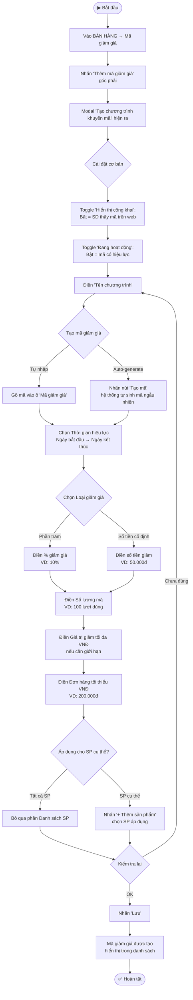
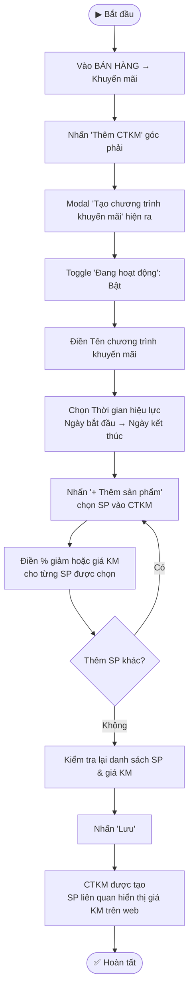
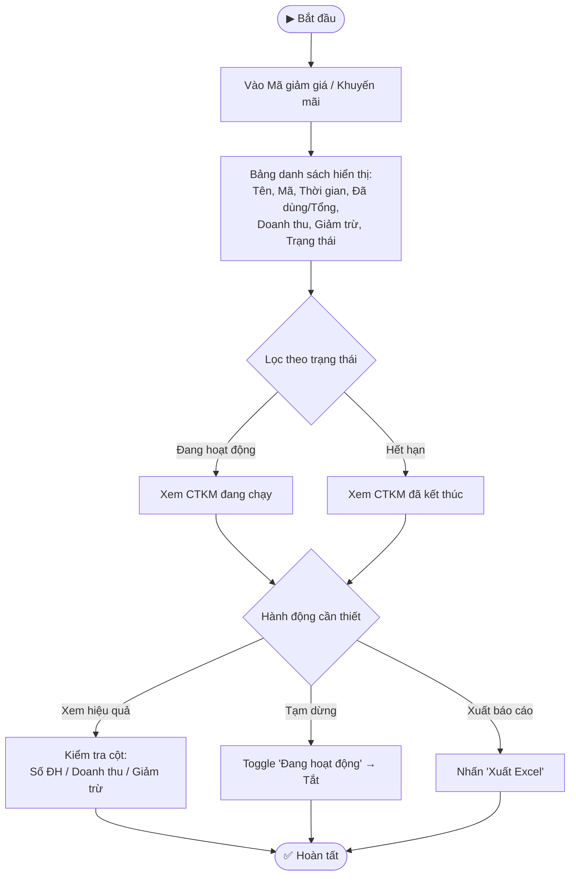

---
{"dg-publish":true,"permalink":"/01-tong-quan-ly-du-an/2-phong-van-hanh/md/sop-md-khotot-ma-giam-gia/","title":"SOP-MD-04 | Mã Giảm Giá & Khuyến Mãi — md.khotot.vn","dg-note-properties":{"title":"SOP-MD-04 | Mã Giảm Giá & Khuyến Mãi — md.khotot.vn","cap_nhat":"2026-03-31","loai":"SOP","phong_ban":"Vận Hành","he_thong":"md.khotot.vn"}}
---

# SOP-MD-04 | Mã Giảm Giá & Khuyến Mãi MD
> **Áp dụng cho:** Nhân viên/Admin vai trò MD tại `md.khotot.vn`
> **Phiên bản:** v1.0 | **Ngày tạo:** 31/03/2026
> **Nguồn:** Tổng hợp từ UAT kiểm thử thực tế

---

## 🎯 Mục đích
Hướng dẫn MD tạo và quản lý mã giảm giá (coupon) và chương trình khuyến mãi (CTKM) áp dụng cho khách hàng SD.

---

## 📌 Thông tin truy cập

| Module | URL | Sidebar |
|---|---|---|
| Mã giảm giá | `/app/sale/coupons` | BÁN HÀNG → Mã giảm giá |
| Khuyến mãi | `/app/sale/promotions` | BÁN HÀNG → Khuyến mãi |

---

## 🔄 LUỒNG 1: Tạo Mã Giảm Giá (Coupon Code)

---

## 🔄 LUỒNG 2: Tạo Chương Trình Khuyến Mãi (CTKM)

> **Khác với Mã giảm giá:** CTKM là giảm giá theo sản phẩm (không cần nhập mã), SD thấy giá gạch + giá KM trực tiếp trên web.

---

## 🔄 LUỒNG 3: Quản lý & Theo Dõi Hiệu Quả

---

## 📋 So Sánh: Mã Giảm Giá vs Khuyến Mãi

| Tiêu chí | Mã Giảm Giá | Khuyến Mãi (CTKM) |
|---|---|---|
| **Cách dùng** | SD nhập mã khi checkout | Tự động hiển thị giá KM |
| **Trường bắt buộc** | Mã, Thời gian, Loại giảm, Giá trị, SL | Tên, Thời gian, SP áp dụng |
| **Hiển thị công khai** | Có toggle | Luôn hiển thị |
| **Giới hạn đơn tối thiểu** | Có | Không |
| **Theo dõi lượt dùng** | Có (đã dùng/tổng SL) | Theo SP bán được |
| **Phù hợp cho** | Flash sale, quà tặng riêng | Giảm giá toàn bộ danh mục |

---

## ⚠️ Lưu ý quan trọng
- **Mã không trùng:** Hệ thống không cho phép 2 mã giảm giá trùng nhau
- **Thời hạn rõ ràng:** Luôn cài ngày hết hạn — mã không bao giờ tự tắt nếu không có ngày kết thúc
- **Kiểm tra đơn tối thiểu:** Cài đúng để tránh lỗ khi SD dùng mã cho đơn nhỏ
- **CTKM từ DSS:** MD có thể đăng ký tham gia CTKM do DSS tạo (tại tab Kho hàng → Banner DSS)

---

## 📞 Liên quan
- [[01_TONG_QUAN_LY_DU_AN/2_PHONG_VAN_HANH/MD/SOP_MD_KHOTOT_XuLyDonHang\|SOP-MD-03: Xử lý Đơn hàng MD]]
- [[01_TONG_QUAN_LY_DU_AN/9_LUU_TRU_TIEN_DO/UAT_CHECKLIST_MD_KHOTOT_2026-03-31\|📋 UAT Checklist MD (31/03/2026)]]
