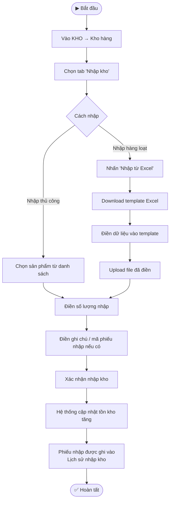
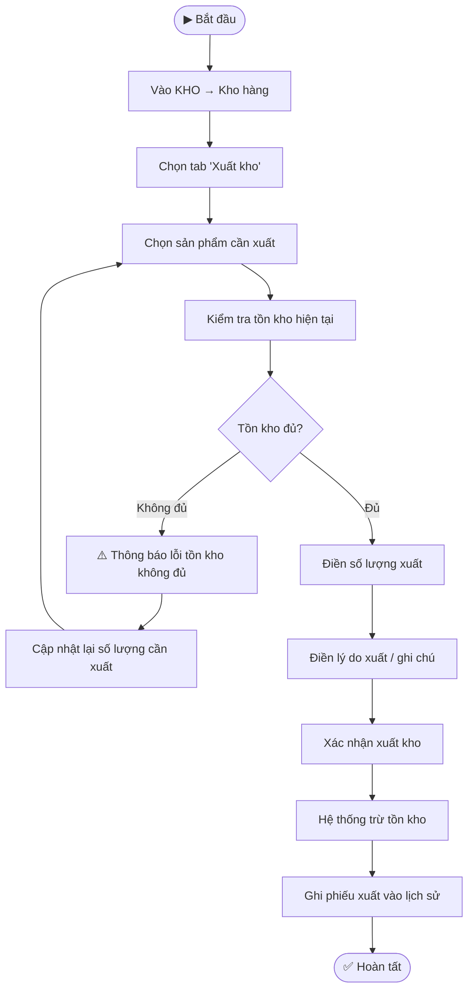
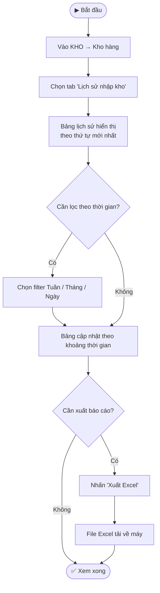

---
{"dg-publish":true,"permalink":"/01-tong-quan-ly-du-an/2-phong-van-hanh/md/sop-md-khotot-quan-ly-kho/","title":"SOP-MD-02 | Quản lý Kho hàng — md.khotot.vn","dg-note-properties":{"title":"SOP-MD-02 | Quản lý Kho hàng — md.khotot.vn","cap_nhat":"2026-03-31","loai":"SOP","phong_ban":"Vận Hành","he_thong":"md.khotot.vn"}}
---


# SOP-MD-02 | Quản lý Kho hàng MD
> **Áp dụng cho:** Nhân viên/Admin vai trò MD tại `md.khotot.vn`
> **Phiên bản:** v1.0 | **Ngày tạo:** 31/03/2026
> **Nguồn:** Tổng hợp từ UAT kiểm thử thực tế

---

## 🎯 Mục đích
Hướng dẫn MD quản lý tồn kho: nhập hàng, xuất hàng, kiểm kê, và tra cứu lịch sử xuất nhập tại kho định danh do DSS cấp.

---

## 📌 Thông tin truy cập
- **URL:** `https://md.khotot.vn/app/warehouses`
- **Sidebar:** KHO → Kho hàng
- **Tabs trong module:** Nhập kho | Xuất kho | Lịch sử nhập kho | Kiểm kê kho

---

## 🔄 LUỒNG 1: Nhập Kho



---

## 🔄 LUỒNG 2: Xuất Kho



---

## 🔄 LUỒNG 3: Kiểm Kê Kho

```mermaid
flowchart TD
    A([▶ Bắt đầu]) --> B[Vào KHO → Kho hàng]
    B --> C[Chọn tab 'Kiểm kê kho']
    C --> D[Bảng kiểm kê hiển thị:\nSP | Tồn hệ thống | Tồn thực tế]
    D --> E[Đếm tồn kho thực tế tại kho]
    E --> F{Có chênh lệch?}
    F -- Không --> G[Ghi nhận OK — không cần điều chỉnh]
    F -- Có --> H[Nhập số lượng tồn thực tế vào cột]
    H --> I[Hệ thống tính độ lệch]
    I --> J[Xác nhận điều chỉnh tồn kho]
    J --> K[Hệ thống cập nhật tồn kho theo thực tế]
    K --> L[Ghi log kiểm kê]
    G & L --> M([✅ Hoàn tất])
```

---

## 🔄 LUỒNG 4: Tra Cứu Lịch Sử Nhập/Xuất



---

## ⚠️ Lưu ý quan trọng
- **Kho định danh:** MD chỉ có 1 kho duy nhất do DSS cấp phát — không tự tạo kho mới
- **Import Excel:** Phải dùng đúng template hệ thống cung cấp, không tự tạo file
- **Tự động trừ kho:** Khi đơn hàng SD hoàn tất → hệ thống tự động trừ tồn kho (không cần xuất kho thủ công)
- **Cảnh báo tồn kho thấp:** Liên hệ DSS để được nhập kho bổ sung khi cần

---

## 📞 Liên quan
- [[01_TONG_QUAN_LY_DU_AN/2_PHONG_VAN_HANH/MD/SOP_MD_KHOTOT_XuLyDonHang\|SOP-MD-03: Xử lý Đơn hàng MD]]
- [[01_TONG_QUAN_LY_DU_AN/9_LUU_TRU_TIEN_DO/UAT_CHECKLIST_MD_KHOTOT_2026-03-31\|📋 UAT Checklist MD (31/03/2026)]]
