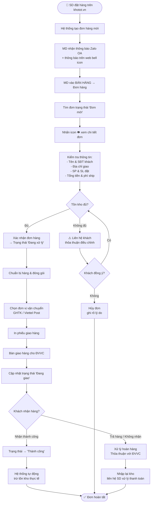
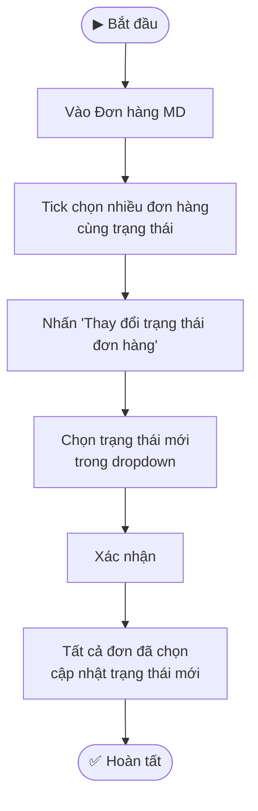
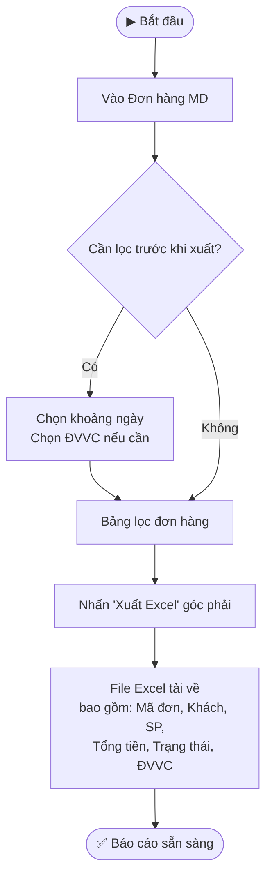

---
{"dg-publish":true,"permalink":"/01-tong-quan-ly-du-an/2-phong-van-hanh/md/sop-md-khotot-xu-ly-don-hang/","title":"SOP-MD-03 | Xử lý Đơn hàng — md.khotot.vn","dg-note-properties":{"title":"SOP-MD-03 | Xử lý Đơn hàng — md.khotot.vn","cap_nhat":"2026-03-31","loai":"SOP","phong_ban":"Vận Hành","he_thong":"md.khotot.vn"}}
---


# SOP-MD-03 | Xử lý Đơn hàng MD
> **Áp dụng cho:** Nhân viên/Admin vai trò MD tại `md.khotot.vn`
> **Phiên bản:** v1.0 | **Ngày tạo:** 31/03/2026
> **Nguồn:** Tổng hợp từ UAT kiểm thử thực tế

---

## 🎯 Mục đích
Hướng dẫn MD xử lý toàn bộ vòng đời đơn hàng: từ khi SD đặt hàng → nhận thông báo → xác nhận → chọn ĐVVC → giao hàng → hoàn tất.

---

## 📌 Thông tin truy cập
- **URL:** `https://md.khotot.vn/app/sale/orders`
- **Sidebar:** BÁN HÀNG → Đơn hàng

---

## 📊 Bảng thống kê trạng thái đơn hàng

| Trạng thái | Ý nghĩa | Hành động cần làm |
|---|---|---|
| **Đơn mới** | SD vừa đặt, chưa xử lý | Xử lý ngay trong 24h |
| **Đang xử lý** | MD đã xác nhận, đang chuẩn bị hàng | Theo dõi ĐVVC |
| **Thành công** | Hàng đã giao, khách xác nhận | Không cần thao tác |
| **Thất bại / Đã hủy** | Đơn bị hủy (chưa thanh toán hoặc khách hủy) | Kiểm tra lý do, liên hệ khách nếu cần |

---

## 🔄 LUỒNG CHÍNH: Xử Lý Đơn Hàng Đầy Đủ



---

## 🔄 LUỒNG PHỤ: Thay Đổi Trạng Thái Hàng Loạt



---

## 🔄 LUỒNG PHỤ: Xuất Báo Cáo Đơn Hàng Excel



---

## 📋 Chi Tiết Màn Hình Order Detail Modal

Khi click icon 👁️ xem đơn, modal hiển thị:

```
┌─────────────────────────────────────────────────────┐
│ Chi tiết đơn hàng - Mã đơn hàng: #[ID]              │
│ Ngày đặt: [ngày] | [Trạng thái] | ĐVVC: [tên]       │
│ [Badge trạng thái]                                   │
├──────────────────────┬──────────────────────────────┤
│ THÔNG TIN NGƯỜI NHẬN │ LỊCH SỬ & TÌNH TRẠNG         │
│ • Tên khách hàng     │ 🔴 Đơn hàng đã hủy            │
│ • Số điện thoại      │    - [Timestamp]              │
│ • Địa chỉ giao       │ 🟡 Đơn hàng mới               │
│ • Yêu cầu hóa đơn   │    - [Timestamp]              │
├──────────────────────┴──────────────────────────────┤
│ CHI TIẾT ĐƠN ĐẶT HÀNG                               │
│ Tên SP | Giá | SL | Thành tiền                       │
├─────────────────────────────────────────────────────┤
│ TÓM TẮT THANH TOÁN        [Badge thanh toán]         │
│ Tổng SP + Giảm giá + Phí ship = TỔNG THANH TOÁN      │
└─────────────────────────────────────────────────────┘
```

---

## ⚠️ Lưu ý quan trọng
- **SLA xử lý đơn:** Đơn hàng mới phải được xử lý trong **24 giờ** để tránh tự động hủy
- **Zalo thông báo:** Đảm bảo SĐT Zalo đã được cài trong Cài đặt MD (sau khi BUG-MD-01 được sửa)
- **Đơn hủy tự động:** Đơn chưa thanh toán sẽ bị hủy tự động sau thời hạn hệ thống quy định
- **Không hoàn tiền thủ công:** Mọi hoàn tiền phải thực hiện qua DSS

---

## 📞 Liên quan
- [[01_TONG_QUAN_LY_DU_AN/2_PHONG_VAN_HANH/MD/SOP_MD_KHOTOT_QuanLyKho\|SOP-MD-02: Quản lý Kho hàng]]
- [[01_TONG_QUAN_LY_DU_AN/2_PHONG_VAN_HANH/MD/SOP_MD_KHOTOT_MaGiamGia\|SOP-MD-04: Tạo Mã Giảm Giá & Khuyến Mãi]]
- [[01_TONG_QUAN_LY_DU_AN/9_LUU_TRU_TIEN_DO/UAT_CHECKLIST_MD_KHOTOT_2026-03-31\|📋 UAT Checklist MD (31/03/2026)]]
