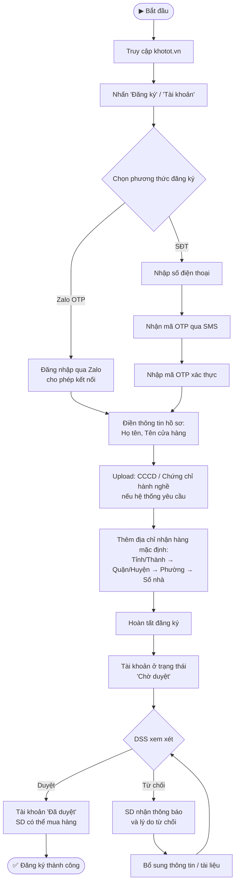
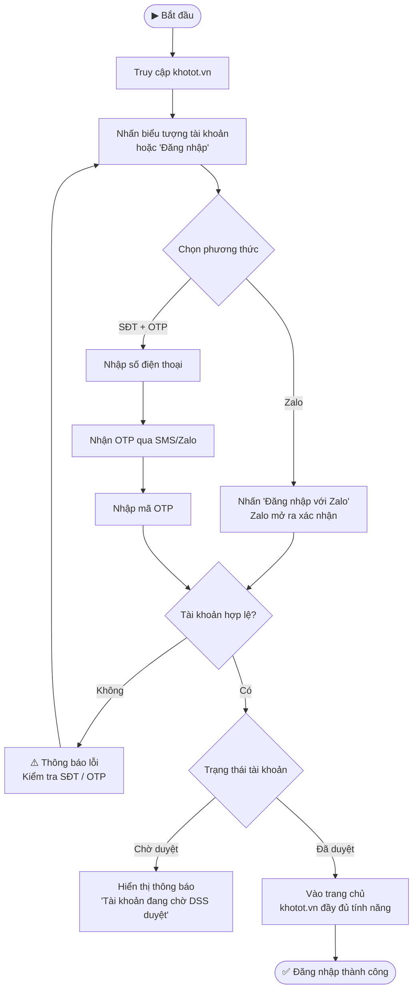
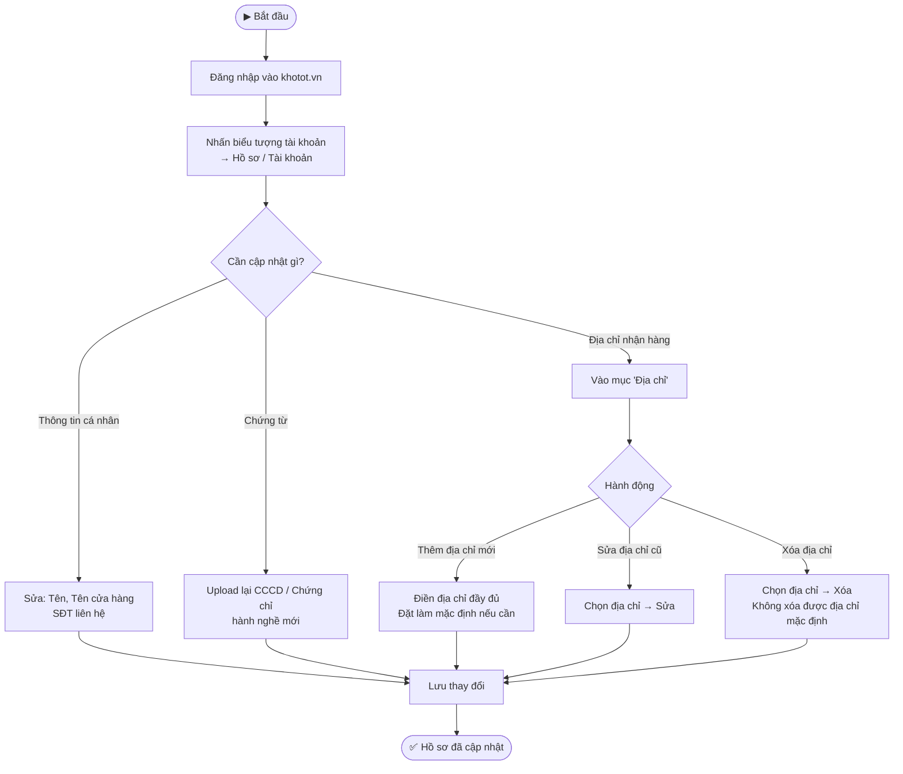

---
{"dg-publish":true,"permalink":"/01-tong-quan-ly-du-an/2-phong-van-hanh/sd/sop-sd-khotot-dang-ky-dang-nhap/","title":"SOP-SD-01 | Đăng Ký & Đăng Nhập — khotot.vn","dg-note-properties":{"title":"SOP-SD-01 | Đăng Ký & Đăng Nhập — khotot.vn","cap_nhat":"2026-03-31","loai":"SOP","phong_ban":"Vận Hành","he_thong":"khotot.vn"}}
---

# SOP-SD-01 | Đăng Ký & Đăng Nhập SD
> **Áp dụng cho:** Đại lý lẻ / Khách hàng (SD) tại `khotot.vn`
> **Phiên bản:** v1.0 | **Ngày tạo:** 31/03/2026
> **Nguồn:** Tổng hợp từ UAT kiểm thử thực tế (Phase 3 SD)

---

## 🎯 Mục đích
Hướng dẫn SD (Đại lý lẻ/Khách hàng) thực hiện đăng ký tài khoản, đăng nhập, thiết lập hồ sơ và địa chỉ nhận hàng trên khotot.vn.

---

## 📌 Thông tin truy cập
- **URL:** `https://khotot.vn`
- **Phương thức đăng nhập:** Zalo OTP hoặc SĐT
- **Trạng thái tài khoản:** Chờ duyệt → Đã duyệt (do DSS phê duyệt)

---

## 🔄 LUỒNG 1: Đăng Ký Tài Khoản Mới

---

## 🔄 LUỒNG 2: Đăng Nhập Tài Khoản Hiện Có

---

## 🔄 LUỒNG 3: Cập Nhật Hồ Sơ & Địa Chỉ

---

## ⚠️ Lưu ý quan trọng
- **Chờ duyệt:** Tài khoản mới sẽ bị giới hạn chức năng cho đến khi DSS duyệt — không mua được hàng
- **OTP hết hạn:** Mã OTP chỉ có hiệu lực trong **5 phút** — nếu hết hạn cần yêu cầu gửi lại
- **Zalo liên kết:** Nên đăng nhập qua Zalo để nhận thông báo đơn hàng nhanh nhất
- **Địa chỉ mặc định:** Luôn thiết lập ít nhất 1 địa chỉ mặc định để checkout nhanh hơn

---

## 📞 Liên quan
- [[01_TONG_QUAN_LY_DU_AN/2_PHONG_VAN_HANH/SD/SOP_SD_KHOTOT_TimKiemMuaHang\|SOP-SD-02: Tìm Kiếm & Mua Hàng]]
- [[01_TONG_QUAN_LY_DU_AN/2_PHONG_VAN_HANH/SD/SOP_SD_KHOTOT_ThanhToan\|SOP-SD-03: Thanh Toán (Checkout)]]
- [[01_TONG_QUAN_LY_DU_AN/9_LUU_TRU_TIEN_DO/UAT_CHECKLIST_KHOTOT_2026-03-31\|📋 UAT Checklist khotot.vn SD (31/03/2026)]]
