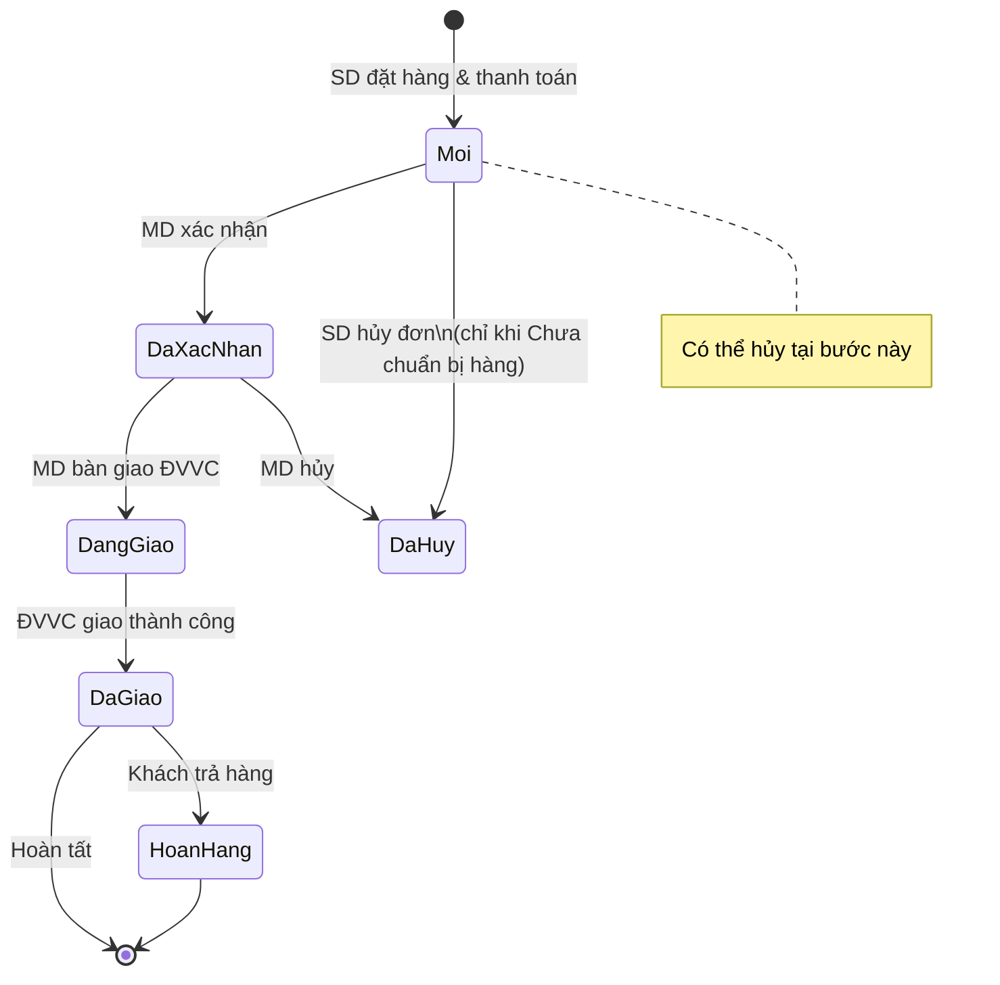
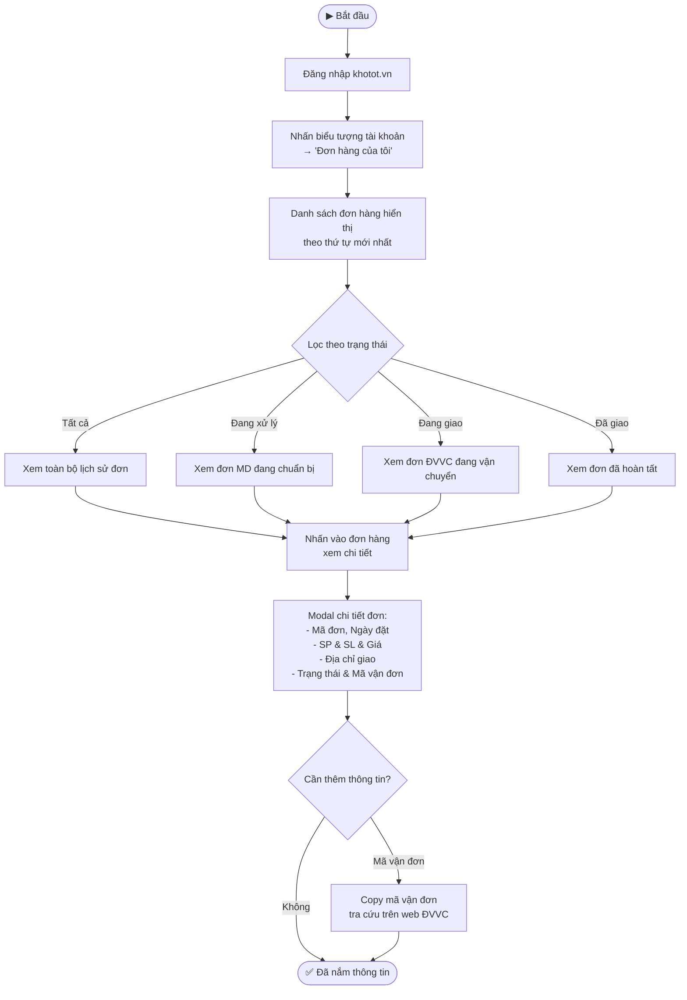
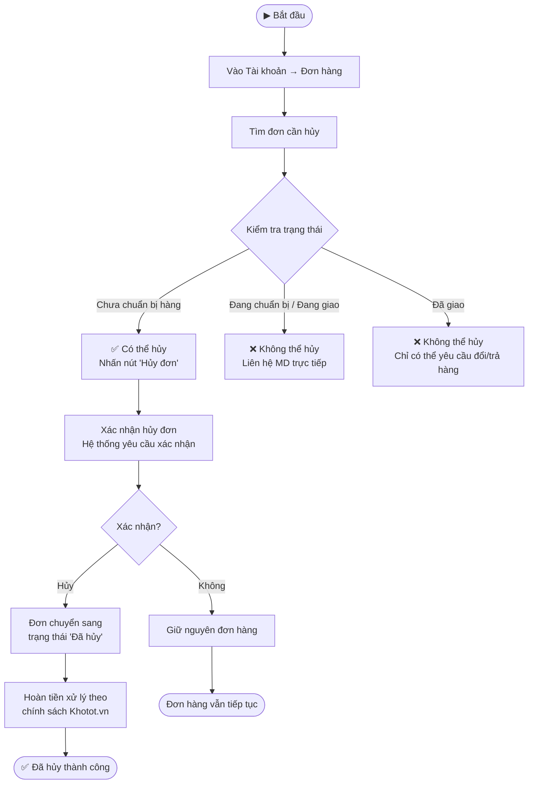
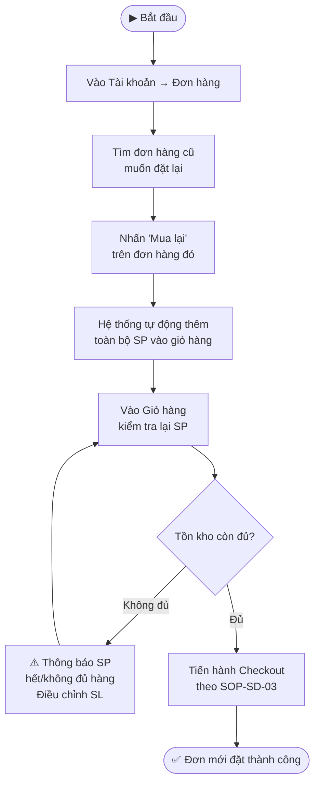

---
{"dg-publish":true,"permalink":"/01-tong-quan-ly-du-an/2-phong-van-hanh/sd/sop-sd-khotot-quan-ly-don-hang/","title":"SOP-SD-04 | Quản Lý Đơn Hàng — khotot.vn","dg-note-properties":{"title":"SOP-SD-04 | Quản Lý Đơn Hàng — khotot.vn","cap_nhat":"2026-03-31","loai":"SOP","phong_ban":"Vận Hành","he_thong":"khotot.vn"}}
---

# SOP-SD-04 | Quản Lý Đơn Hàng SD
> **Áp dụng cho:** Đại lý lẻ / Khách hàng (SD) tại `khotot.vn`
> **Phiên bản:** v1.0 | **Ngày tạo:** 31/03/2026
> **Nguồn:** Tổng hợp từ UAT kiểm thử thực tế (Phase 3 SD)

---

## 🎯 Mục đích
Hướng dẫn SD theo dõi trạng thái đơn hàng, xem lịch sử mua hàng, hủy đơn và mua lại nhanh.

---

## 📌 Thông tin truy cập
- **Danh sách đơn hàng:** `khotot.vn/tai-khoan/don-hang`
- **Chi tiết đơn hàng:** Xem qua modal từ danh sách *(deep link `/tai-khoan/don-hang/{id}` hiện lỗi 404 — BUG-01)*
- **Sidebar Tài khoản:** Tài khoản → Đơn hàng của tôi

---

## 📊 Vòng Đời Đơn Hàng SD

---

## 🔄 LUỒNG 1: Theo Dõi Đơn Hàng

---

## 🔄 LUỒNG 2: Hủy Đơn Hàng

---

## 🔄 LUỒNG 3: Mua Lại (Reorder)

---

## 📋 Bảng Trạng Thái Đơn Hàng SD

| Trạng thái | Hiển thị | Ý nghĩa | SD có thể hủy? |
|---|---|---|:---:|
| **Đơn mới** | 🔵 Xanh | Đã đặt & thanh toán, chờ MD xác nhận | ✅ Có |
| **Chờ xử lý** | 🟡 Vàng | MD đang chuẩn bị hàng | ✅ Có |
| **Đang giao** | 🟠 Cam | ĐVVC đã nhận hàng, đang vận chuyển | ❌ Không |
| **Đã giao** | 🟢 Xanh lá | Khách nhận hàng thành công | ❌ Không |
| **Đã hủy** | 🔴 Đỏ | Đơn bị hủy (do SD hoặc MD) | — |

---

## ⚠️ Lưu ý quan trọng & Bugs đã biết
- **BUG-01 (HIGH):** Deep link `/tai-khoan/don-hang/{orderId}` → **404** — Không share link đơn trực tiếp, phải vào qua trang danh sách đơn hàng
- **Hủy đơn có hạn:** Chỉ hủy được khi đơn ở trạng thái "Chưa chuẩn bị hàng" — sau đó phải liên hệ MD
- **Hoàn tiền:** Khotot.vn chưa có tự động hoàn tiền — liên hệ MD/DSS để xử lý nếu đơn bị hủy sau thanh toán
- **Mã vận đơn:** Sau khi MD bàn giao ĐVVC, mã vận đơn xuất hiện trong chi tiết đơn để SD tự tra cứu

---

## 📞 Liên quan
- [[01_TONG_QUAN_LY_DU_AN/2_PHONG_VAN_HANH/SD/SOP_SD_KHOTOT_ThanhToan\|SOP-SD-03: Thanh Toán (Checkout)]]
- [[01_TONG_QUAN_LY_DU_AN/2_PHONG_VAN_HANH/SD/SOP_SD_KHOTOT_TimKiemMuaHang\|SOP-SD-02: Tìm Kiếm & Mua Hàng]]
- [[01_TONG_QUAN_LY_DU_AN/9_LUU_TRU_TIEN_DO/UAT_CHECKLIST_KHOTOT_2026-03-31\|📋 UAT Checklist khotot.vn SD (31/03/2026)]]
