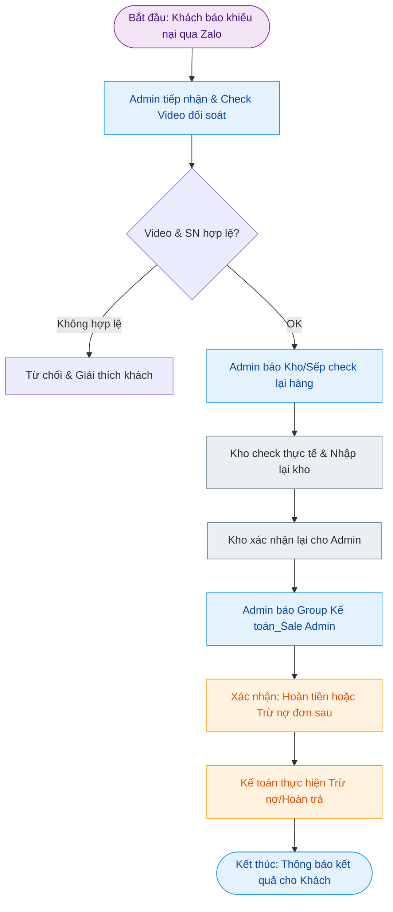

---
{"dg-publish":true,"permalink":"/01-tong-quan-ly-du-an/2-phong-van-hanh/sop-07-xu-ly-khieu-nai-hoan-tra/","title":"SOP 07 — QUY TRÌNH XỬ LÝ KHIẾU NẠI & HOÀN TRẢ","dg-note-properties":{"title":"SOP 07 — QUY TRÌNH XỬ LÝ KHIẾU NẠI & HOÀN TRẢ"}}
---

# 🛡️ SOP 07 — QUY TRÌNH XỬ LÝ KHIẾU NẠI & HOÀN TRẢ

> **Dự án:** Web ETZ — Khotot.vn
> **Mục tiêu:** Xử lý nhanh chóng các khiếu nại về hàng lỗi, tem hỏng và thực hiện quy trình hoàn tiền/trừ nợ chính xác.
> **Phiên bản:** 1.0 | **Cập nhật:** 2026-04-02

---

## 🎯 MỤC TIÊU
Đảm bảo quyền lợi cho khách hàng (Đại lý lẻ) khi gặp sự cố sản phẩm, đồng thời kiểm soát chặt chẽ việc nhập lại kho và đối soát tài chính.

---

## 🔄 SƠ ĐỒ QUY TRÌNH (FLOWCHART)

---

## 📝 CHI TIẾT CÁC BƯỚC THỰC HIỆN

### 1. Tiếp nhận Khiếu nại (Admin)
- **Kênh tiếp nhận:** Khách hàng (Đại lý lẻ) gửi yêu cầu và Video link qua Zalo cho Admin.
- **Tiêu chuẩn Video:** 
    - Phải quay rõ quá trình quét Serial Number (SN).
    - Quay rõ tình trạng tem bảo hành (lỗi, hỏng) hoặc hàng lỗi.
- **Thao tác:** Admin kiểm tra link video. Nếu hợp lệ, chuyển sang bước tiếp theo.

### 2. Kiểm tra & Nhập kho (Kho)
- **Báo cáo:** Admin báo trực tiếp cho Sếp hoặc Nghĩa (Kho) để chuẩn bị kiểm hàng.
- **Thực hiện:** Kho (Nghĩa) kiểm tra thực tế hàng lỗi/trả về.
- **Xác nhận:** Sau khi kiểm tra đạt yêu cầu nhập lại, Kho xác nhận lại cho Admin để tiến hành bước tài chính.

### 3. Đối soát & Xử lý tài chính (Kế toán)
- **Thông báo:** Admin gửi thông tin xác nhận từ Kho vào **Group Zalo: Kế toán & Sale Admin**.
- **Hình thức xử lý:** Admin và Kế toán thống nhất phương án:
    1. **Hoàn tiền:** Chuyển trả trực tiếp cho khách.
    2. **Trừ nợ:** Khấu trừ vào giá trị đơn hàng tiếp theo.
- **Thực hiện:** Kế toán thực hiện nghiệp vụ trên phần mềm và chứng từ.

### 4. Hoàn tất (Admin)
- Thông báo kết quả cuối cùng cho khách hàng qua Zalo.

---

## ⚠️ LƯU Ý QUAN TRỌNG
- **Yếu tố Video:** Đây là bằng chứng quan trọng nhất để Admin duyệt khiếu nại. Tuyệt đối không duyệt nếu thiếu video quét SN/Tem BH.
- **Xác nhận Kho:** Chỉ được báo Kế toán hoàn tiền khi đã có xác nhận "Đã nhận hàng - OK" từ Kho.

---
*Tài liệu này là quy chuẩn xử lý khiếu nại chính thức của Web ETZ.*
