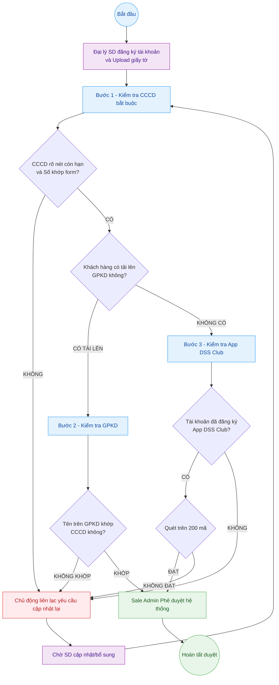

---
{"dg-publish":true,"permalink":"/01-tong-quan-ly-du-an/2-phong-van-hanh/sop-1-1-quy-trinh-duyet-tai-khoan-sd/","title":"SOP 01.1 — QUY TRÌNH DUYỆT TÀI KHOẢN ĐẠI LÝ SD (SALE ADMIN)","dg-note-properties":{"title":"SOP 01.1 — QUY TRÌNH DUYỆT TÀI KHOẢN ĐẠI LÝ SD (SALE ADMIN)"}}
---

# SOP 01.1 — QUY TRÌNH DUYỆT TÀI KHOẢN ĐẠI LÝ SD

> **Dự án:** Web ETZ — Khotot.vn
> **Phiên bản:** 1.2 | **Cập nhật:** 2026-04-14
> **Phòng ban:** Phòng Vận Hành
> **Vùng dữ liệu:** Zone 01 — Tổng Hành Dinh

---

## 🎯 MỤC TIÊU
Quy định các bước kiểm tra, đánh giá và phê duyệt tài khoản đại lý SD mới đăng ký trên hệ thống. Đảm bảo luồng duyệt tài khoản tối ưu và hiệu quả: **CCCD là thông tin kiên quyết bắt buộc. Ưu tiên xét duyệt nhanh cho Đại lý cung cấp đầy đủ GPKD hợp lệ. Chỉ khi đại lý thiếu GPKD mới sử dụng tín nhiệm qua lịch sử App DSS Club làm cơ sở phê duyệt bổ sung.** Tối đa hóa hỗ trợ khách hàng thông qua việc chủ động liên lạc khi có sai sót giấy tờ.

---

## 🔄 SƠ ĐỒ PHỐI HỢP

---

### 1. ĐIỀU KIỆN ĐẦU VÀO CẦN THIẾT
- Khách hàng (Đại lý SD) đã thao tác **đăng ký tài khoản thành công** trên hệ thống Web ETZ.
- Đại lý đã cung cấp các giấy tờ tùy chọn, trong đó **Căn cước công dân (CCCD) là chứng từ KIÊN QUYẾT BẮT BUỘC PHẢI CÓ** để xác minh danh tính.

---

### 2. GIAI ĐOẠN 1: KIỂM TRA ĐIỀU KIỆN KIÊN QUYẾT (CCCD)
Sale Admin truy cập vào quản trị hệ thống, bắt buộc mở hình ảnh CCCD do khách hàng tải lên để đối chiếu đầu tiên.

* **Tiêu chí đánh giá Căn cước công dân (CCCD):**
  * Hình ảnh chụp rõ nét, không bị lóa mờ, không bị mất góc.
  * Thời hạn sử dụng vẫn còn hiệu lực.
  * **Khớp số:** Dãy số CCCD hiển thị trên hình ảnh phải **trùng khớp chính xác** với số form hệ thống.
  * *Chỉ khi CCCD đạt mọi điều kiện thì mới được phép chuyển sang Giai đoạn 2.*

---

### 3. GIAI ĐOẠN 2: ÉP LUỒNG DUYỆT KINH DOANH (GPKD HOẶC APP DSS)
Từ bước này, Sale Admin theo dõi xem Đại lý có cung cấp Giấy phép Kinh doanh (GPKD) hay không, để dẫn rẽ nhánh xử lý tương ứng:

* **Luồng 1: Khách hàng CÓ tải lên Giấy phép kinh doanh (GPKD)**
  * **Hành động:** Sale Admin ưu tiên mở hình ảnh GPKD lên xem.
  * **Đối chiếu:** Tên Người đứng đầu / Người đại diện pháp luật / Chủ sở hữu trên GPKD phải **trùng khớp hoàn toàn** với họ tên của người hiển thị trên CCCD ở Giai đoạn 1.
  * **Quyết định:** Nếu khớp, tiến hành **[Phê duyệt ngay]** mà **không cần** kiểm tra thông tin lịch sử trên App DSS Club. Nếu không khớp, đưa vào luồng chờ bổ sung.

* **Luồng 2: Khách hàng KHÔNG CÓ Giấy phép kinh doanh (Chỉ tải CCCD)**
  * **Hành động:** Chuyển sang kiểm tra bằng nền tảng tín nhiệm lịch sử thông qua Ứng dụng quản lý mã vạch nội bộ (App DSS Club). Sale Admin dùng SĐT của khách để tra soát.
  * **Điều kiện thay thế GPKD:**
    * **Khối lượng tích lũy:** Tổng số thiết bị (serial) đã quét phải đạt mức **trên 200 mã**.
  * **Quyết định:** Nếu đạt toàn bộ tín nhiệm, tiến hành **[Phê duyệt]**. Nếu không đạt hoặc khách hàng không dùng App, liên lạc thông báo buộc khách hàng phải cung cấp GPKD thủ công.

---

### 4. GIAI ĐOẠN 3: XỬ LÝ KẾT QUẢ KIỂM DUYỆT & TRẢ KẾT QUẢ

* **Trường hợp ĐẠT ĐIỀU KIỆN:**
  * Nếu thỏa mãn điều kiện theo một trong hai nhánh ở Giai đoạn 2, Sale Admin thao tác **[Phê duyệt]** tài khoản trực tiếp trên hệ thống Web ETZ.
  * Hệ thống tự động kích hoạt và gửi thông báo thành công (Email/SMS) cho khách hàng.
  
* **Trường hợp KHÔNG ĐẠT ĐIỀU KIỆN (Thiếu xót, ảnh mờ, không đủ KPI, tên lệch):**
  * Sale Admin **TUYỆT ĐỐI KHÔNG thao tác [Từ chối]** thẳng mặt trên hệ thống. 
  * Hãy **chủ động gọi điện / nhắn tin Zalo** liên lạc trực tiếp với khách hàng.
  * **Nội dung trao đổi cần nêu bật hướng dẫn:**
    * *"Căn cước công dân của anh/chị cung cấp bị lóa số, phiền anh/chị chụp lại giúp em."*
    * *"Tên trên GPKD không khớp với chủ thẻ CCCD, anh chị cung cấp CCCD của người đứng đầu GPKD giúp chi nhánh."*
    * *"Do anh/chị chưa có Giấy phép kinh doanh, mà lịch sử quét trên App DSS chưa đủ tín nhiệm (ví dụ chưa đạt trên 200 mã) nên hệ thống chưa cấp được tài khoản Đại lý, anh chị bổ sung thêm GPKD giúp em nhé."*
  * **Hướng xử lý hệ thống:** Thao tác chuyển hồ sơ về trạng thái **[Chờ cập nhật / Bổ sung thông tin]** và lưu vết để tiện theo dõi các lần sau.

---

## 📊 KPI THEO DÕI & LƯU Ý
- **Sale Admin:** Thời gian xử lý và đánh giá hồ sơ kể từ lúc đăng ký phải tiến hành nhanh chóng, không để tồn đọng qua ngày.
- **Tỉ lệ Chăm sóc:** Đạt KPI khi chủ động gọi và chuyển hóa tệp đăng ký sai thành công thủ công, hạn chế sử dụng nút TỪ CHỐI gây đứt gãy với Đại lý.
- Có những đại lý chưa thể sửa tên trong GPKD kịp thời nhưng quy mô đủ lớn, Sale Admin được quyền nốt lại trình thẳng lên Quản lý (Manager) để cho phép phê duyệt dựa trên mối quan hệ tín nhiệm cao cấp.

---
