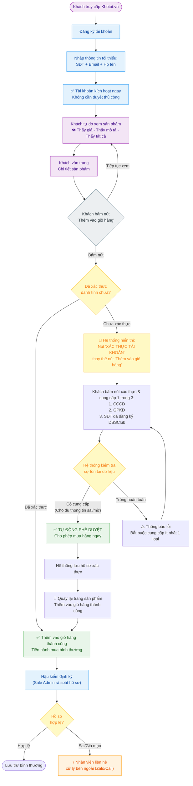

---
{"dg-publish":true,"permalink":"/01-tong-quan-ly-du-an/2-phong-van-hanh/sop-1-2-quy-trinh-dang-ky-xac-thuc-sd-v2/","title":"SOP 01.2 — QUY TRÌNH ĐĂNG KÝ & XÁC THỰC TÀI KHOẢN SD (v2 — ĐÃ BỊ THAY THẾ)","dg-note-properties":{"title":"SOP 01.2 — QUY TRÌNH ĐĂNG KÝ & XÁC THỰC TÀI KHOẢN SD (v2 — ĐÃ BỊ THAY THẾ)","status":"SUPERSEDED","version":"2.0-DRAFT","created":"2026-05-11","updated":"2026-05-18","author":"AI Antigravity (dựa theo đề xuất của Sếp)","superseded_by":"SOP_1.3_Quy_Trinh_SD_Vao_Web_v3.md"}}
---


> [!FAILURE]
> ## TÀI LIỆU ĐÃ BỊ THAY THẾ (SUPERSEDED)
> Tài liệu này **không còn hiệu lực** kể từ 2026-05-18.
> **Thay thế bởi:** [[01_TONG_QUAN_LY_DU_AN/2_PHONG_VAN_HANH/SOP_1.3_Quy_Trinh_SD_Vao_Web_v3\|SOP 01.3 — Phone-First, DSSClub-Verified (v3.0)]]
> **Lý do:** Cuộc họp Khotot.vn tháng 5 (2026-05-13) chọn phương án Phone-First DSSClub thay vì lazy-auth tại giỏ hàng.
> Giữ lại để tham khảo lịch sử quyết định.

---

# 📋 SOP 01.2 — QUY TRÌNH ĐĂNG KÝ & XÁC THỰC TÀI KHOẢN SD (Phiên bản Đề xuất v2)

> **Dự án:** Web ETZ — Khotot.vn
> **Phiên bản:** 2.0-DRAFT | **Ngày tạo:** 2026-05-11
> **Phòng ban:** Phòng Vận Hành
> **Trạng thái:** ĐỀ XUẤT — Chờ phê duyệt sau cuộc họp

---

## 🎯 TRIẾT LÝ THIẾT KẾ

> **"Đăng ký dễ — Mua hàng đúng người"**

| Giai đoạn | Nguyên tắc | Kết quả |
|---|---|---|
| **Đăng ký tài khoản** | Không rào cản, không yêu cầu giấy tờ | Tăng tỷ lệ đăng ký, thu hút đại lý mới nhanh |
| **Xem sản phẩm** | Tự do hoàn toàn — thấy giá, thấy mô tả, thấy tất cả | Không rào cản khám phá sản phẩm |
| **Thêm vào giỏ hàng** | 🔒 Cổng kiểm soát — bắt buộc xác thực danh tính | Đảm bảo chỉ đại lý đã xác thực mới mua được hàng |
| **Phê duyệt** | Tự động theo điều kiện | Không tạo bottleneck vận hành, trải nghiệm mua hàng trọn vẹn |

---

## 🔄 SƠ ĐỒ LUỒNG TỔNG QUAN



---

## 📝 CHI TIẾT TỪNG GIAI ĐOẠN

### GIAI ĐOẠN 1: ĐĂNG KÝ TÀI KHOẢN (Không rào cản)

**Mục tiêu:** Tối đa hóa tỷ lệ đăng ký — khách chỉ mất < 1 phút.

**Thông tin yêu cầu (tối thiểu):**
- Số điện thoại (dùng làm định danh chính)
- Email
- Họ và tên

**Không yêu cầu:** CCCD, GPKD, ảnh chân dung, địa chỉ chi tiết.

**Kết quả ngay lập tức:**
- Tài khoản được kích hoạt **ngay lập tức**, không cần chờ duyệt thủ công.
- Khách có thể **tự do xem toàn bộ website**: duyệt sản phẩm, xem giá, xem mô tả, xem chi tiết sản phẩm.

> 💡 **Lý do thiết kế:** Rào cản đăng ký cao là nguyên nhân số 1 khiến đại lý bỏ qua platform. Loại bỏ rào cản này giúp thu hút đại lý mới nhanh hơn.

---

### GIAI ĐOẠN 2: XÁC THỰC TẠI TRANG CHI TIẾT SẢN PHẨM (Cổng kiểm soát)

**Trigger:** Khách bấm nút **"Thêm vào giỏ hàng"** tại trang chi tiết sản phẩm.

**Cơ chế hoạt động của nút:**

| Trạng thái tài khoản | Nút hiển thị | Hành động khi bấm |
|---|---|---|
| **Đã xác thực** | `🛒 Thêm vào giỏ hàng` (bình thường) | Thêm vào giỏ hàng ngay |
| **Chưa xác thực** | `🔒 Xác thực tài khoản` (thay thế nút thêm giỏ) | Dẫn đến trang xác thực danh tính |

> 📌 **Điểm quan trọng:** Khách có thể xem toàn bộ trang chi tiết sản phẩm (hình ảnh, mô tả, giá) — chỉ **tại thời điểm muốn thêm vào giỏ hàng** mới yêu cầu xác thực.

**Thông tin cần xác thực (Chỉ cần 1 trong 3):**

| Tài liệu | Mức độ | Mục đích |
|---|---|---|
| **CCCD (2 mặt)** | Tùy chọn | Xác minh danh tính cá nhân |
| **GPKD / Chứng chỉ hành nghề** | Tùy chọn | Xác minh tư cách pháp nhân |
| **Số điện thoại đăng ký DSSClub** | Tùy chọn | Xác minh sự tín nhiệm cũ |

> 📌 **Lưu ý thiết kế:** Hệ thống chỉ kiểm tra **sự tồn tại** của thông tin. Khách hàng chỉ cần cung cấp ÍT NHẤT 1 trong 3 loại thông tin trên là được phép qua ải.

**Sau khi xác thực thành công:**
- Hệ thống phê duyệt tự động (xem Giai đoạn 3).
- Khách được quay lại trang sản phẩm và **thêm vào giỏ hàng ngay lập tức**.
- Từ đó trở đi, nút trở về trạng thái `🛒 Thêm vào giỏ hàng` bình thường — **không hỏi lại**.

> 💡 **Lý do chọn điểm trigger này:** Giúp khách biết sớm mình cần xác thực trước khi bỏ thời gian chọn nhiều sản phẩm — tránh trải nghiệm tệ khi bị chặn ở bước cuối cùng.

---

### GIAI ĐOẠN 3: PHÊ DUYỆT TỰ ĐỘNG (Frictionless)

**Nguyên tắc:** Mọi dữ liệu khách hàng cung cấp đều được hệ thống nhắm mắt cho qua ngay lập tức để đảm bảo trải nghiệm mua hàng không bị gián đoạn.

**Điều kiện phê duyệt tự động:**

```
NẾU khách hàng có cung cấp ÍT NHẤT 1 TRONG 3 thông tin (CCCD, GPKD, SĐT DSSClub):
  → TỰ ĐỘNG PHÊ DUYỆT → Cho phép hoàn tất đơn hàng NGAY.
  → KHÔNG QUAN TÂM thông tin đó có bị sai, mờ, hay giả mạo.

NẾU khách hàng KHÔNG cung cấp bất kỳ thông tin nào (để trống hoàn toàn):
  → CHẶN → Thông báo lỗi bắt buộc điền và không cho phép mua hàng.
```

**Kết quả:** Khách hàng hoàn tất đơn hàng **trong cùng một phiên** — trải nghiệm mua hàng trọn vẹn, tỷ lệ chốt sale tối đa.

---

### GIAI ĐOẠN 4: HẬU KIỂM & XỬ LÝ NGOÀI LUỒNG (Sale Admin)

**Nguyên tắc:** "Cho phép mua trước, rà soát lại sau". Sale Admin sẽ kiểm tra lại tính hợp lệ của hồ sơ sau khi hệ thống đã tự động phê duyệt.

**Quy trình Hậu kiểm:**
1. Định kỳ hàng ngày, Sale Admin lọc danh sách các tài khoản mới được tự động phê duyệt.
2. Kiểm tra bằng mắt thường hình ảnh CCCD, GPKD hoặc đối chiếu SĐT DSSClub trên hệ thống nội bộ.
3. **Nếu thông tin chính xác:** Hồ sơ lưu trữ bình thường.
4. **Nếu thông tin sai lệch, ảnh mờ, GPKD giả hoặc mượn:**
   - Hệ thống web **KHÔNG khóa hay chặn** tự động.
   - Sale Admin sẽ chủ động **liên hệ và xử lý bên ngoài** (gọi điện thoại, nhắn tin Zalo) để yêu cầu khách hàng bổ sung giấy tờ đúng chuẩn.
   - Việc mua hàng của khách vẫn được tiếp tục trong thời gian xử lý sự cố.

---

## 📊 SO SÁNH VỚI CHÍNH SÁCH CŨ (SOP 1.1)

| Tiêu chí | SOP 1.1 (Cũ) | SOP 1.2 (Đề xuất) |
|---|---|---|
| Yêu cầu khi đăng ký | CCCD bắt buộc ngay | Chỉ SĐT + Email + Tên |
| Xem giá / Chi tiết SP | Cần được duyệt trước | ✅ **Tự do hoàn toàn** |
| Điểm yêu cầu xác thực | Trước khi được duyệt | **Khi bấm "Thêm vào giỏ hàng"** |
| Điều kiện phê duyệt | Thủ công duyệt hình ảnh | ✅ **Tự động 100% (chỉ cần có điền)** |
| Xử lý dữ liệu sai/giả | Chặn không cho tạo tài khoản | ✅ **Cho qua để mua hàng → Hậu kiểm xử lý Zalo sau** |
| Trải nghiệm khách | Chờ duyệt, dễ bỏ cuộc | Mua hàng trọn vẹn không gián đoạn |
| Rủi ro & Quản trị | An toàn, nhưng rào cản cao | Đề cao doanh thu, đẩy rủi ro về xử lý hậu kiểm |

---

## ⚠️ CÁC ĐIỂM CẦN THẢO LUẬN TRONG CUỘC HỌP

> [!IMPORTANT]
> **Câu hỏi 1:** Có giới hạn hạn mức đơn hàng tối đa đối với các tài khoản mới tự động duyệt (chưa được hậu kiểm) không?

> [!IMPORTANT]
> **Câu hỏi 2:** SLA (Thời gian tối đa) để nhân viên Sale Admin phải hoàn thành hậu kiểm một tài khoản mới là bao lâu (vd: 24h)?

---

## 📎 TÀI LIỆU LIÊN QUAN

- [[01_TONG_QUAN_LY_DU_AN/2_PHONG_VAN_HANH/SOP_1_Quy_Trinh_Dang_Ky_Xac_Thuc_SD\|SOP-01: Đăng ký & Xác thực SD (v1)]]
- [[01_TONG_QUAN_LY_DU_AN/2_PHONG_VAN_HANH/SOP_1.1_Quy_Trinh_Duyet_Tai_Khoan_SD\|SOP-01.1: Duyệt tài khoản (DEPRECATED)]]
- [[01_TONG_QUAN_LY_DU_AN/2_PHONG_VAN_HANH/SOP_2_Quy_Trinh_Xuly_Don_Chuan_Khotot\|SOP-02: Xử lý đơn hàng chuẩn]]

---

*Phiên bản 2.0-DRAFT | Soạn thảo: 2026-05-11 | Dựa theo đề xuất của Sếp DSS*
