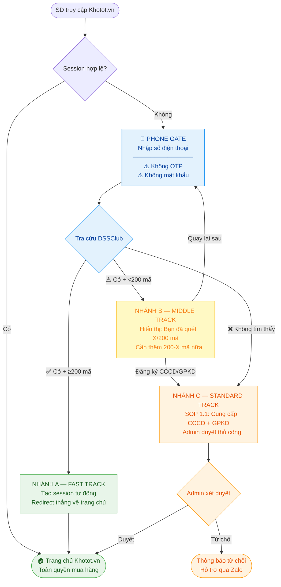

> [!SUCCESS]
> ## TRẠNG THÁI: ĐÃ PHÊ DUYỆT
> Quyết định từ cuộc họp Khotot.vn tháng 5 (2026-05-13).
> **Thay thế:** SOP 1.2 v2 (DRAFT — đã bị supersede).
> **SOP 1.1** vẫn còn hiệu lực — được dùng làm luồng đăng ký cho Nhánh B và C.

---

# SOP 01.3 — QUY TRÌNH TRUY CẬP WEB SD v3: PHONE-FIRST, DSSCLUB-VERIFIED

> **Dự án:** Web ETZ — Khotot.vn
> **Phiên bản:** 3.0 | **Ngày phê duyệt:** 2026-05-13
> **Phòng ban:** Phòng Vận Hành

---

## TRIẾT LÝ THIẾT KẾ

> **"Ai đã là của DSS (≥200 mã) → vào thẳng. Gần đủ (<200 mã) → hướng dẫn và cho lựa chọn. Người lạ → đăng ký chuẩn."**

Thay vì yêu cầu đăng ký, điền thông tin, hay xác thực bước giữa — hệ thống tra cứu ngay SĐT vào DSSClub. Người dùng đã chứng minh mối quan hệ với hệ sinh thái DSS qua 200+ lần quét mã không cần thêm bất kỳ thủ tục nào.

---

## TRIGGER

Mỗi lần SD truy cập Khotot.vn mà **không có session hợp lệ** trên trình duyệt.

---

## SƠ ĐỒ LUỒNG TỔNG QUAN



---

## CHI TIẾT CÁC BƯỚC

### BƯỚC 1 — PHONE GATE

**Giao diện:** Full-page screen (không phải modal) xuất hiện trước khi vào bất kỳ trang nào.

**Nội dung:**
- Tiêu đề: "Nhập số điện thoại để tiếp tục"
- Input: Số điện thoại (bắt buộc)
- Button: "Xác nhận"

**Quy tắc:**
- KHÔNG có OTP
- KHÔNG có mật khẩu
- KHÔNG yêu cầu thêm thông tin nào ở bước này
- Validation cơ bản: định dạng SĐT Việt Nam hợp lệ (10 số, bắt đầu 0)

---

### BƯỚC 2 — TRA CỨU DSSCLUB

Sau khi user bấm "Xác nhận", hệ thống tra cứu SĐT trong database DSSClub và phân nhánh theo 3 kết quả:

| Điều kiện | Nhánh | Kết quả |
|---|---|---|
| SĐT CÓ trong DSSClub **VÀ** số mã quét **≥ 200** | A — Fast Track | Vào thẳng web |
| SĐT CÓ trong DSSClub **NHƯNG** số mã quét **< 200** | B — Middle Track | Thông báo + 2 lựa chọn |
| SĐT **KHÔNG** tồn tại trong DSSClub | C — Standard Track | Đăng ký SOP 1.1 |

> **"200 mã"** = 200 mã seri sản phẩm đã quét trong ứng dụng DSSClub (còn gọi là E Chess Club). Đây là chỉ số xác nhận SD có mối quan hệ thực sự và lâu dài với hệ sinh thái DSS.

---

### NHÁNH A — FAST TRACK (DSSClub ≥ 200 mã)

**Điều kiện:** SĐT tồn tại trong DSSClub VÀ số mã quét ≥ 200.

**Hành động hệ thống:**
1. Tạo session với SĐT làm định danh chính
2. Gán trạng thái tài khoản: **"Đã xác thực"** (pre-verified)
3. Redirect thẳng vào homepage Khotot.vn

**Quyền hạn ngay lập tức (không cần thêm bước nào):**
- Xem toàn bộ sản phẩm, giá, mô tả
- Thêm vào giỏ hàng
- Đặt đơn hàng
- Thanh toán bình thường

**Zero friction — tuyệt đối không yêu cầu:**
- OTP
- Email hoặc họ tên
- CCCD hoặc GPKD
- Chờ admin duyệt

**Session management:**
- Không lưu cookie persistence sau khi tắt trình duyệt
- Mỗi phiên mới: nhập lại SĐT → hệ thống tra DSSClub lại
- Nếu SĐT vẫn còn ≥ 200 mã → vào thẳng (< 1 giây)
- Lý do không dùng cookie: bảo mật tối thiểu, tránh truy cập trái phép nếu mượn thiết bị

**Thông tin cần điền sau khi vào (tại checkout, không phải tại đây):**
- Địa chỉ giao hàng → hỏi khi đặt đơn lần đầu
- Thông tin xuất hóa đơn → hỏi nếu đơn > 5 triệu hoặc user yêu cầu

---

### NHÁNH B — MIDDLE TRACK (DSSClub có nhưng < 200 mã)

**Điều kiện:** SĐT tồn tại trong DSSClub NHƯNG số mã quét < 200.

**Giao diện hiển thị:**

```
┌─────────────────────────────────────────────────────┐
│  Bạn chưa đủ điều kiện truy cập ngay                │
│                                                     │
│  Bạn đã quét: [X] / 200 mã seri trong DSSClub      │
│  ████████░░░░░░░░░░░░░░░  [X/200]                   │
│                                                     │
│  Cần quét thêm [200-X] mã nữa trong app DSSClub    │
│  để được vào thẳng website.                         │
│                                                     │
│  [Quay lại khi đủ 200 mã]                           │
│  [Đăng ký ngay với CCCD/GPKD →]                    │
└─────────────────────────────────────────────────────┘
```

**Hai lựa chọn:**
1. **"Quay lại khi đủ 200 mã"** → Thoát, trở về Phone Gate. Quay lại sau khi quét đủ trong app DSSClub.
2. **"Đăng ký ngay với CCCD/GPKD"** → Chuyển sang luồng SOP 1.1 (đăng ký thủ công, chờ admin duyệt).

> **Lưu ý:** Lựa chọn 2 đưa user vào SOP 1.1 như người hoàn toàn mới — không có ưu tiên đặc biệt dù đã có trong DSSClub.

---

### NHÁNH C — STANDARD TRACK (Không có trong DSSClub)

**Điều kiện:** SĐT không tồn tại trong database DSSClub.

**Hành động:** Redirect sang quy trình đăng ký theo [[01_TONG_QUAN_LY_DU_AN/2_PHONG_VAN_HANH/SOP_1.1_Quy_Trinh_Duyet_Tai_Khoan_SD\|SOP 01.1]]:

1. Cung cấp **CCCD (số)** + **GPKD (giấy phép kinh doanh)**
2. Sale Admin thủ công xét duyệt hồ sơ (không có hạn mức thời gian cố định)
3. Sau khi được duyệt → nhận thông báo → truy cập web đầy đủ

---

## SO SÁNH VỚI CÁC PHIÊN BẢN CŨ

| Tiêu chí | SOP 1.1 (Cũ) | SOP 1.2 v2 (DRAFT — Bỏ) | **SOP 1.3 v3 (HIỆN TẠI)** |
|---|---|---|---|
| Điểm đầu vào | Đăng ký + CCCD/GPKD ngay | Đăng ký Phone+Email+Tên | **Phone Gate: chỉ SĐT** |
| Ai vào ngay? | Không ai (cần duyệt) | Không ai (cần auth tại giỏ hàng) | **DSSClub ≥200 mã → vào thẳng** |
| OTP | Zalo OTP | Zalo OTP | **Không OTP** |
| Xác thực | CCCD/GPKD bắt buộc ngay | Tại "Thêm vào giỏ hàng" | **Chỉ với người lạ (Nhánh C)** |
| Admin duyệt | Bắt buộc 100% | Tự động 100% | **Chỉ Nhánh B (chọn SOP 1.1) và C** |
| Hậu kiểm | Không | Sale Admin hằng ngày | **Tùy nghi — chỉ khi cần** |
| Trải nghiệm Fast Track | Không có | Không có | **< 3 giây từ SĐT đến trang chủ** |

---

## YÊU CẦU KỸ THUẬT (TODO cho đội Developer)

> [!WARNING]
> Phần này là yêu cầu kỹ thuật cần implement — không phải đặc tả UX.

| Hạng mục                          | Mô tả                                                                                                           | Ưu tiên       |
| --------------------------------- | --------------------------------------------------------------------------------------------------------------- | ------------- |
| **DSSClub API / DB sync**         | Endpoint hoặc database sync để tra cứu `(SĐT → scan_count)` theo real-time hoặc near real-time (cache ≤ 5 phút) | 🔴 Cao        |
| **Phone Gate middleware**         | Middleware chặn mọi route nếu không có session hợp lệ, redirect về Phone Gate                                   | 🔴 Cao        |
| **Session creation (Nhánh A)**    | Tạo server-side session với `phone_number` + `verified: true` sau khi pass DSSClub check                        | 🔴 Cao        |
| **Session expiry**                | Session hết hạn khi trình duyệt đóng (no cookie persistence) hoặc sau X giờ không hoạt động                     | 🟡 Trung bình |
| **Progress bar (Nhánh B)**        | Hiển thị `X / 200` với thanh tiến trình, số mã cần thêm                                                         | 🟡 Trung bình |
| **SOP 1.1 redirect (Nhánh B, C)** | Link/button chuyển sang form đăng ký SOP 1.1 hiện hành                                                          | 🟡 Trung bình |
| **Checkout — địa chỉ giao hàng**  | Hỏi địa chỉ giao hàng tại bước checkout lần đầu (không phải tại Phone Gate)                                     | 🟢 Thấp       |

---

## RỦI RO VÀ TRADE-OFF ĐÃ CHẤP NHẬN

| Rủi ro | Mức độ | Lý do chấp nhận |
|---|---|---|
| Ai biết SĐT người khác có thể đăng nhập thay | Thấp | Hàng bán B2B giá buôn — ít động cơ giả mạo; hậu kiểm xử lý nếu xảy ra |
| DSSClub data không đồng bộ real-time | Trung bình | Cache 5 phút chấp nhận được; người đạt 200 mã không mất status đột ngột |
| Người <200 mã bị chặn vào web | Thấp | Vẫn có Nhánh B → SOP 1.1 làm lối thoát thứ hai |

---

## TÀI LIỆU LIÊN QUAN

- [[01_TONG_QUAN_LY_DU_AN/2_PHONG_VAN_HANH/SOP_1.1_Quy_Trinh_Duyet_Tai_Khoan_SD\|SOP-01.1: Duyệt tài khoản SD (vẫn hiệu lực — dùng cho Nhánh B, C)]]
- [[01_TONG_QUAN_LY_DU_AN/2_PHONG_VAN_HANH/SOP_1.2_Quy_Trinh_Dang_Ky_Xac_Thuc_SD_v2\|SOP-01.2 v2: SUPERSEDED bởi SOP 1.3 này]]
- [[01_TONG_QUAN_LY_DU_AN/2_PHONG_VAN_HANH/SOP_2_Quy_Trinh_Xuly_Don_Chuan_Khotot\|SOP-02: Xử lý đơn hàng (áp dụng sau khi SD đã vào web)]]
- `01_TONG_QUAN_LY_DU_AN/10_MEETING/Khotot.vn tháng 5.md` — Biên bản họp phê duyệt

---

*Phiên bản 3.0 | Phê duyệt: 2026-05-13 | Soạn thảo: 2026-05-18 | AI Antigravity*
