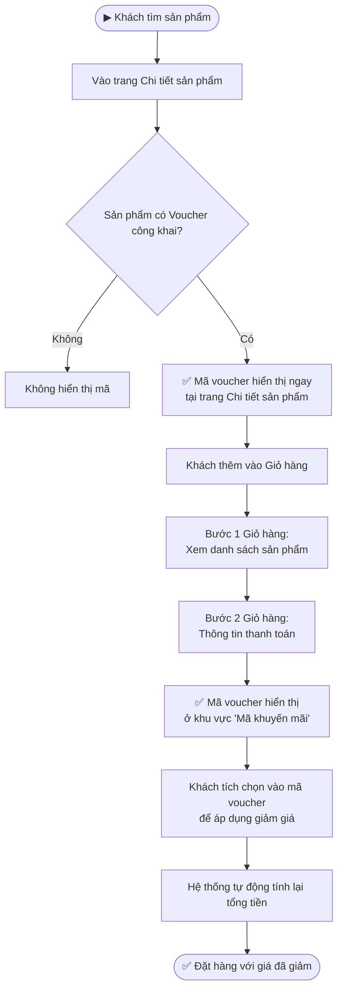
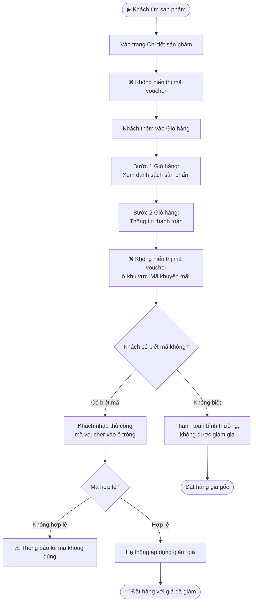
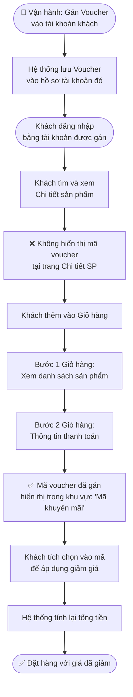

---
{"dg-publish":true,"permalink":"/01-tong-quan-ly-du-an/2-phong-van-hanh/sop-10-quan-ly-ma-voucher/","title":"SOP-10 | Quản lý Mã Voucher — Khotot.vn","dg-note-properties":{"title":"SOP-10 | Quản lý Mã Voucher — Khotot.vn","cap_nhat":"2026-05-07","loai":"SOP","phong_ban":"Vận Hành","he_thong":"md.khotot.vn"}}
---

# SOP-10 | Quản lý Mã Voucher (Discount Code)

> **Áp dụng cho:** Nhân viên/Admin vai trò MD & Vận hành tại `md.khotot.vn`
> **Phiên bản:** v1.0 | **Ngày tạo:** 07/05/2026
> **Nguồn:** Tổng hợp từ mô tả nghiệp vụ thực tế

---

## 🎯 Mục đích

Hướng dẫn vận hành hệ thống mã voucher giảm giá theo **3 chế độ**:
1. **Công khai** — Khách tự thấy và áp dụng mã
2. **Ẩn (Nội bộ)** — Khách không thấy mã, nhưng có thể nhập thủ công nếu biết
3. **Gán cho tài khoản** — Vận hành gán mã cho tài khoản cụ thể, khách tự kích hoạt

---

## 📌 Phân loại Chế độ Voucher

| Chế độ | Hiển thị trang SP | Hiển thị Giỏ hàng (B2) | Cách kích hoạt |
|---|---|---|---|
| 🟢 Công khai | ✅ Có | ✅ Có | Khách tích chọn tại B2 |
| 🔴 Ẩn (Nội bộ) | ❌ Không | ❌ Không | Khách nhập thủ công nếu biết mã |
| 🟡 Gán tài khoản | ❌ Không | ✅ Có (chỉ đúng TK) | Khách tích chọn tại B2 |

---

## 🔄 CHẾ ĐỘ 1: Voucher Công Khai

> Voucher được tạo ở chế độ **Công khai** — tất cả khách hàng đều có thể nhìn thấy và sử dụng.

**Tóm tắt hành trình:**
- Trang Chi tiết SP → **Thấy mã**
- Bước 2 Giỏ hàng → **Thấy mã, kích chọn để áp dụng**

---

## 🔄 CHẾ ĐỘ 2: Voucher Ẩn (Nội Bộ)

> Voucher được tạo ở chế độ **Ẩn** — chỉ dùng cho nội bộ hoặc phân phát kín. Khách không thể nhìn thấy mã ở bất kỳ đâu trên giao diện, nhưng nếu biết mã, họ vẫn có thể nhập thủ công để được giảm giá.

**Tóm tắt hành trình:**
- Trang Chi tiết SP → **Không thấy mã**
- Bước 2 Giỏ hàng → **Không thấy mã**
- Khách biết mã → **Nhập thủ công vào ô trống → được giảm giá**

> ⚠️ **Lưu ý:** Chế độ Ẩn thường dùng cho chương trình khuyến mãi nội bộ, ưu đãi khách VIP hoặc phân phát qua kênh Zalo/email riêng.

---

## 🔄 CHẾ ĐỘ 3: Voucher Gán Cho Tài Khoản

> Vận hành gán trực tiếp mã voucher vào **tài khoản cụ thể** của khách hàng. Khách không thấy mã ở trang sản phẩm, nhưng khi vào **Bước 2 Giỏ hàng**, mã sẽ tự động xuất hiện cho đúng tài khoản đó.

**Tóm tắt hành trình:**
- Trang Chi tiết SP → **Không thấy mã**
- Bước 2 Giỏ hàng → **✅ Thấy mã (chỉ đúng tài khoản được gán), kích chọn để áp dụng**

> 💡 **Gợi ý sử dụng:** Phù hợp để tạo ưu đãi cá nhân hóa cho từng khách hàng chiến lược, khách hàng thân thiết hoặc chiến dịch chăm sóc sau mua.

---

## 🛠️ Hướng Dẫn Vận Hành: Tạo & Gán Voucher

### Tạo Voucher Mới

| Bước | Thao tác |
|---|---|
| 1 | Đăng nhập Admin → vào **Marketing / Khuyến mãi → Voucher** |
| 2 | Nhấn **Tạo mới** |
| 3 | Điền thông tin: Tên mã, Mã code, % hoặc số tiền giảm, Ngày hiệu lực |
| 4 | Chọn **Chế độ hiển thị:** Công khai / Ẩn |
| 5 | Chọn **Áp dụng cho:** Tất cả SP / SP cụ thể / Danh mục |
| 6 | Lưu |

### Gán Voucher Cho Tài Khoản Cụ Thể

| Bước | Thao tác |
|---|---|
| 1 | Vào **Quản lý Tài khoản → Tìm tài khoản khách** |
| 2 | Mở hồ sơ tài khoản → Chọn tab **Voucher / Ưu đãi** |
| 3 | Nhấn **Gán Voucher** → Tìm và chọn mã voucher muốn gán |
| 4 | Xác nhận → Hệ thống ghi nhận voucher vào tài khoản |
| 5 | Thông báo cho khách (qua Zalo/email) biết họ có voucher |

---

## ⚠️ Lưu ý quan trọng

- **Mỗi chế độ voucher** phục vụ mục đích kinh doanh khác nhau — chọn đúng chế độ trước khi tạo
- **Voucher ẩn:** Cần chủ động truyền thông mã cho khách qua kênh ngoài hệ thống (Zalo, email)
- **Voucher gán TK:** Khách **bắt buộc phải đăng nhập** đúng tài khoản mới thấy được mã
- **Voucher công khai:** Rủi ro bị chia sẻ rộng rãi ngoài ý muốn — cần đặt giới hạn số lần sử dụng
- **Kiểm tra hiệu lực:** Xác nhận ngày bắt đầu & kết thúc voucher trước khi thông báo cho khách

---

## 📋 Bảng So Sánh Nhanh 3 Chế Độ

| Tiêu chí | 🟢 Công khai | 🔴 Ẩn (Nội bộ) | 🟡 Gán tài khoản |
|---|---|---|---|
| Thấy mã tại trang SP | ✅ | ❌ | ❌ |
| Thấy mã tại Bước 2 GH | ✅ | ❌ | ✅ (đúng TK) |
| Nhập mã thủ công | Không cần | ✅ (nếu biết mã) | Không cần |
| Phạm vi áp dụng | Tất cả KH | KH biết mã | TK được gán |
| Phù hợp dùng khi | Flash sale, KM lớn | Ưu đãi kín, nội bộ | Chăm sóc KH cá nhân |

---

## 📞 Liên quan

- [[01_TONG_QUAN_LY_DU_AN/2_PHONG_VAN_HANH/SOP_8_Quy_Trinh_Cap_Nhat_Gia_Ton_Kho\|SOP-08: Cập nhật Giá & Tồn kho]]
- [[01_TONG_QUAN_LY_DU_AN/2_PHONG_VAN_HANH/SOP_9_Quy_Trinh_Cap_Nhat_San_Pham_Moi\|SOP-09: Cập nhật Sản phẩm mới]]
- [[01_TONG_QUAN_LY_DU_AN/2_PHONG_VAN_HANH/SOP_5_Tao_Khuyen_Mai_Theo_Thoi_Gian\|SOP-05: Tạo Khuyến mãi theo Thời gian]]
