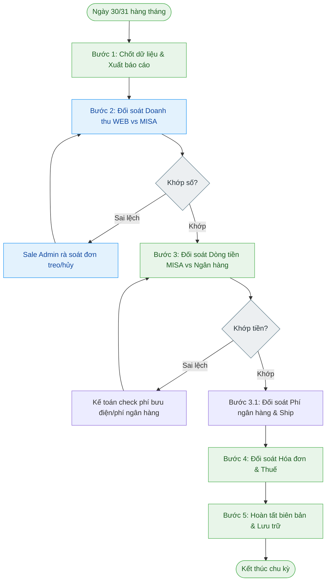

---
{"dg-publish":true,"permalink":"/01-tong-quan-ly-du-an/2-phong-van-hanh/sop-12-quy-trinh-doi-soat-ke-toan-hang-thang/","title":"SOP 12 — QUY TRÌNH ĐỐI SOÁT KẾ TOÁN HÀNG THÁNG","tags":["SOP","Kế toán","Đối soát","Vận hành"],"dg-note-properties":{"title":"SOP 12 — QUY TRÌNH ĐỐI SOÁT KẾ TOÁN HÀNG THÁNG","tags":["SOP","Kế toán","Đối soát","Vận hành"]}}
---

# 🛡️ SOP 12 — QUY TRÌNH ĐỐI SOÁT KẾ TOÁN HÀNG THÁNG

> **Dự án:** Web ETZ — Khotot.vn
> **Mục tiêu:** Đảm bảo khớp dữ liệu 100% giữa Website (Web Admin), Phần mềm kế toán (MISA), và Dòng tiền thực tế (Ngân hàng).
> **Phiên bản:** 1.0 | **Cập nhật:** 2026-04-10
> **Phòng ban:** Kế toán & Vận hành

---

## 🎯 MỤC TIÊU
- Kiểm soát doanh thu thực tế so với doanh thu ghi nhận trên hệ thống.
- Phát hiện và xử lý các đơn hàng lỗi, đơn hàng chưa thanh toán hoặc sai lệch công nợ.
- Đảm bảo tính pháp lý về hóa đơn điện tử cho 100% giao dịch thành công.

---

## 🔄 SƠ ĐỒ QUY TRÌNH (FLOWCHART)

---

## 📝 CHI TIẾT CÁC BƯỚC THỰC HIỆN

### 1. Giai đoạn 1: Chốt dữ liệu & Xuất báo cáo (Cut-off)
**Thời điểm:** Sau 17:00 ngày cuối cùng của tháng.
- **Kế toán:** Xuất báo cáo **Bán hàng chi tiết** theo ngày trên MISA (Lọc mã BH).
- **Sale Admin:** Xuất danh sách đơn hàng hoàn thành (Completed) trên **Web Admin Dashboard**.
- **Công cụ:** Excel/Google Sheet.

### 2. Giai đoạn 2: Đối soát Doanh thu (Web vs MISA)
- **Mục tiêu:** Đảm bảo mọi đơn hoàn thành trên Web đều đã được tạo mã BH trên MISA.
- **Thực hiện:**
    - So sánh **Mã đơn hàng** giữa Web và MISA.
    - Kiểm tra tổng giá trị doanh thu (sau giảm giá).
- **Xử lý sai lệch:** Nếu có đơn trên Web nhưng không có trên MISA, Sale Admin phải bổ sung hoặc giải trình lý do (ví dụ: đơn đổi hàng ngoài hệ thống).

### 3. Giai đoạn 3: Đối soát Dòng tiền & Chi phí liên quan
- **Mục tiêu:** Khớp dòng tiền thực tế thu về và kiểm soát các chi phí giao dịch/vận hành đơn hàng.
- **3.1. Đối soát Phí giao dịch (Bank/SePay fees):**
    - So khớp tổng số tiền của các mã đơn **BH** trên MISA với số dư tăng thêm trên tài khoản Ngân hàng.
    - Khấu trừ biểu phí dịch vụ (SePay/Phí chuyển khoản) để khớp số dư Net.
- **3.2. Đối soát Phí vận chuyển (Shipment fees):**
    - Tập hợp danh sách mã vận đơn (Waybill) đã giao thành công trong tháng.
    - Đối chiếu phí ship thực tế bưu điện (Viettel Post) thu với số tiền phí ship đã thu của khách trên đơn hàng.
    - Ghi nhận chênh lệch phí ship (nếu có) vào báo cáo chi phí vận hành.
- **Lưu ý:** Nếu có đơn đã giao nhưng tiền chưa về (đơn Viettel Post đang đối soát phí), Kế toán ghi nhận vào danh sách **"Công nợ đang treo"**.

### 4. Giai đoạn 4: Đối soát Hóa đơn & Thuế
- **Mục tiêu:** Đảm bảo tính pháp lý.
- **Thực hiện:**
    - Đối chiếu danh sách đơn BH đã hoàn tất với danh sách hóa đơn điện tử đã phát hành.
    - Đảm bảo 100% đơn hàng khách hàng yêu cầu hóa đơn đều đã được gửi link HĐĐT.
    - Rà soát các biên bản hủy hóa đơn (nếu có đơn bị trả hàng/hoàn tiền trong tháng).

### 5. Giai đoạn 5: Hoàn tất biên bản & Báo cáo tổng hợp
- Lập **Biên bản đối soát tháng** (Theo mẫu 08-BBDS).
- **Báo cáo Lợi nhuận Net:** Tổng doanh thu - [Giá vốn hàng bán + Phí ngân hàng + Phí vận chuyển].
- Chốt số dư tồn kho cuối tháng trên MISA để đối chiếu với Kho thực tế.
- Lưu trữ file Excel đối soát vào thư mục: `Nam_2026/Thang_X`.

---

## ⚠️ LƯU Ý QUAN TRỌNG
- **Nguyên tắc "Đơn nào, Tiền nấy":** Tuyệt đối không gộp chung nhiều tháng khi đối soát.
- **Xử lý hoàn tiền:** Các đơn hàng hoàn tiền (Refund) theo [SOP 07](SOP_07_Xu_Ly_Khieu_Nai_Hoan_Tra) phải có chứng từ hoàn tiền đính kèm vào báo cáo đối soát tháng.
- **Thời hạn:** Hoàn tất đối soát trước ngày 05 của tháng kế tiếp.

---
*Tài liệu này là quy chuẩn đối soát chính thức của bộ phận Kế toán Web ETZ.*
