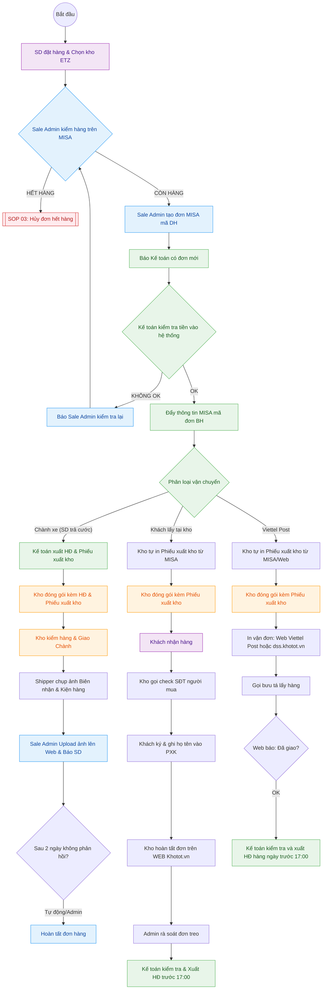

---
{"dg-publish":true,"permalink":"/01-tong-quan-ly-du-an/2-phong-van-hanh/sop-2-0-xu-ly-don-hang-chuan-1/","title":"SOP 01 — QUY TRÌNH XỬ LÝ ĐƠN HÀNG (ĐA LUỒNG)","dg-note-properties":{"title":"SOP 01 — QUY TRÌNH XỬ LÝ ĐƠN HÀNG (ĐA LUỒNG)"}}
---

# 📦 SOP 02 — QUY TRÌNH XỬ LÝ ĐƠN HÀNG

> **Dự án:** Web ETZ — Khotot.vn
> **Phiên bản:** 2.0 | **Cập nhật:** 2026-04-06
> **Phòng ban:** Phòng Vận Hành
> **Vùng dữ liệu:** Zone 01 — Tổng Hành Dinh

---

## 🎯 MỤC TIÊU
Đảm bảo mọi đơn hàng được xử lý chính xác thông qua hệ thống MISA, phân rõ vai trò giữa Sale Admin, Kế toán và Kho, đảm bảo tính pháp lý hóa đơn và dòng tiền.

---

## 🔄 SƠ ĐỒ PHỐI HỢP 

---

## 👁️ CHI TIẾT CÁC GIAI ĐOẠN

### 1. GIAI ĐOẠN 1: KHÁCH HÀNG (SD) ĐẶT HÀNG
- SD chọn sản phẩm và chọn **Kho ETZ Miền Nam** (lộ trình giai đoạn 1).
- Chọn hình thức: Thanh toán, Phương thức vận chuyển, và **Yêu cầu xuất hóa đơn**.

### 2. GIAI ĐOẠN 2: SALE ADMIN KIỂM TRA & TẠO ĐƠN
- Sale Admin tiếp nhận thông tin đơn hàng từ Dashboard.
- **Kiểm tra trên MISA:** Xác định tồn kho vật lý và khớp lệnh trên phần mềm MISA.
- **Tình huống Hết hàng:** Chuyển ngay sang quy trình xử lý tại [[01_TONG_QUAN_LY_DU_AN/2_PHONG_VAN_HANH/SOP_3_Huy_Don_Het_Hang\|SOP 02: Hủy đơn hết hàng]].
- **Tình huống Còn hàng:** 
    1. Tạo đơn hàng trên MISA với **mã đơn DH**.
    2. Thông báo cho bộ phận Kế toán có đơn hàng mới cần kiểm tra thanh toán.

### 3. GIAI ĐOẠN 3: KẾ TOÁN KIỂM TRA TIỀN & PHÊ DUYỆT (BH)
- Kế toán tiếp nhận thông báo từ Sale Admin.
- **Kiểm tra thanh toán:** Xác nhận tiền đã vào hệ thống (SePay hoặc Chuyển khoản).
- **Phê duyệt:** 
    - Nếu **OK**: Đẩy thông tin qua MISA với **mã đơn BH**. Đây là lệnh cho phép Kho bắt đầu đóng gói hàng.
    - Nếu **KHÔNG OK**: Báo Sale Admin kiểm tra lại với khách hàng hoặc hệ thống.
- **Phân loại vận chuyển:** Dựa trên phương thức vận chuyển của đơn hàng để thực hiện xuất hóa đơn (như quy trình tại Giai đoạn 4).

### 4. GIAI ĐOẠN 4: PHÂN LUỒNG HÓA ĐƠN & VẬN CHUYỂN

| Hình thức | Kế toán (Hóa đơn) | Kho (Đóng gói & Giao) | Sale Admin (Hoàn tất đơn) |
|---|---|---|---|
| **Chành xe** | Sau khi tạo mã BH, xuất HĐ & Phiếu xuất kho ngay. | **Bắt buộc** kèm HĐ & Phiếu xuất kho. Giao xong phải chụp ảnh biên nhận báo ngay cho Admin. | **Thủ công:** Upload ảnh lên Web. **Quy tắc 2 ngày:** Tự động hoàn tất nếu khách không khiếu nại. |
| **Lấy tại kho** | Kiểm tra tình trạng, xuất HĐ trước 17:00 cho đơn hoàn thành. | **Tự in Phiếu xuất kho.** Đóng gói, gọi check SĐT khách, **Khách ký & ghi họ tên**, Hoàn tất trên Web. | **Rà soát:** Kiểm tra đơn khách chưa lấy, báo Kho đối chiếu (tránh quên đơn). |
| **Viettel Post** | Cuối ngày (trước 17:00), kiểm tra API báo *Đã giao thành công*. | **Tự in Phiếu xuất kho.** Đóng gói, In vận đơn & Gọi bưu tá (Web VT/Khotot). | **Tự động:** Hệ thống tự đổi trạng thái dựa theo API nhà vận chuyển. |

---

## 📊 KPI THEO DÕI
- **Sale Admin:** Tốc độ tạo đơn DH trên MISA (< 30 phút từ khi có đơn Web). Chịu trách nhiệm theo dõi thông tin từ Kho để hoàn tất đơn hàng thủ công (tránh đơn treo).
- **Kế toán:** Kiểm tra tiền và đẩy mã BH kịp thời để Kho đóng gói. Mọi đơn Viettel Post thành công phải được xuất HĐ trước 17:00 hàng ngày.
- **Kho:** Tuyệt đối không đóng gói hàng khi chưa có mã BH trên MISA. Báo cáo Sale Admin ngay sau khi hàng rời kho/khách lấy hàng.

---
---

## 👁️ IV. CHI TIẾT GIAO HÀNG CHÀNH XE (ĐẶC THÙ)

Đối với các đơn hàng SD yêu cầu gửi qua nhà xe/xe khách:

1.  **Hồ sơ đi đường:** Kế toán phải hoàn tất **Hóa đơn** và **Phiếu xuất kho** trước khi hàng rời kho để đảm bảo tính pháp lý và đối soát sản phẩm khi nhà xe giao hàng.
2.  **Đóng gói & Nhãn:** Kho dán nhãn khổ lớn ghi rõ: *Tên SD - SĐT SD - Tên Chành - Nơi đến*.
3.  **Xác thực giao hàng (Bằng chứng):**
    - Shipper nội bộ lấy **Biên nhận (Vận đơn)** từ nhà xe.
    - Chụp ảnh thùng hàng đã đặt tại văn phòng Chành và ảnh Biên nhận rõ mã số liên hệ.
4.  **Thông báo & Thanh toán cước:**
    - Sale Admin upload ảnh bằng chứng lên Web để SD yên tâm.
    - **Lưu ý thanh toán:** SD (Người nhận) có trách nhiệm tự thanh toán tiền cước vận chuyển trực tiếp cho nhà xe khi nhận hàng.
5.  **Quy tắc hoàn tất & Miễn trừ trách nhiệm:**
    - Sau **02 ngày** kể từ khi Kho xác nhận đã gửi hàng (upload biên nhận), nếu khách hàng không phản hồi, đơn hàng được xem là đã nhận thành công.
    - Khotot sẽ **không chịu trách nhiệm** về bất kỳ khiếu nại nào liên quan đến hàng hóa sau thời hạn 02 ngày này.
    - Hệ thống sẽ tự động chuyển trạng thái hoặc Sale Admin thực hiện cập nhật thủ công thành "Hoàn thành".

---

## 👁️ V. CHI TIẾT GIAO HÀNG VIETTEL POST (THỰC TẾ)

Quy trình xử lý cho các đơn hàng vận chuyển qua bưu cục Viettel Post:

1.  **Chuẩn bị hồ sơ:** Ngay khi có mã **BH** trên MISA/Web, Kho chủ động in **Phiếu xuất kho** từ hệ thống nội bộ.
2.  **Đóng gói:** 
    - Kiểm tra hàng hóa đúng chủng loại, số lượng.
    - Đặt Phiếu xuất kho vào bên trong kiện hàng trước khi đóng băng keo.
3.  **Tạo vận đơn:**
    - Truy cập vào **Web Viettel Post** hoặc **dss.khotot.vn** (tùy chọn tiện lợi).
    - Nhập thông tin đơn hàng, chọn dịch vụ và **In vận đơn (Waybill)**.
    - Dán vận đơn chắc chắn lên mặt ngoài thùng hàng.
4.  **Bàn giao vận chuyển:**
    - Sử dụng chức năng "Gọi bưu tá" trên Web hoặc liên hệ Hotline bưu tá khu vực để lấy hàng.
    - Ký nhận bàn giao (nếu có) và theo dõi trạng thái "Đang vận chuyển" trên hệ thống.

---

## 👁️ VI. CHI TIẾT KHÁCH LẤY TẠI KHO (THỰC TẾ)

Quy trình xử lý cho các đơn hàng Khách hàng (SD) trực tiếp đến nhận tại kho:

1.  **Chuẩn bị hàng:** Ngay khi có mã **BH**, Kho chủ động in **Phiếu xuất kho** từ hệ thống MISA và đóng gói hàng sẵn.
2.  **Xác minh khách hàng:** 
    - Khi khách tới nhận, Kho yêu cầu cung cấp mã đơn hàng.
    - **Bắt buộc:** Kho thực hiện cuộc gọi vào số điện thoại người mua ghi trên đơn để xác nhận đúng người hoặc đúng đối tượng được ủy quyền nhận hàng.
3.  **Hoàn tất tại chỗ:**
    - Sau khi verify SĐT, Kho yêu cầu khách hàng **ký và ghi rõ họ tên** vào Phiếu xuất kho để làm bằng chứng đối soát.
    - Giao hàng xong, Kho truy cập **Web Khotot.vn** để chuyển trạng thái "Hoàn thành" cho đơn hàng ngay lập tức.
4.  **Kiểm soát & Hóa đơn:**
    - **Sale Admin:** Cuối buổi rà soát danh sách đơn "Chờ nhận hàng". Nếu còn đơn treo quá lâu, phải báo ngay cho Kho để kiểm tra xem khách chưa tới hay Kho quên cập nhật trên Web.
    - **Kế toán:** Kiểm tra danh sách đơn đã "Hoàn thành" (bao gồm cả Viettel Post và Lấy tại kho) để thực hiện xuất hóa đơn điện tử hàng loạt trước 17:00 hàng ngày.
