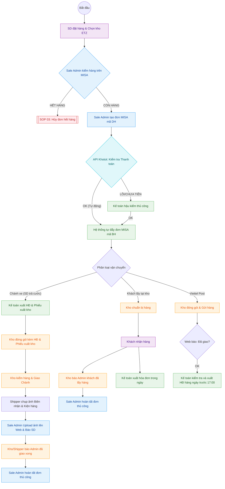

---
{"dg-publish":true,"permalink":"/01-tong-quan-ly-du-an/2-phong-van-hanh/sop-2-0-xu-ly-don-hang-chuan-2/","title":"SOP 01 — QUY TRÌNH XỬ LÝ ĐƠN HÀNG (ĐA LUỒNG)","dg-note-properties":{"title":"SOP 01 — QUY TRÌNH XỬ LÝ ĐƠN HÀNG (ĐA LUỒNG)"}}
---

# 📦 SOP 02 — QUY TRÌNH XỬ LÝ ĐƠN HÀNG (ĐA LUỒNG)

> **Dự án:** Web ETZ — Khotot.vn
> **Phiên bản:** 2.0 | **Cập nhật:** 2026-04-06
> **Phòng ban:** Phòng Vận Hành
> **Vùng dữ liệu:** Zone 01 — Tổng Hành Dinh

---

## 🎯 MỤC TIÊU
Đảm bảo mọi đơn hàng được xử lý chính xác thông qua hệ thống MISA, phân rõ vai trò giữa Sale Admin, Kế toán và Kho, đảm bảo tính pháp lý hóa đơn và dòng tiền.

---

## 🔄 SƠ ĐỒ PHỐI HỢP (SWIMLANE FLOWCHART)

---

## 👁️ CHI TIẾT CÁC GIAI ĐOẠN

### 1. GIAI ĐOẠN 1: KHÁCH HÀNG (SD) ĐẶT HÀNG
- SD chọn sản phẩm và chọn **Kho ETZ Miền Nam** (lộ trình giai đoạn 1).
- Chọn hình thức: Thanh toán, Phương thức vận chuyển, và **Yêu cầu xuất hóa đơn**.

### 2. GIAI ĐOẠN 2: SALE ADMIN KIỂM TRA & TẠO ĐƠN
- Sale Admin tiếp nhận thông tin đơn hàng từ Dashboard.
- **Kiểm tra trên MISA:** Xác định tồn kho vật lý và khớp lệnh trên phần mềm MISA.
- **Tình huống Hết hàng:** Chuyển ngay sang quy trình xử lý tại [[01_TONG_QUAN_LY_DU_AN/2_PHONG_VAN_HANH/SOP_3_Huy_Don_Het_Hang\|SOP 02: Hủy đơn hết hàng]].
- **Tình huống Còn hàng:** 
    1. Tạo đơn hàng trên MISA với **mã đơn DH**.
    2. Thông báo cho bộ phận Kế toán có đơn hàng mới cần kiểm tra thanh toán.

### 3. GIAI ĐOẠN 3: TỰ ĐỘNG XÁC MINH THANH TOÁN & PHÊ DUYỆT (BH)
- **Hệ thống Web (API):** Tự động liên kết với ngân hàng/cổng thanh toán để xác nhận tiền vào dựa trên mã đơn hàng.
- **Tự động Phê duyệt:** 
    - Nếu **OK**: Hệ thống tự động đẩy thông tin qua MISA với **mã đơn BH**. Kho nhận lệnh xuất hàng ngay lập tức mà không cần chờ kế toán.
    - Nếu **LỖI/CHƯA TIỀN:** Kế toán mới tham gia hậu kiểm thủ công để xử lý các trường hợp treo.
- **Tối ưu hóa:** Bỏ qua các bước xác nhận thủ công giữa chừng để tăng tốc đóng gói (Kho có thể làm việc ngay khi có đơn BH).

| Hình thức | Kế toán (Hóa đơn) | Kho (Đóng gói & Giao) | Sale Admin (Hoàn tất đơn) |
|---|---|---|---|
| **Chành xe** | Sau khi tạo mã BH, xuất HĐ & Phiếu xuất kho ngay. | **Bắt buộc** kèm HĐ & Phiếu xuất kho. Giao xong chụp ảnh biên nhận báo Admin. | **Thủ công:** Upload ảnh biên nhận -> Hoàn tất đơn trên Web. |
| **Lấy tại kho** | Xuất linh hoạt bất kỳ lúc nào trong ngày. | Chuẩn bị hàng sẵn. Khách lấy hàng xong báo ngay cho Admin. | **Thủ công:** Xác nhận từ Kho -> Hoàn tất đơn trên Web. |
| **Viettel Post** | Cuối ngày (trước 17:00), kiểm tra API báo *Đã giao thành công*. | Đóng gói theo chuẩn, gửi hàng cho bưu tá. | **Tự động:** Hệ thống tự đổi trạng thái dựa theo API nhà vận chuyển. |

---

## 📊 KPI THEO DÕI
- **Sale Admin:** Tốc độ tạo đơn DH trên MISA (< 30 phút từ khi có đơn Web). Theo dõi chặt chẽ trạng thái từ Kho để hoàn tất đơn kịp thời.
- **Kế toán:** Đảm bảo mọi đơn hàng đã rời kho trong ngày đều được xuất hóa đơn VAT trước 17:30. Tỷ lệ sai sót mã BH tự động < 1%.
- **Kho:** Đóng gói và giao hàng ngay khi có mã BH. Báo cáo trạng thái giao hàng tức thời cho Sale Admin.

---
---

## 👁️ IV. CHI TIẾT GIAO HÀNG CHÀNH XE (ĐẶC THÙ)

Đối với các đơn hàng SD yêu cầu gửi qua nhà xe/xe khách:

1.  **Hồ sơ đi đường:** Kế toán phải hoàn tất **Hóa đơn** và **Phiếu xuất kho** trước khi hàng rời kho để đảm bảo tính pháp lý và đối soát sản phẩm khi nhà xe giao hàng.
2.  **Đóng gói & Nhãn:** Kho dán nhãn khổ lớn ghi rõ: *Tên SD - SĐT SD - Tên Chành - Nơi đến*.
3.  **Xác thực giao hàng (Bằng chứng):**
    - Shipper nội bộ lấy **Biên nhận (Vận đơn)** từ nhà xe.
    - Chụp ảnh thùng hàng đã đặt tại văn phòng Chành và ảnh Biên nhận rõ mã số liên hệ.
4.  **Thông báo & Thanh toán cước:**
    - Sale Admin upload ảnh bằng chứng lên Web để SD yên tâm.
    - **Lưu ý thanh toán:** SD (Người nhận) có trách nhiệm tự thanh toán tiền cước vận chuyển trực tiếp cho nhà xe khi nhận hàng.
