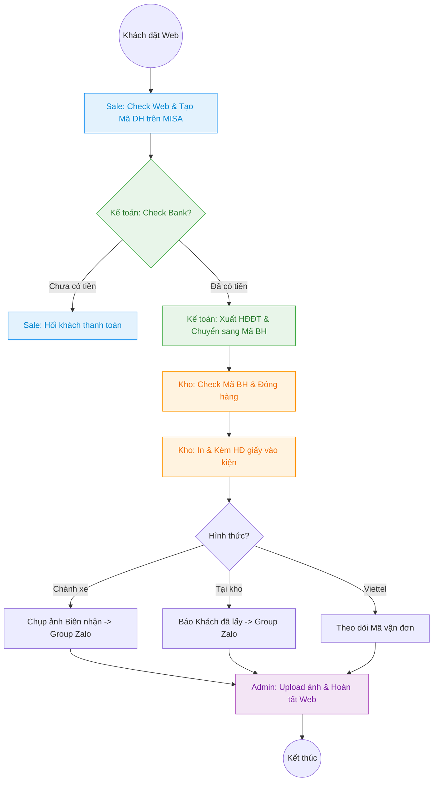

---
{"dg-publish":true,"permalink":"/01-tong-quan-ly-du-an/2-phong-van-hanh/sop-2-10-quy-trinh-ap-dung-thuc-te/","title":"SOP 2.10 — Quy Trình Vận Hành Thực Tế (Sale - Kế toán - Kho)","tags":["SOP","vận-hành","phối-hợp","MISA","Web"],"dg-note-properties":{"title":"SOP 2.10 — Quy Trình Vận Hành Thực Tế (Sale - Kế toán - Kho)","tags":["SOP","vận-hành","phối-hợp","MISA","Web"],"created":"2026-04-06","version":"1.1"}}
---

# 📦 SOP 2.10 — QUY TRÌNH VẬN HÀNH THỰC TẾ (WEB - MISA - KHO)

> **Mục tiêu:** Chuẩn hóa phối hợp giữa Sale, Kế toán, và Kho. Đảm bảo 100% đơn hàng được kiểm soát dòng tiền, xuất hóa đơn đúng quy định và minh chứng giao hàng rõ ràng.

---

## 🛠️ I. PHÂN ĐỊNH VAI TRÒ & CÔNG CỤ (ROLES & TOOLS)

| Bộ phận | Trách nhiệm chính | Công cụ sử dụng |
|---|---|---|
| **Sale / Web Admin** | Tiếp nhận đơn Web, check tồn, đẩy đơn lên MISA | Web Admin, MISA (Mã DH), Zalo |
| **Kế toán** | Xác nhận tiền/công nợ, **Xuất hóa đơn**, duyệt lệnh xuất | MISA, Bank App, E-Invoice Portal |
| **Kho** | Đóng gói, **Kèm HĐ giấy**, giao hàng & tác nghiệp ảnh | MISA (Mã BH), Zalo (Gửi ảnh) |
| **Admin Điều phối** | Giám sát hình ảnh, đối soát và đóng đơn trên Web | Web Admin, Zalo (Lấy ảnh) |

---

## 🔄 II. SƠ ĐỒ TỔNG QUÁT TÍCH HỢP HÓA ĐƠN

---

## ✍️ III. THAO TÁC CHI TIẾT TỪNG BỘ PHẬN

### 1. Sale / Web Admin (Tiếp nhận & Khởi tạo)
- **Thời gian:** Real-time (Ngay khi có đơn).
- **Thao tác:**
    1. Kiểm tra đơn mới trên Web Admin.
    2. Đối soát tồn kho thực tế trên MISA.
    3. Tạo đơn hàng (Mã DH) trên MISA.
    4. **Thông báo cho Kế toán:** Nhắn tin mã đơn/tên khách vào Group Zalo để kế toán check bank.

### 2. Kế toán (Kiểm soát & Xuất hóa đơn)
- **Thời gian:** Sáng (08:30 - 10:30) | Chiều (13:30 - 15:30).
- **Thao tác:**
    1. Kiểm tra biến động số dư Bank hoặc hạn mức công nợ SD.
    2. **Xuất hóa đơn điện tử (HĐĐT):** Thực hiện cho 100% đơn hàng đã thanh toán/hợp lệ công nợ.
    3. **Lệnh xuất kho:** Trên MISA, chuyển trạng thái từ **Mã DH** (Đơn hàng) sang **Mã BH** (Bán hàng).
    4. Gửi link HĐĐT vào Group Zalo hoặc báo Kho *"Đã duyệt Mã BH [Số mã] - Xuất hóa đơn giấy"*.

### 3. Bộ phận Kho (Đóng gói & Minh chứng)
- **Thời gian:** 10:30 - 11:30 | 15:30 - 17:00.
- **Thao tác:**
    1. Kiểm tra danh sách **Mã BH** trên MISA. (Tuyệt đối không xuất khi còn ở Mã DH).
    2. Chuẩn bị hàng, kiểm tra số lượng/chất lượng.
    3. **In hóa đơn giấy:** In từ hệ thống (nếu có yêu cầu) và đính kèm chắc chắn vào kiện hàng.
    4. **Tác nghiệp hình ảnh:** 
        - **Giao Chành:** Chụp ảnh kiện hàng gắn nhãn + Biên nhận nhà xe.
        - **Tại kho:** Chụp ảnh khách nhận hàng/Ký phiếu.
    5. Gửi toàn bộ ảnh vào Group Zalo nội bộ.

### 4. Admin Điều phối (Đối soát & Đóng đơn)
- **Thao tác:**
    1. Lấy ảnh minh chứng từ Group Zalo.
    2. Cập nhật thông tin giao hàng lên Web Admin Panel.
    3. Chuyển trạng thái đơn sang **"Hoàn tất"**.
    4. Lưu trữ hình ảnh theo thư mục ngày tháng (nếu cần đối soát sau này).

---

## 📏 IV. KPI & LƯU Ý QUAN TRỌNG

1. **Quy tắc Vàng MISA:** Tuyệt đối không xuất kho khi đơn còn ở Mã DH. Chỉ xuất khi đã chuyển sang **Mã BH**.
2. **Thời gian vàng:**
    - Đơn sáng (trước 10:30): Ra khỏi kho trước 14:00 cùng ngày.
    - Đơn chiều (trước 15:30): Ra khỏi kho trước 09:00 sáng mai.
3. **Hình ảnh minh chứng:** 100% đơn Chành xe phải có ảnh biên nhận gửi vào Group Zalo. Ảnh phải rõ số điện thoại nhà xe và tên người nhận trên kiện hàng.
4. **Hóa đơn:** 100% đơn hàng phải được xuất HĐĐT đúng quy định của Kế toán.

---
*Tham khảo: [[01_TONG_QUAN_LY_DU_AN/2_PHONG_VAN_HANH/SOP_2_Xu_Ly_Don_Hang_Chuan\|SOP 2]] & [[01_TONG_QUAN_LY_DU_AN/2_PHONG_VAN_HANH/SOP_2.3_Quy_Trinh_XuLy_Don_Hang_Truyen_Thong_Chi_Tiet\|SOP 2.3]]*
