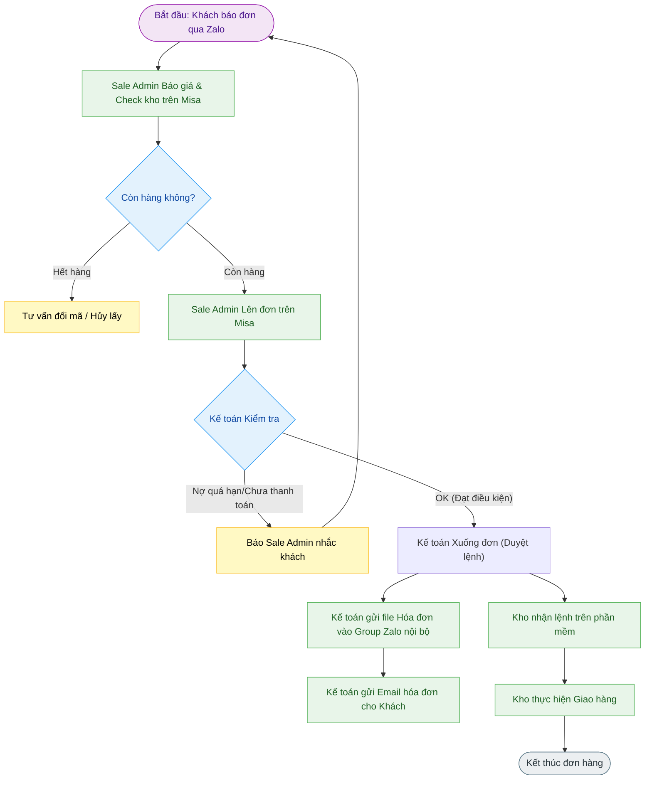

---
{"dg-publish":true,"permalink":"/01-tong-quan-ly-du-an/2-phong-van-hanh/sop-2-1-quy-trinh-mua-hang-truyen-thong/","title":"SOP 2.1 — QUY TRÌNH MUA HÀNG TRUYỀN THỐNG (CHƯA CÓ WEB)","dg-note-properties":{"title":"SOP 2.1 — QUY TRÌNH MUA HÀNG TRUYỀN THỐNG (CHƯA CÓ WEB)"}}
---

# 📦 SOP 2.1 — QUY TRÌNH MUA HÀNG TRUYỀN THỐNG (CHƯA CÓ WEB)

> **Dự án:** Web ETZ — Khotot.vn
> **Bối cảnh:** Quy trình vận hành hiện tại qua Zalo & Misa dành cho Sub-Dealer khi chưa áp dụng hệ thống Web tự động.
> **Phiên bản:** 1.0 | **Cập nhật:** 2026-04-02

---

## 🎯 MỤC TIÊU
Ghi nhận và chuẩn hóa quy trình mua hàng hiện tại để làm cơ sở đối soát, đào đạo nhân sự và chuyển đổi sang hệ thống Web ETZ.

---

## 🔄 SƠ ĐỒ QUY TRÌNH (FLOWCHART)

---

## 📝 CHI TIẾT CÁC BƯỚC THỰC HIỆN

### 1. Tiếp nhận & Xử lý thông tin (Sale Admin)
- **Kênh tiếp nhận:** Khách hàng báo đơn hàng trực tiếp qua Zalo cho Sale/Sale Admin.
- **Kiểm tra tồn kho:** Sale Admin sử dụng phần mềm **Misa** để check tồn kho thực tế.
- **Tư vấn:** 
    - Nếu hết hàng: Chủ động báo khách để đổi mã sản phẩm hoặc xác nhận hủy.
    - Nếu còn hàng: Tiến hành báo giá và xác nhận số lượng.
- **Thao tác hệ thống:** Sale Admin thực hiện **"Lên đơn"** trên phần mềm Misa.

### 2. Kiểm soát Tài chính & Duyệt đơn (Kế toán)
- **Kiểm tra công nợ:** Kế toán vào hệ thống Misa check các đơn mới tạo.
- **Điều kiện xuống đơn:**
    - Kiểm tra hạn mức công nợ hoặc xác nhận tiền đã về tài khoản (nếu thanh toán trước).
    - Nếu có đơn nợ quá hạn: Kế toán báo Sale Admin qua Group làm việc để nhắc khách thanh toán trước khi đi hàng.
- **Duyệt lệnh:** Nếu mọi thông tin tài chính OK, Kế toán thực hiện **"Xuống đơn"** (Duyệt lệnh xuất kho).

### 3. Chứng từ & Phối hợp (Group Zalo nội bộ)
- **Chứng từ:** Kế toán gửi file xuất hóa đơn vào Group Zalo chung (nhóm Sale Admin & Kế toán).
- **Gửi khách:** Kế toán trực tiếp gửi Email file hóa đơn cho khách hàng đối soát.
- **Phối hợp Kho:** Kế toán báo trực tiếp qua Group (Kế toán & Kho) về tình trạng đơn hàng có được phép đi hay không.

### 4. Giao nhận (Kho)
- **Nhận lệnh:** Kho theo dõi lệnh xuất trên phần mềm sau khi Kế toán đã duyệt.
- **Thực hiện:** Kho phụ trách quy trình đóng gói và giao hàng theo lệnh đã duyệt.

---

## 📊 CÁC NHÓM LÀM VIỆC (ZALO GROUPS)
Hệ thống vận hành hiện tại dựa trên sự phối hợp chặt chẽ qua các Group Zalo:
1. **Group Sale & Sale Admin:** Tiếp nhận yêu cầu, phối hợp lên đơn.
2. **Group Kế toán & Sale Admin:** Đối soát công nợ, gửi file hóa đơn.
3. **Group Kế toán & Kho:** Duyệt lệnh đi hàng/đứng đơn.

---

## ⚠️ LƯU Ý QUAN TRỌNG
- Sale Admin dùng Misa chủ yếu để **Check kho** và **Lên đơn**.
- Kế toán giữ vai trò **"Chốt chặn"** về tài chính trước khi thực hiện **"Xuống đơn"** cho Kho giao.
- Mọi thông báo về việc đơn "đi được" hay "không đi được" đều phải có sự xác nhận của Kế toán.

---
*Tài liệu này dùng để đào tạo nhân sự nắm vững quy trình cốt lõi trước khi chuyển dịch toàn bộ lên Web Khotot.vn.*
