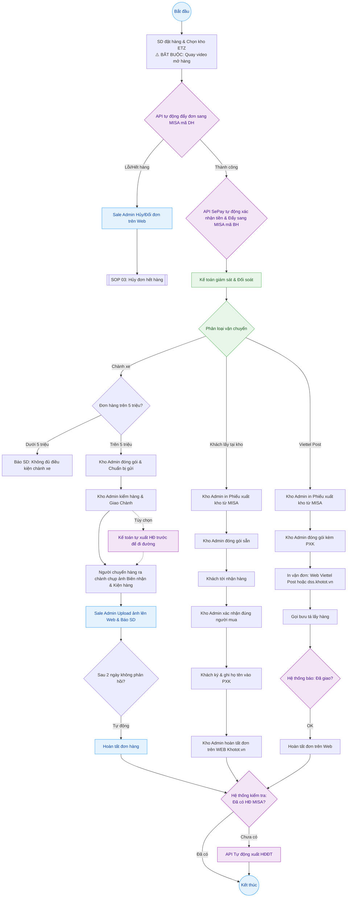

---
{"dg-publish":true,"permalink":"/01-tong-quan-ly-du-an/2-phong-van-hanh/sop-2-1-xu-ly-don-hang-api/","title":"SOP 01 — QUY TRÌNH XỬ LÝ ĐƠN HÀNG (ĐA LUỒNG)","dg-note-properties":{"title":"SOP 01 — QUY TRÌNH XỬ LÝ ĐƠN HÀNG (ĐA LUỒNG)"}}
---

# SOP 02 — QUY TRÌNH XỬ LÝ ĐƠN HÀNG

> **Dự án:** Web ETZ — Khotot.vn
> **Phiên bản:** 2.1 | **Cập nhật:** 2026-04-08
> **Phòng ban:** Phòng Vận Hành
> **Vùng dữ liệu:** Zone 01 — Tổng Hành Dinh

---

## 🎯 MỤC TIÊU
Đảm bảo mọi đơn hàng được xử lý tự động thông qua tích hợp API giữa Web Khotot và hệ thống MISA, tối ưu hóa tốc độ xử lý, giảm thiểu sai sót do nhập liệu và tự động hóa việc xuất hóa đơn điện tử.

---

## 🔄 SƠ ĐỒ PHỐI HỢP

---

### 1. GIAI ĐOẠN 1: KHÁCH HÀNG (SD) ĐẶT HÀNG
- SD chọn sản phẩm và chọn Kho ETZ Miền Nam (lộ trình giai đoạn 1).
- Chọn hình thức: Thanh toán, Phương thức vận chuyển, và Yêu cầu xuất hóa đơn.
- **YÊU CẦU BẮT BUỘC:** SD khi nhận hàng từ bất kỳ phương thức nào cũng viết phải quay video khi mở hàng để Khotot kiểm tra và chấp nhận khiếu nại (nếu có).

### 2. GIAI ĐOẠN 2: HỆ THỐNG TỰ ĐỘNG KHỞI TẠO (API MISA)
- **Tạo đơn hàng (DH):** Ngay khi SD bấm đặt hàng trên Web Khotot.vn, hệ thống tự động đẩy thông tin sang MISA để tạo đơn hàng mã **DH**.
- **Kiểm tra tồn kho API:** Hệ thống tự động kiểm tra tồn kho vật lý. 
  - Nếu hết hàng thực tế (do sai lệch): Sale Admin thực hiện **Hủy hoặc Đổi đơn trực tiếp trên Web Khotot**. API sẽ tự động đồng bộ trạng thái Hủy/Sửa sang đơn DH trên MISA.
- **Xác nhận thanh toán (SePay):** Khi SD chuyển khoản thành công, API SePay tự động ghi nhận tiền và chuyển trạng thái đơn hàng trên MISA từ **DH** sang **BH** (Đã xác nhận đơn hàng/lệnh xuất kho).

### 3. GIAI ĐOẠN 3: GIÁM SÁT & ĐIỀU PHỐI (SALE ADMIN & KẾ TOÁN)
- **Sale Admin:** Giám sát tiến độ đẩy đơn API. Xử lý các trường hợp lỗi kết nối hoặc khách hàng muốn thay đổi thông tin sau khi đã đẩy API.
- **Kế toán:** Không cần nhập liệu thủ công. Thực hiện đối soát định kỳ giữa dòng tiền thực tế trên ngân hàng và trạng thái đơn **BH** trên MISA để đảm bảo khớp lệnh 100%.
- **Phân loại vận chuyển:** Dựa trên phương thức vận chuyển, đơn hàng sẽ được chuyển sang các luồng đóng gói tương ứng.

---

## 📊 KPI THEO DÕI
- **Hệ thống API:** Tỷ lệ đẩy đơn sang MISA thành công > 99%. Thời gian đồng bộ < 2 phút.
- **Sale Admin:** Xử lý các đơn hàng lỗi API hoặc yêu cầu Hủy/Đổi đơn trên Web trong vòng 15 phút.
- **Kế toán:** Đối soát dòng tiền và trạng thái BH định kỳ 2 lần/ngày (Sáng/Chiều). Đảm bảo mọi đơn hoàn thành đều đã được API xuất HĐ điện tử.
- **Kho Admin:** Đóng gói hàng ngay khi thấy mã BH xuất hiện trên hệ thống monitor.

---

## 👁️ IV. CHI TIẾT GIAO HÀNG CHÀNH XE (ĐẶC THÙ)
Đối với các đơn hàng SD yêu cầu gửi qua nhà xe/xe khách:
1. **Điều kiện vận chuyển:** Chỉ áp dụng cho đơn hàng có giá trị từ **5.000.000 VNĐ trở lên**. Khotot hỗ trợ chi phí vận chuyển từ kho ra chành gom.
2. Hồ sơ đi đường: Kế toán phải hoàn tất Hóa đơn và Phiếu xuất kho trước khi hàng rời kho để đảm bảo tính pháp lý và đối soát sản phẩm khi nhà xe giao hàng.
3. Đóng gói & Nhãn: Kho Admin dán nhãn khổ lớn ghi rõ: Tên SD - SĐT SD - Tên Chành - Nơi đến.
4. Xác thực giao hàng (Bằng chứng):
   - **Người chuyển hàng ra chành chụp ảnh Biên nhận & Kiện hàng** (từ nhà xe).
   - Chụp ảnh thùng hàng đã đặt tại văn phòng Chành và ảnh Biên nhận rõ mã số liên hệ.
5. Thông báo & Thanh toán cước:
   - Sale Admin upload ảnh bằng chứng lên Web để SD yên tâm.
   - Lưu ý thanh toán: SD (Người nhận) có trách nhiệm tự thanh toán tiền cước vận chuyển trực tiếp cho nhà xe khi nhận hàng.
6. **Tự động hóa Hóa đơn (Có ngoại lệ):** 
   - Thông thường: API sẽ tự động xuất HĐĐT khi đơn "Hoàn thành".
   - **Ngoại lệ Chành xe:** Để đảm bảo tính pháp lý khi lưu thông trên đường, Kế toán có thể chủ động **tự xuất hóa đơn trên MISA trước** khi hàng rời kho. 
   - Hệ thống API sẽ tự động nhận diện nếu đơn hàng đã được xuất hóa đơn thủ công bởi Kế toán thì sẽ không thực hiện lệnh xuất tự động khi đơn "Hoàn thành" nữa (tránh nhân đôi hóa đơn).

---

## 👁️ V. CHI TIẾT GIAO HÀNG VIETTEL POST (THỰC TẾ)
Quy trình xử lý cho các đơn hàng vận chuyển qua bưu cục Viettel Post:
1. Chuẩn bị hồ sơ: Ngay khi có mã BH trên MISA/Web, Kho Admin chủ động in Phiếu xuất kho từ hệ thống nội bộ.
2. Đóng gói:
   - Kiểm tra hàng hóa đúng chủng loại, số lượng.
   - Đặt Phiếu xuất kho vào bên trong kiện hàng trước khi đóng băng keo.
3. Tạo vận đơn:
   - Truy cập vào Web Viettel Post hoặc [dss.khotot.vn](http://dss.khotot.vn) (tùy chọn tiện lợi).
   - Nhập thông tin đơn hàng, chọn dịch vụ và In vận đơn (Waybill).
   - Dán vận đơn chắc chắn lên mặt ngoài thùng hàng.
4. Bàn giao vận chuyển:
   - Sử dụng chức năng "Gọi bưu tá" trên Web hoặc liên hệ Hotline bưu tá khu vực để lấy hàng.
   - Khi bưu tá quét mã đơn: Hệ thống Viettel Post đồng bộ sang Web Khotot trạng thái "Đang giao".
   - **Tự động xuất HĐ:** Ngay khi hệ thống Viettel Post báo "Giao hàng thành công", đơn hàng trên Web tự động chuyển sang "Hoàn thành" và API MISA tự động xuất hóa đơn điện tử.

---

## 👁️ VI. CHI TIẾT KHÁCH LẤY TẠI KHO (THỰC TẾ)
Quy trình xử lý cho các đơn hàng Khách hàng (SD) trực tiếp đến nhận tại kho:
1. Chuẩn bị hàng: Ngay khi có mã BH, Kho Admin chủ động in Phiếu xuất kho từ hệ thống MISA và đóng gói hàng sẵn.
2. Xác minh khách hàng:
   - Khi khách tới nhận, Kho Admin yêu cầu cung cấp mã đơn hàng.
   - **Bắt buộc:** **Kho Admin xác nhận đúng người mua tới nhận hàng.**
3. Hoàn tất tại chỗ:
   - Kho Admin yêu cầu khách hàng ký và ghi rõ họ tên vào Phiếu xuất kho để làm bằng chứng đối soát.
   - Giao hàng xong, Kho Admin truy cập Web [Khotot.vn](http://Khotot.vn) để chuyển trạng thái "Hoàn thành" cho đơn hàng ngay lập tức.
4. Kiểm soát & Tự động Hóa đơn:
   - Khi Kho Admin bấm "Hoàn thành" trên Web, API MISA sẽ ngay lập tức **tự động xuất hóa đơn điện tử** cho đơn hàng đó.
   - Kế toán: Thực hiện kiểm tra ngẫu nhiên các hóa đơn đã xuất tự động để đảm bảo không có sai sót về đơn giá/thuế suất.
