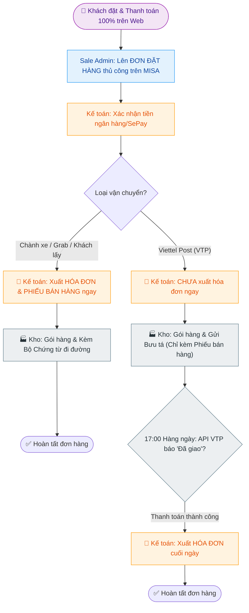

---
{"dg-publish":true,"permalink":"/01-tong-quan-ly-du-an/2-phong-van-hanh/sop-2-2-quy-trinh-van-hanh-web-thuc-te/","title":"SOP 2.2 — QUY TRÌNH VẬN HÀNH WEBSITE CHI TIẾT (WEB ETZ - HYBRID V3.6)","dg-note-properties":{"title":"SOP 2.2 — QUY TRÌNH VẬN HÀNH WEBSITE CHI TIẾT (WEB ETZ - HYBRID V3.6)"}}
---

# 🚀 SOP 2.2 — QUY TRÌNH VẬN HÀNH WEBSITE CHI TIẾT (WEB ETZ - HYBRID v3.6)

> **Dự án:** Web ETZ — Khotot.vn
> **Mô hình:** Hybrid (Thanh toán 100% Web) — **CHUẨN HÓA HÓA ĐƠN THEO SOP 2**.
> **Quy tắc vàng:** Thanh toán 100% - Thủ công Misa - **Thời điểm xuất Hóa đơn theo Vận chuyển**.
> **Phiên bản:** v3.6 | **Ngày cập nhật:** 2026-04-02

---

## 🎯 I. MỤC TIÊU & CHỈ SỐ KPI (SLA)
- **Mục tiêu:** Đồng bộ chính xác đơn hàng Web sang Misa và tuân thủ quy chuẩn xuất hóa đơn linh hoạt theo từng đơn vị vận chuyển.
- **KPI Chốt đơn:** 15 - 30 phút.
- **KPI Tài chính:** 100% Thu đủ tiền (Web 100%) & Xuất hóa đơn đúng luồng pháp lý.

---

## 🔄 II. SƠ ĐỒ PHỐI HỢP & THỜI ĐIỂM XUẤT HÓA ĐƠN (SOP 2 FOCUS)

---

## 📝 III. QUY CHUẨN XUẤT HÓA ĐƠN (Áp dụng SOP 2)

Dựa trên hình thức vận chuyển, Kế toán thực hiện theo 2 kịch bản xuất hóa đơn khác nhau để tối ưu hóa pháp lý và tránh sai sót:

### 1. Kịch bản A: Xuất hóa đơn TRƯỚC KHI GIAO (Bắt buộc)
- **Áp dụng:** Gửi hàng qua **Chành xe (Xe khách)**, **Grab/Ahamove**, hoặc **Khách lấy tại kho**.
- **Lý do:** Đảm bảo hồ sơ đi đường hợp lệ cho Shipper và Nhà xe; tránh rủi ro kiểm tra của Quản lý thị trường.
- **Thành phần bộ chứng từ:** 01 Phiếu bán hàng (Misa) + 01 Hóa đơn điện tử (Bản giấy).

### 2. Kịch bản B: Xuất hóa đơn SAU KHI GIAO THÀNH CÔNG (Viettel Post)
- **Áp dụng:** Duy nhất cho đơn vị vận chuyển hỗ trợ API (Viettel Post).
- **Quy trình:**
    - Bước 1: Admin duyệt lệnh gọi vận chuyển trên Web. Kho gởi hàng đi (Chưa kèm hóa đơn).
    - Bước 2: Kế toán kiểm tra danh sách đơn Viettel Post vào lúc **17:00 hàng ngày**.
    - Bước 3: Nếu API báo "Đã giao thành công", Kế toán thực hiện xuất hóa đơn đồng loạt cho khách.

---

## 📝 IV. CHI TIẾT CÔNG VIỆC (MISA & WEB)

### 1. Sale Admin (Khâu nạp liệu)
- **Hành động:** Nhập PO (Đơn đặt hàng) từ Web sang Misa.
- **Yêu cầu CCCD:** Thu thập CCCD ngay tại thời điểm khách đặt đơn (nếu là khách lẻ).

### 2. Kế toán (Khâu điều phối hóa đơn)
- **Hành động:** Tuân thủ đúng thời điểm xuất HĐ (Ngay lập tức vs Cuối ngày) theo bảng chuẩn ở Mục III.
- **Phối hợp:** Nhắn tin lệnh xuất cho Kho qua Microsoft Teams.

### 3. Kho (Khâu thực thi)
- **Hành động:** In phiếu bán hàng từ Misa. Chụp ảnh biên nhận nhà xe (nếu đi Chành).
- **Hành động:** Cập nhật trạng thái/Mã bưu vận lên Web Admin.

---

## 🛡️ V. QUY TRÌNH HỦY/TRẢ HÀNG
- **Quy tắc:** Hóa đơn đã xuất không hủy. Nếu trả hàng, thực hiện **Biên bản Điều chỉnh giảm HĐ**.
- **Yêu cầu:** Khách hàng ký giấy biên bản điều chỉnh mới thực hiện hoàn tiền/trừ nợ trên Misa.

---
*Mọi nhân sự lưu ý: Bản SOP v3.6 là chuẩn quy trình cuối cùng về Hóa đơn và Vận chuyển cho dự án Web ETZ.*
