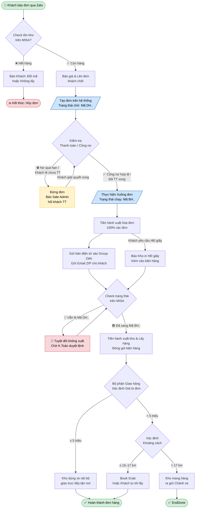

---
{"dg-publish":true,"permalink":"/01-tong-quan-ly-du-an/2-phong-van-hanh/sop-2-3-quy-trinh-xu-ly-don-hang-truyen-thong-chi-tiet/","tags":["SOP","vận-hành","kho","kế-toán","giao-hàng"],"dg-note-properties":{"tags":["SOP","vận-hành","kho","kế-toán","giao-hàng"],"created":"2026-04-02","version":"1.0"}}
---

# "SOP 2.3 — Quy Trình Xử Lý Đơn Hàng Thực Tế (Vận Hành Thủ Công)"

> **Phạm vi áp dụng:** Bộ phận Sale, Kế toán, Kho, Giao hàng  
> **Trạng thái:** Đang vận hành (chưa có Web)  
> **Nguồn gốc:** Quy trình thực tế tổng hợp từ sơ đồ AD-KT-KHO

---

## 1. MỤC ĐÍCH

Tài liệu này mô tả toàn bộ quy trình xử lý đơn hàng từ lúc **khách đặt hàng qua Zalo** cho đến khi **hoàn thành giao hàng**, bao gồm các bước kiểm tra tồn kho, duyệt thanh toán, xuất hóa đơn và giao hàng — áp dụng trong giai đoạn vận hành thủ công (chưa có hệ thống Web bán hàng tự động).

---

## 2. TRÁCH NHIỆM

| Vai trò | Trách nhiệm chính |
|---|---|
| **Sale / Admin** | Nhận đơn Zalo, báo giá, lên đơn, hối khách thanh toán |
| **Kế toán** | Kiểm tra công nợ, duyệt lệnh xuất kho, xuất hóa đơn |
| **Kho** | Kiểm tra tồn kho MISA, xuất kho, đóng gói, in HĐ giấy |
| **Giao hàng** | Xác định phương thức giao, thực hiện giao hàng |

---

## 3. SƠ ĐỒ LUỒNG TỔNG QUAN

---

## 4. QUY TRÌNH CHI TIẾT

### GIAI ĐOẠN 1 — TIẾP NHẬN & KIỂM TRA TỒN KHO

**Bước 1.1 — Khách đặt hàng qua Zalo**
- Khách gửi yêu cầu đặt hàng qua kênh Zalo chính thức.
- Sale/Admin tiếp nhận và ghi nhận thông tin: tên hàng, số lượng, địa chỉ giao.

**Bước 1.2 — Kiểm tra tồn kho trên MISA**
- Kho hoặc Sale kiểm tra tồn kho thực tế trên phần mềm MISA.

| Kết quả | Hành động tiếp theo |
|---|---|
| ✅ **Còn hàng** | Báo giá & Lên đơn khách chốt → Sang Giai đoạn 2 |
| ❌ **Hết hàng** | Báo khách: Đổi mã hàng hoặc Không lấy → **Kết thúc: Hủy đơn** |

---

### GIAI ĐOẠN 2 — TẠO ĐƠN HÀNG TRÊN HỆ THỐNG

**Bước 2.1 — Tạo đơn trên hệ thống**
- Sau khi khách chốt, Sale/Admin tạo đơn trên hệ thống MISA.
- Trạng thái đơn lúc này: **Mã DH..** (Đơn hàng — trạng thái chờ).

> ⚠️ **Lưu ý:** Khi đơn còn ở Mã DH.. tuyệt đối KHÔNG được xuất kho. Phải chờ Kế toán duyệt.

---

### GIAI ĐOẠN 3 — KIỂM TRA THANH TOÁN / CÔNG NỢ

**Bước 3.1 — Kế toán kiểm tra tình trạng thanh toán**

| Tình trạng | Hành động |
|---|---|
| ⛔ **Khách nợ quá hạn / Khách lẻ chưa thanh toán** | **Đứng đơn** → Báo Sale Admin hối khách thanh toán |
| ↩️ **Khách đã giải quyết xong** | Quay lại kiểm tra lại trạng thái công nợ |
| ✅ **Công nợ hợp lệ / Đã thanh toán xong** | Thực hiện **Xuống đơn** → Sang Giai đoạn 4 |

**Bước 3.2 — Xuống đơn (khi được duyệt)**
- Kế toán xác nhận, đơn được chuyển sang trạng thái: **Mã BH..** (Bán hàng — trạng thái chạy).

---

### GIAI ĐOẠN 4 — XUẤT HÓA ĐƠN

**Bước 4.1 — Tiến hành xuất hóa đơn (100% các đơn)**
- Kế toán xuất hóa đơn điện tử cho **100% đơn hàng**, không có ngoại lệ.
- Gửi bản điện tử vào **Group Zalo nội bộ**.
- Gửi **Email kèm file ZIP** cho khách hàng.

**Bước 4.2 — Trường hợp khách yêu cầu hóa đơn giấy**
- Kế toán **báo Kho** in HĐ giấy.
- Kho in hóa đơn giấy và **kèm vào kiện hàng** khi đóng gói.

---

### GIAI ĐOẠN 5 — XUẤT KHO & CHUẨN BỊ HÀNG

**Bước 5.1 — Kho kiểm tra trạng thái đơn trên MISA trước khi xuất**

| Trạng thái trên MISA | Hành động của Kho |
|---|---|
| 🔴 **Vẫn là Mã DH..** | **Tuyệt đối KHÔNG xuất** — Chờ Kế toán duyệt lệnh |
| 🟢 **Đã sang Mã BH..** | Tiến hành **xuất kho & lấy hàng** |

**Bước 5.2 — Xuất kho và đóng gói**
- Kho tiến hành lấy hàng theo đơn đã được duyệt.
- In HĐ giấy (nếu có yêu cầu) và kèm vào kiện hàng.
- Bàn giao kiện hàng cho bộ phận Giao hàng.

---

### GIAI ĐOẠN 6 — GIAO HÀNG

**Bước 6.1 — Bộ phận Giao hàng xác định phương thức giao**

Dựa vào **Giá trị đơn hàng** để phân luồng:

| Giá trị đơn | Khoảng cách | Phương thức giao |
|---|---|---|
| **< 5 triệu** | ≤ 15–17 km | Book Grab / Khách tự tới lấy |
| **< 5 triệu** | > 17 km | Gửi Chành xe |
| **≥ 5 triệu** | Mọi khoảng cách | Xe nội bộ giao tận nơi |

---

## 5. QUY TẮC BẮT BUỘC (KHÔNG ĐƯỢC VI PHẠM)

> 🚨 **TUYỆT ĐỐI KHÔNG** xuất kho khi đơn còn ở trạng thái **Mã DH..**
>
> ✅ **CHỈ ĐƯỢC** xuất kho khi đơn đã chuyển sang **Mã BH..** và Kế toán đã duyệt lệnh.

| # | Quy tắc | Người chịu trách nhiệm |
|---|---|---|
| 1 | Không xuất kho khi chưa có Mã BH.. | Kho |
| 2 | 100% đơn phải xuất hóa đơn điện tử | Kế toán |
| 3 | Đơn khách lẻ chưa thanh toán → Đứng đơn ngay | Kế toán / Sale |
| 4 | HĐ giấy phải kèm vào kiện hàng trước khi giao | Kho |
| 5 | Giao hàng ≥ 5 triệu → Dùng xe nội bộ, không dùng Grab | Giao hàng |

---

## 6. LIÊN KẾT TÀI LIỆU LIÊN QUAN

- [[00_BO_NAO_AI_INTERNAL/02_Context_Dictionaries/DAI_TU_DIEN_SOP_ETZ\|📖 Đại Từ Điển SOP ETZ]]
- [[01_TONG_QUAN_LY_DU_AN/00_Dashboard/README_HE_THONG\|🏠 README Hệ Thống]]
- [[SOP 2.1 — Quy Trình Tiếp Nhận Đơn Hàng\|SOP 2.1 — Quy Trình Tiếp Nhận Đơn Hàng]]
- [[SOP 2.2 — Quy Trình Kiểm Soát Công Nợ\|SOP 2.2 — Quy Trình Kiểm Soát Công Nợ]]
- [[SOP 2.4 — Quy Trình Trả Hàng & Đổi Hàng\|SOP 2.4 — Quy Trình Trả Hàng & Đổi Hàng]]

---

*Tài liệu được tạo: 2026-04-02 | Phiên bản: 1.0 | Nguồn: AD-KT-KHO.pdf*
