---
{"dg-publish":true,"permalink":"/01-tong-quan-ly-du-an/2-phong-van-hanh/sop-2-quy-trinh-xuly-don-chuan-khotot/","title":"SOP 02.10.2 — QUY TRÌNH VẬN HÀNH WEBSITE THỰC TẾ (WEB ETZ - v3.8)","dg-note-properties":{"title":"SOP 02.10.2 — QUY TRÌNH VẬN HÀNH WEBSITE THỰC TẾ (WEB ETZ - v3.8)"}}
---

# 🚀 SOP 02.10.2 — QUY TRÌNH VẬN HÀNH WEBSITE THỰC TẾ (WEB ETZ - v3.8)

> **Dự án:** Web ETZ — Khotot.vn
> **Mô hình:** Hybrid (Thanh toán 100% Web) — Chuẩn hóa theo SOP 02
> **Quy tắc vàng:** Thanh toán 100% → Thủ công MISA → Xuất hóa đơn đúng luồng vận chuyển
> **Phiên bản:** v3.8 | **Ngày cập nhật:** 2026-05-18
> **Thay đổi v3.8:** Cập nhật Giai đoạn 3 — Quyên dùng thông tin hóa đơn từ đơn hàng (không hỏi lại khách); thêm cột "🧾 HD?" vào bảng phân công

---

## 👥 PHÂN CÔNG NHÂN SỰ PHỤ TRÁCH

| Vai trò | Người phụ trách | Trách nhiệm chính |
|---|---|---|
| **Kế toán** | **Quyên** | Xác nhận tiền, chuyển mã BH, xuất hóa đơn trước 17:00 |
| **Kho Admin** | **Thúy** | Đóng gói, xuất kho, giao hàng, cập nhật trạng thái |
| **Admin / Vận hành** | **Admin** (phối hợp MKT + Sale Admin + Vận hành) | Tiếp nhận đơn Web, tạo đơn MISA, upload bằng chứng, rà soát đơn treo, hoàn tất đơn |

> ⚠️ **Admin** là đầu mối trung tâm: phối hợp trực tiếp với bộ phận MKT (chăm sóc khách hàng), Sale Admin (tạo đơn MISA), và Vận hành (theo dõi tiến độ giao hàng).

---

## 🎯 MỤC TIÊU & KPI

| Chỉ số | Mục tiêu | Người chịu trách nhiệm |
|---|---|---|
| Tốc độ tạo đơn DH trên MISA | < 30 phút từ khi có đơn Web | Admin |
| Chuyển mã BH sau khi xác nhận tiền | Kịp thời trong ngày | Quyên |
| Xuất hóa đơn Viettel Post | Trước 17:00 hàng ngày | Quyên |
| Không đóng gói khi chưa có mã BH | 100% tuân thủ | Thúy |
| Báo cáo sau khi hàng rời kho | Ngay lập tức | Thúy → Admin |

---

## ⏰ QUY TẮC THỜI GIAN CHỐT ĐƠN

> 🕐 **Thời gian chốt:** **16:00 mỗi ngày**
> - Đơn hàng đặt **trước 16:00** → Xử lý & giao hàng **trong ngày**.
> - Đơn hàng đặt **sau 16:00** → Dời lịch đóng gói và giao hàng sang **ngày hôm sau**.

---

## 🔄 SƠ ĐỒ PHỐI HỢP (THEO SOP 02)

```mermaid
graph TD
    classDef sd fill:#F3E5F5,stroke:#9C27B0,color:#4A148C;
    classDef admin fill:#E3F2FD,stroke:#2196F3,color:#0D47A1;
    classDef acc fill:#E8F5E9,stroke:#4CAF50,color:#1B5E20;
    classDef kho fill:#FFF3E0,stroke:#FF9800,color:#E65100;
    classDef error fill:#FFEBEE,stroke:#D32F2F,color:#B71C1C;

    Start((Bắt đầu)) --> SD_Order["SD đặt hàng trên Khotot.vn<br/>⚠️ BẮT BUỘC: Quay video khi mở hàng"]

    SD_Order --> Admin_Check{"Admin kiểm hàng trên MISA<br/>(chưa kết nối tự động)"}
    Admin_Check -- "HẾT HÀNG" --> OutOfStock[["SOP 03: Hủy đơn hết hàng"]]
    Admin_Check -- "CÒN HÀNG" --> Admin_DH["Admin tạo đơn MISA — Mã DH<br/>📌 Phối hợp: MKT + Sale Admin"]
    Admin_DH --> Notify_Quyen["Báo Quyên: Có đơn mới cần xác nhận tiền"]

    Notify_Quyen --> Quyen_Check{"Quyên kiểm tra tiền<br/>vào hệ thống (SePay/CK)"}
    Quyen_Check -- "KHÔNG OK" --> Quyen_Reject["Báo Admin kiểm tra lại với khách"]
    Quyen_Reject --> Admin_Check
    Quyen_Check -- "OK" --> Quyen_BH["Quyên chuyển MISA → Mã BH<br/>✅ Lệnh cho phép Thúy đóng gói"]
    Quyen_BH --> Ship_Type{"Phân loại vận chuyển"}

    %% Nhánh Chành xe %%
    Ship_Type -- "Chành xe" --> Quyen_Inv1["Quyên xuất HĐ & Phiếu xuất kho<br/>⚠️ Phải xong TRƯỚC khi hàng rời kho"]
    Quyen_Inv1 --> Thuy_Pack1["Thúy đóng gói — kèm HĐ & Phiếu xuất kho<br/>Dán nhãn: Tên SD - SĐT - Tên Chành - Nơi đến"]
    Thuy_Pack1 --> Thuy_Chanh["Thúy (hoặc người được phân công)<br/>chụp ảnh Biên nhận & Kiện hàng tại Chành"]
    Thuy_Chanh --> Admin_Upload["Admin upload ảnh bằng chứng lên Web<br/>Báo SD đã gửi hàng"]
    Admin_Upload --> Rule3D{"Sau 03 ngày SD không phản hồi?"}
    Rule3D -- "Hệ thống tự động / Admin xử lý thủ công" --> Done1["✅ Hoàn tất đơn hàng"]

    %% Nhánh Khách lấy tại kho %%
    Ship_Type -- "Khách lấy tại kho" --> Thuy_Print2["Thúy in Phiếu xuất kho từ MISA"]
    Thuy_Print2 --> Thuy_Pack2["Thúy đóng gói — kèm Phiếu xuất kho"]
    Thuy_Pack2 --> SD_Pick["Khách đến nhận hàng tại kho"]
    SD_Pick --> Thuy_Verify["Thúy xác nhận đúng người mua tới nhận"]
    Thuy_Verify --> SD_Sign["Khách ký & ghi họ tên vào Phiếu xuất kho"]
    SD_Sign --> Thuy_Web["Thúy cập nhật trạng thái 'Hoàn thành' trên Khotot.vn"]
    Thuy_Web --> Admin_Soat["Admin rà soát đơn treo cuối buổi"]
    Admin_Soat --> Quyen_Inv2["Quyên xuất HĐ điện tử hàng loạt trước 17:00"]

    %% Nhánh Viettel Post %%
    Ship_Type -- "Viettel Post" --> Thuy_Print3["Thúy in Phiếu xuất kho từ MISA/Web"]
    Thuy_Print3 --> Thuy_Pack3["Thúy đóng gói — kèm Phiếu xuất kho"]
    Thuy_Pack3 --> Thuy_VT["Thúy in vận đơn (Web Viettel Post / dss.khotot.vn)<br/>Gọi bưu tá lấy hàng"]
    Thuy_VT --> API_Check{"Web báo: Đã giao thành công?"}
    API_Check -- "OK" --> Quyen_Inv3["Quyên xuất HĐ điện tử hàng loạt trước 17:00"]
    Quyen_Inv3 --> Done3["✅ Hoàn tất đơn hàng"]

    class SD_Order,SD_Pick sd;
    class Admin_Check,Admin_DH,Notify_Quyen,Quyen_Reject,Admin_Upload,Admin_Soat,Rule3D,Done1 admin;
    class Quyen_Check,Quyen_BH,Quyen_Inv1,Quyen_Inv2,Quyen_Inv3 acc;
    class Thuy_Pack1,Thuy_Pack2,Thuy_Pack3,Thuy_Chanh,Thuy_Print2,Thuy_Print3,Thuy_Verify,SD_Sign,Thuy_Web,Thuy_VT kho;
    class OutOfStock error;
```

---

## 📝 CHI TIẾT TỪNG GIAI ĐOẠN

### GIAI ĐOẠN 1 — KHÁCH HÀNG (SD) ĐẶT HÀNG

- SD chọn sản phẩm, chọn Kho ETZ Miền Nam, chọn phương thức vận chuyển và thanh toán 100% trên Web.
- **YÊU CẦU BẮT BUỘC:** SD phải quay video khi mở hàng để Khotot.vn chấp nhận khiếu nại (nếu có).

---

### GIAI ĐOẠN 2 — ADMIN TIẾP NHẬN & TẠO ĐƠN

**Người thực hiện: Admin** (phối hợp MKT + Sale Admin + Vận hành)

- Tiếp nhận đơn từ Dashboard Web Khotot.vn.
- **⏰ Kiểm tra thời gian:** Nếu đơn phát sinh **sau 16:00** → ghi chú chuyển xử lý sang ngày hôm sau.
- Kiểm tra tồn kho thực tế trên MISA:
  - **Hết hàng** → Chuyển sang [[01_TONG_QUAN_LY_DU_AN/2_PHONG_VAN_HANH/SOP_3_Huy_Don_Het_Hang\|SOP 03: Hủy đơn hết hàng]]
  - **Còn hàng** → Tạo đơn MISA mã **DH..**, báo ngay cho **Quyên** xác nhận tiền.

---

### GIAI ĐOẠN 3 — QUYÊN XÁC NHẬN TIỀN & CHUYỂN MÃ BH

**Người thực hiện: Quyên (Kế toán)**

- Nhận thông báo từ Admin, kiểm tra tiền đã vào hệ thống (SePay hoặc chuyển khoản).
- **Tiền OK** → Chuyển đơn MISA sang mã **BH..** → Đây là lệnh cho phép **Thúy** bắt đầu đóng gói.
- **Tiền KHÔNG OK** → Báo Admin kiểm tra lại với khách.
- Phân luồng xuất hóa đơn theo phương thức vận chuyển (xem Giai đoạn 4A/4B/4C).

> 🚨 **Thúy tuyệt đối không đóng gói khi đơn chưa chuyển sang mã BH.**

#### 🧾 Quy trình xử lý hóa đơn theo thông tin từ đơn hàng (v3.8)

Từ phiên bản này, Quyên **không cần liên hệ khách để hỏi thông tin hóa đơn** — mọi thông tin đã được khách khai báo tại bước checkout.

Kiểm tra cột **"🧾 HD?"** trong danh sách đơn trên Dashboard:

| Giá trị cột HD? | Hành động của Quyên |
|---|---|
| **Không** | Bỏ qua — không xuất hóa đơn, không liên hệ khách |
| **Có — Cá nhân** | Nhập vào MISA: **Họ tên + CCCD** của người mua → xuất HĐ cá nhân → gửi file về **email** ghi trong đơn |
| **Có — DN/HKD** | Nhập vào MISA: **Tên đơn vị + MST + Địa chỉ** → xuất HĐ đơn vị → gửi file về **email** ghi trong đơn |

> ⚠️ **Lưu ý MST:** Từ 01/07/2025, hộ cá thể không có MST riêng được dùng **số CCCD (12 chữ số)** thay thế — đây là hợp lệ theo NĐ 70/2025/NĐ-CP.
>
> ⚠️ **Nếu email gửi thất bại:** Liên hệ Admin gửi link hóa đơn qua **Zalo OA** của khách.

---

### GIAI ĐOẠN 4A — CHÀNH XE (Xuất HĐ TRƯỚC khi giao)

**Quyên** xuất Hóa đơn điện tử + Phiếu xuất kho **ngay sau khi duyệt mã BH** — bắt buộc hoàn tất trước khi hàng rời kho.

**Thúy (Kho):**
1. Đóng gói hàng, kèm đầy đủ HĐ + Phiếu xuất kho vào kiện hàng.
2. Dán nhãn khổ lớn: **Tên SD — SĐT SD — Tên Chành — Nơi đến**.
3. Mang hàng ra Chành, chụp ảnh **Biên nhận** và **Kiện hàng** tại văn phòng nhà xe.
4. Gửi ảnh về cho **Admin**.

**Admin:**
- Upload ảnh bằng chứng lên Web Khotot.vn, báo SD đã gửi hàng.
- Theo dõi: **Sau 03 ngày** SD không phản hồi → Hệ thống tự động hoàn tất hoặc Admin cập nhật thủ công thành "Hoàn thành".

> 📌 **Điều kiện chành xe: KHÔNG GIỚI HẠN giá trị đơn hàng.** Mọi đơn đều được gửi chành xe theo yêu cầu của SD.
> SD (người nhận) tự thanh toán cước vận chuyển trực tiếp cho nhà xe khi nhận hàng.
> Khotot không chịu trách nhiệm khiếu nại sau **03 ngày** kể từ ngày upload biên nhận.

---

### GIAI ĐOẠN 4B — KHÁCH LẤY TẠI KHO

**Thúy (Kho):**
1. In Phiếu xuất kho từ MISA ngay khi có mã BH.
2. Đóng gói hàng, kèm Phiếu xuất kho.
3. Khi khách đến: xác nhận đúng người mua (theo mã đơn hàng).
4. Yêu cầu khách **ký và ghi rõ họ tên** vào Phiếu xuất kho.
5. Cập nhật trạng thái "Hoàn thành" trên Web Khotot.vn **ngay lập tức** sau khi giao hàng.

**Admin:**
- Cuối buổi rà soát danh sách đơn "Chờ nhận hàng" — nếu có đơn treo quá lâu báo ngay Thúy kiểm tra.

**Quyên:**
- Kiểm tra danh sách đơn "Hoàn thành", xuất hóa đơn điện tử hàng loạt **trước 17:00**.

---

### GIAI ĐOẠN 4C — VIETTEL POST (Xuất HĐ SAU khi giao)

**Thúy (Kho):**
1. In Phiếu xuất kho từ MISA/Web ngay khi có mã BH.
2. Đóng gói, đặt Phiếu xuất kho vào bên trong kiện trước khi dán băng keo.
3. Truy cập Web Viettel Post hoặc [dss.khotot.vn](http://dss.khotot.vn) → Nhập thông tin, in vận đơn, dán lên kiện hàng.
4. Gọi bưu tá lấy hàng, theo dõi trạng thái "Đang vận chuyển".

**Quyên:**
- Kiểm tra danh sách đơn Viettel Post lúc **17:00 hàng ngày**.
- API báo "Đã giao thành công" → Xuất hóa đơn điện tử hàng loạt.

---

## 📊 BẢNG TÓM TẮT PHÂN CÔNG THEO LUỒNG

| Bước                                     | Chành xe           | Tại kho              | Viettel Post  | Người thực hiện  |
| ---------------------------------------- | ------------------ | -------------------- | ------------- | ---------------- |
| Tiếp nhận đơn Web                        | ✅                  | ✅                    | ✅             | **Admin**        |
| Tạo đơn MISA (mã DH)                     | ✅                  | ✅                    | ✅             | **Admin**        |
| Xác nhận tiền → mã BH                    | ✅                  | ✅                    | ✅             | **Quyên**        |
| Kiểm tra cột 🧾 HD? → xử lý HĐ           | Trước giao         | Sau giao             | Sau giao      | **Quyên**        |
| Xuất HĐ (dùng data từ đơn hàng)          | Trước giao         | Sau giao             | Sau giao      | **Quyên**        |
| Đóng gói & dán nhãn                      | ✅                  | ✅                    | ✅             | **Thúy**         |
| Giao chành / gọi bưu tá / xác nhận khách | ✅                  | ✅                    | ✅             | **Thúy**         |
| Chụp ảnh biên nhận & upload Web          | ✅                  | —                    | —             | **Thúy → Admin** |
| Cập nhật "Hoàn thành" trên Web           | Admin (sau 3 ngày) | Thúy (ngay lúc giao) | Tự động (API) | **Thúy / Admin** |
| Rà soát đơn treo                         | ✅                  | ✅                    | ✅             | **Admin**        |

---

## 🚨 QUY TẮC BẮT BUỘC

| # | Quy tắc | Người chịu trách nhiệm |
|---|---|---|
| 1 | **Thúy** tuyệt đối không đóng gói khi đơn chưa có mã BH | **Thúy** |
| 2 | Đơn chành xe: **KHÔNG giới hạn** giá trị đơn hàng | **Admin / Quyên** |
| 3 | Đơn phát sinh **sau 16:00** → xử lý & giao hàng **ngày hôm sau** | **Admin** |
| 4 | Chành xe: SD không phản hồi sau **03 ngày** → hoàn tất đơn | **Admin** |
| 5 | **Quyên** xuất HĐ Viettel Post và Tại kho trước **17:00** hàng ngày | **Quyên** |
| 6 | Chành xe: **Quyên** xuất HĐ **trước khi hàng rời kho** | **Quyên** |
| 7 | SD phải quay video khi mở hàng để được hỗ trợ khiếu nại | SD |

---

*Phiên bản v3.7 — Cập nhật theo kết quả họp 2026-04-14 | Người cập nhật: DSS*
*Phiên bản v3.8 — Cập nhật 2026-05-18: Giai đoạn 3 dùng thông tin HĐ từ đơn hàng; thêm cột HD? | Người cập nhật: DSS*
