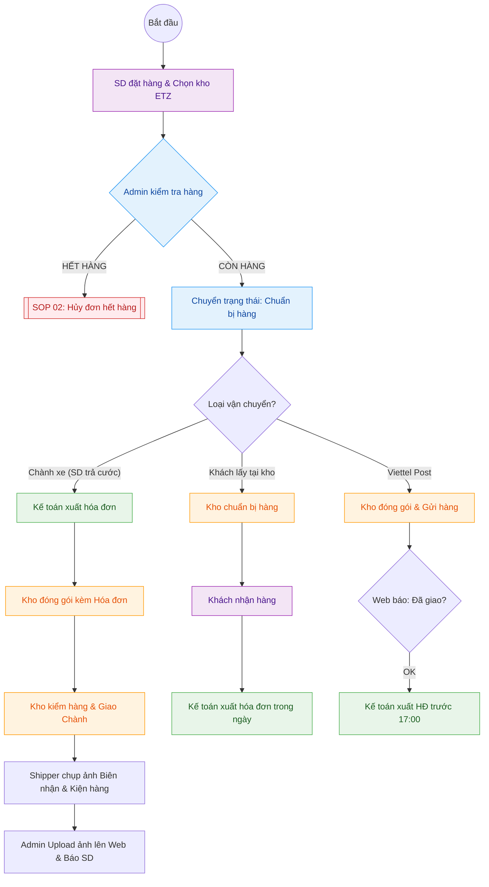

---
{"dg-publish":true,"permalink":"/01-tong-quan-ly-du-an/2-phong-van-hanh/sop-2-xu-ly-don-hang-chuan/","title":"SOP 01 — QUY TRÌNH XỬ LÝ ĐƠN HÀNG (ĐA LUỒNG)","dg-note-properties":{"title":"SOP 01 — QUY TRÌNH XỬ LÝ ĐƠN HÀNG (ĐA LUỒNG)"}}
---

# 📦 SOP 01 — QUY TRÌNH XỬ LÝ ĐƠN HÀNG (ĐA LUỒNG)

> **Dự án:** Web ETZ — Khotot.vn
> **Phiên bản:** 1.1 | **Cập nhật:** 2026-03-30
> **Tác giả:** Antigravity AI
> **Phòng ban:** Phòng Vận Hành
> **Vùng dữ liệu:** Zone 01 — Tổng Hành Dinh

---

## 🎯 MỤC TIÊU
Đảm bảo mọi đơn hàng được xử lý chính xác từ khâu SD đặt hàng, Admin điều phối đến Kế toán xuất hóa đơn đúng thời điểm cho từng loại hình vận chuyển.

---

## 🔄 SƠ ĐỒ PHỐI HỢP (SWIMLANE FLOWCHART)

---

## 👁️ CHI TIẾT CÁC GIAI ĐOẠN

### 1. GIAI ĐOẠN 1: KHÁCH HÀNG (SD) ĐẶT HÀNG
- SD chọn sản phẩm và chọn **Kho ETZ Miền Nam** (lộ trình giai đoạn 1).
- Chọn hình thức: Thanh toán, Phương thức vận chuyển, và **Yêu cầu xuất hóa đơn**.

### 2. GIAI ĐOẠN 2: ADMIN ĐIỀU PHỐI (GATEKEEPER)
- Tiếp nhận thông tin đơn hàng từ Dashboard.
- Kiểm tra tồn kho vật lý và khớp lệnh.
- **Tình huống Hết hàng:** Chuyển ngay sang quy trình xử lý tại [[01_TONG_QUAN_LY_DU_AN/2_PHONG_VAN_HANH/SOP_3_Huy_Don_Het_Hang\|SOP 02: Hủy đơn hết hàng]].
- **Tình huống Còn hàng:** Đổi trạng thái đơn sang **"Chuẩn bị hàng"**.

### 3. GIAI ĐOẠN 3: PHÂN LUỒNG HÓA ĐƠN & VẬN CHUYỂN

| Hình thức | Kế toán (Hóa đơn) | Kho (Đóng gói & Giao) |
|---|---|---|
| **Chành xe** | Xuất ngay sau khi Admin duyệt đơn. Gửi thông tin cho Kho. | **Bắt buộc** đóng gói kèm Hóa đơn chứng từ. Kiểm tra đủ mới bàn giao vận chuyển. |
| **Lấy tại kho** | Xuất linh hoạt bất kỳ lúc nào trong ngày (trong cùng ngày SD lấy hàng). | Chuẩn bị hàng sẵn chờ SD đến lấy. |
| **Viettel Post** | Cuối ngày (trước 17:00), kiểm tra API báo *Đã giao thành công* để xuất HĐ hàng loạt. | Đóng gói theo chuẩn, dán vận đơn và gửi hàng cho bưu tá. |

---

## 📊 KPI THEO DÕI
- **Kế toán:** Mọi đơn Viettel Post thành công phải được xuất HĐ trước 17:00 hàng ngày.
- **Kho:** Đơn Chành xe không được xuất kho nếu thiếu hóa đơn kèm theo.

---
---

## 👁️ IV. CHI TIẾT GIAO HÀNG CHÀNH XE (ĐẶC THÙ)

Đối với các đơn hàng SD yêu cầu gửi qua nhà xe/xe khách:

1.  **Hồ sơ đi đường:** Kế toán phải hoàn tất hóa đơn/chứng từ trước khi hàng rời kho để đảm bảo tính pháp lý khi lưu thông.
2.  **Đóng gói & Nhãn:** Kho dán nhãn khổ lớn ghi rõ: *Tên SD - SĐT SD - Tên Chành - Nơi đến*.
3.  **Xác thực giao hàng (Bằng chứng):**
    - Shipper nội bộ lấy **Biên nhận (Vận đơn)** từ nhà xe.
    - Chụp ảnh thùng hàng đã đặt tại văn phòng Chành và ảnh Biên nhận rõ mã số liên hệ.
4.  **Thông báo & Thanh toán cước:**
    - Admin upload ảnh bằng chứng lên Web để SD yên tâm.
    - **Lưu ý thanh toán:** SD (Người nhận) có trách nhiệm tự thanh toán tiền cước vận chuyển trực tiếp cho nhà xe khi nhận hàng.
