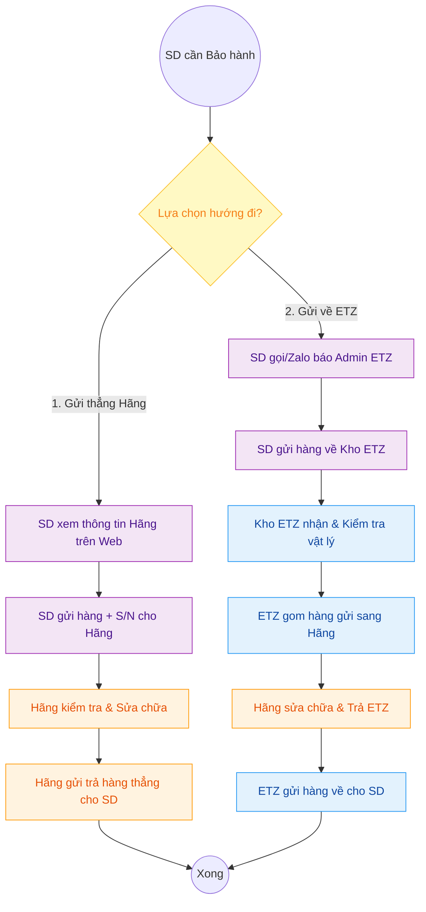

---
{"dg-publish":true,"permalink":"/01-tong-quan-ly-du-an/2-phong-van-hanh/sop-4-bao-hanh-xy-ly-ngoai-luong/","title":"SOP 04 — QUY TRÌNH TIẾP NHẬN BẢO HÀNH (XỬ LÝ NGOÀI LUỒNG)","dg-note-properties":{"title":"SOP 04 — QUY TRÌNH TIẾP NHẬN BẢO HÀNH (XỬ LÝ NGOÀI LUỒNG)"}}
---

# 📦 SOP 04 — QUY TRÌNH TIẾP NHẬN BẢO HÀNH (XỬ LÝ NGOÀI LUỒNG)

> **Dự án:** Web ETZ — Khotot.vn
> **Phiên bản:** 1.0 | **Cập nhật:** 2026-03-30
> **Tác giả:** Antigravity AI
> **Phòng ban:** Phòng Vận Hành
> **Vùng dữ liệu:** Zone 01 — Tổng Hành Dinh

---

## 🎯 MỤC TIÊU
Quy định luồng phối hợp bảo hành linh hoạt giữa SD, ETZ và Hãng sản xuất. Toàn bộ quy trình được thực hiện thông qua giao tiếp trực tiếp (Zalo/SMS), không cập nhật trạng thái trên Dashboard Web để tối giản vận hành.

---

## 🔄 SƠ ĐỒ LUỒNG PHỐI HỢP (OFFLINE FLOWCHART)

---

## 👁️ CHI TIẾT CÁC BƯỚC THỰC HIỆN (NGOÀI LUỒNG WEB)

### 1. HƯỚNG 1: SD GỬI TRỰC TIẾP CHO HÃNG
*   **Tiếp cận thông tin:** SD tự vào mục "Thông tin bảo hành/Hỗ trợ" trên Web để lấy địa chỉ và SĐT của các Trung tâm bảo hành (TTBH) chính hãng.
*   **Vận hành:** SD tự đóng gói, ghi chú lỗi và gửi hàng. Mọi trao đổi về tiến độ sửa chữa SD làm việc trực tiếp với nhà xe/bưu điện và TTBH hãng.
*   **Vai trò ETZ:** Đứng ngoài luồng này, chỉ hỗ trợ cung cấp thông tin trung tâm bảo hành nếu SD không tìm thấy trên Web.

### 2. HƯỚNG 2: SD GỬI VỀ CHO TRUNG TÂM ETZ
*   **Liên hệ đầu vào:** SD liên hệ qua Zalo OA hoặc Hotline hỗ trợ của ETZ để báo mã đơn hàng/S/N cần bảo hành.
*   **Gửi hàng:** SD gửi hàng về kho ETZ Miền Nam.
*   **Tiếp nhận (Kho ETZ):**
    - Nhân viên kho nhận hàng, quay video khui kiện hàng để tránh tranh chấp hư hỏng vật lý.
    - Ghi chép sổ tay hoặc file Excel nội bộ (Không nhập lên Web).
*   **Xử lý trung chuyển:** ETZ định kỳ gom hàng bảo hành và gửi sang TTBH của Hãng.
*   **Trả hàng:** Sau khi Hãng trả hàng về ETZ, nhân viên ETZ kiểm tra lại rồi gửi chuyển phát/Chành xe về cho SD.

---

## 📊 QUY ĐỊNH VỀ CHI PHÍ & TRÁCH NHIỆM
- **Phí gửi đi (SD đến Hãng/ETZ):** SD (Sub-Dealer) chi trả.
- **Phí gửi về (Hãng/ETZ đến SD):** ETZ hoặc Hãng chi trả (tùy theo thỏa thuận và chính sách bảo hành của từng hãng).
- **Trách nhiệm:** ETZ chỉ chịu trách nhiệm bảo quản hàng hóa trong thời gian hàng nằm tại kho ETZ. Các rủi ro trong quá trình vận chuyển (Chành xe/Bưu điện) do bên thuê vận chuyển chịu trách nhiệm.

---

## 📎 TÀI LIỆU LIÊN QUAN
- `DAI_TU_DIEN_SOP_ETZ.md` — Quy chuẩn kiểm tra S/N và thời hạn bảo hành.
- `SOP_3_Huy_Don_Het_Hang.md` — Trường hợp hàng lỗi không sửa được và phải hoàn tiền.
