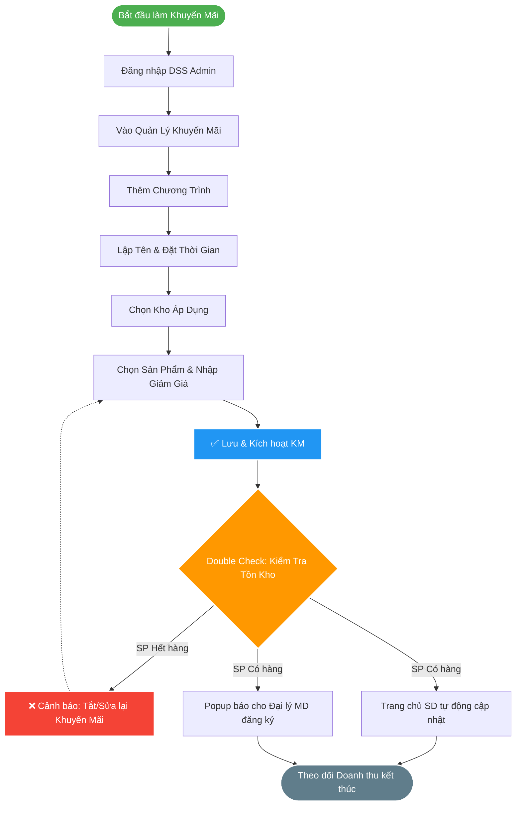

# 📝 SOP 05: QUY TRÌNH TẠO CHƯƠNG TRÌNH KHUYẾN MÃI (GIẢM GIÁ THEO THỜI GIAN)
> **Bộ phận:** Admin Vận Hành / Marketing
> **Hệ thống áp dụng:** `dss.khotot.vn` (DSS Admin Portal)

Trong hệ thống Web ETZ, tính năng này cho phép Admin thiết lập các campaign Sale giảm giá chớp nhoáng hoặc chạy dài ngày cho từng sản phẩm cụ thể nhằm thúc đẩy đơn hàng từ MD và SD.

---

## 🗺️ BIỂU ĐỒ QUY TRÌNH (FLOWCHART)

---

## ⚙️ CÁC BƯỚC THỰC HIỆN CHI TIẾT

### Bước 1: Quyền truy cập
- Đăng nhập vào trang quản trị Admin DSS (`dss.khotot.vn`).
- Trên thanh Menu, tìm và truy cập vào module **Quản lý Khuyến Mãi** (hoặc Ưu đãi).

### Bước 2: Khởi tạo chương trình mới
- Nhấp chọn nút **[Thêm chương trình khuyến mãi]** (hoặc Thêm mới).

### Bước 3: Điền thông tin cốt lõi
1. **Tên chương trình:** Đặt tên rõ ràng, dễ nhận diện (Ví dụ: *Flash Sale Cuối Tuần 15/4*, *Xả kho thẻ nhớ 32GB*...).
2. **Thời gian diễn ra:** Chọn chính xác thời điểm bắt đầu và kết thúc (Theo Giờ/Phút/Ngày/Tháng). **Quan trọng:** Ghi nhớ rằng chức năng này là *Khuyến mãi giảm giá theo thời gian*, chương trình sẽ tự động ẩn khi hết hạn.

### Bước 4: Thiết lập kho & Sản phẩm
1. **Chọn Kho áp dụng:** Chọn kho bãi cụ thể đang chạy chương trình giảm giá này (Kho tổng hoặc kho phân phối chỉ định).
2. **Chọn Sản phẩm & Giảm giá:** Tích chọn các sản phẩm nằm trong danh mục ưu đãi và nhập chi tiết Mức giảm giá (Tỉ lệ % hoặc Khấu trừ tiền mặt trực tiếp).
3. Nhấn **[Lưu & Kích hoạt]** chương trình trên hệ thống. 

### Bước 5: Double - Check Tồn Kho (🚨 Bắt buộc)
> [!warning] 🚨 LƯU Ý SỐNG CÒN SAU KHI TẠO XONG KHUYẾN MÃI
> Để tránh khủng hoảng bão đơn không có hàng giao, **NGAY LẬP TỨC** sau khi Lưu Khuyến mãi thành công, Admin Vận hành phải truy cập vào trình trạng Sản phẩm và **KIỂM TRA LẠI KHỐI LƯỢNG TỒN KHO THỰC TẾ**.
> Cần đảm bảo rằng các Sản phẩm được chọn Khuyến mãi đang có Tồn kho lớn (>0) trước khi thông báo này popup tại MD và SD. Nếu phát hiện hết hàng: Phải lập tức TẮT ngay sản phẩm đó ra khỏi KM.
