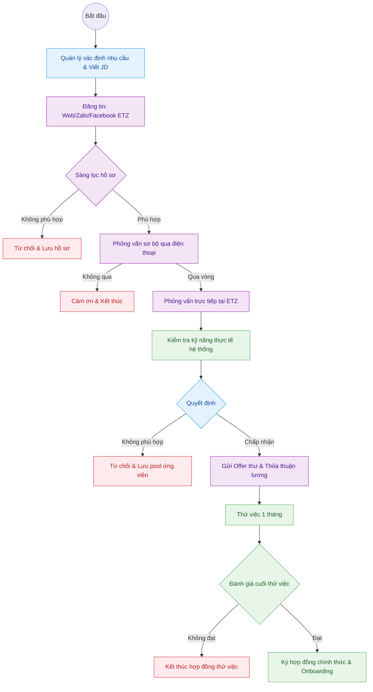

---
{"dg-publish":true,"permalink":"/01-tong-quan-ly-du-an/2-phong-van-hanh/sop-5-tuyen-dung-van-hanh-he-thong/","title":"SOP_5 — QUY TRÌNH TUYỂN DỤNG NHÂN SỰ VẬN HÀNH HỆ THỐNG","dg-note-properties":{"title":"SOP_5 — QUY TRÌNH TUYỂN DỤNG NHÂN SỰ VẬN HÀNH HỆ THỐNG"}}
---

# 👥 SOP 5 — QUY TRÌNH TUYỂN DỤNG NHÂN SỰ VẬN HÀNH HỆ THỐNG

> **Dự án:** Web ETZ — Khotot.vn
> **Phiên bản:** 1.0 | **Cập nhật:** 2026-03-30
> **Tác giả:** Antigravity AI
> **Phòng ban:** Phòng Vận Hành
> **Vùng dữ liệu:** Zone 01 — Tổng Hành Dinh

---

## 🎯 MỤC TIÊU

Đảm bảo quy trình tuyển dụng nhân sự vận hành hệ thống Web ETZ diễn ra bài bản, nhanh chóng và lựa chọn được ứng viên phù hợp với văn hóa và yêu cầu kỹ thuật của khotot.vn.

---

## 🔄 SƠ ĐỒ QUY TRÌNH (SWIMLANE FLOWCHART)

---

## 👁️ CHI TIẾT CÁC GIAI ĐOẠN

### GIAI ĐOẠN 1: XÁC ĐỊNH NHU CẦU & ĐĂNG TIN

**Quản lý phụ trách thực hiện:**
- Viết **Mô tả công việc (JD)** rõ ràng gồm: nhiệm vụ chính, kỹ năng yêu cầu, quyền lợi.
- Yêu cầu tối thiểu cho vị trí Vận hành hệ thống:
  - Thành thạo sử dụng máy tính, phần mềm quản lý đơn hàng.
  - Có khả năng thao tác trên web/app nội bộ ETZ.
  - Cẩn thận, trung thực, chịu được áp lực công việc.
- Đăng tin trên: **Zalo OA ETZ, Facebook ETZ, các group tuyển dụng địa phương**.

---

### GIAI ĐOẠN 2: SÀNG LỌC HỒ SƠ (Trong vòng 24h)

| Tiêu chí | Đạt | Không đạt |
|---|---|---|
| Độ tuổi | 18 – 35 tuổi | Ngoài độ tuổi |
| Kinh nghiệm | Ưu tiên có kinh nghiệm kho/vận hành | Hoàn toàn không có kinh nghiệm liên quan |
| Hồ sơ | CV rõ ràng, đầy đủ thông tin | Thiếu thông tin liên lạc |

> **Lưu ý:** Hồ sơ không đạt vẫn lưu vào **pool ứng viên** để tham khảo sau.

---

### GIAI ĐOẠN 3: PHỎNG VẤN SƠ BỘ (Điện thoại – 15 phút)

**Người phụ trách:** Quản lý hoặc Admin cấp cao.

Các câu hỏi chuẩn:
1. Bạn có thể mô tả kinh nghiệm làm việc với hệ thống phần mềm không?
2. Bạn xử lý thế nào khi phát hiện lỗi trong quá trình vận hành?
3. Bạn có thể đi làm vào ngày cuối tuần/theo ca không?

**Tiêu chí qua vòng:** Giao tiếp tốt, thái độ tích cực, cam kết thời gian làm việc.

---

### GIAI ĐOẠN 4: PHỎNG VẤN TRỰC TIẾP & KIỂM TRA KỸ NĂNG

**Địa điểm:** Văn phòng ETZ / Kho ETZ Miền Nam.

**Bài kiểm tra thực tế:**
- Thao tác trên **Web ETZ Demo**: Xử lý 1 đơn hàng mẫu từ đầu đến cuối.
- Kiểm tra khả năng đọc và cập nhật trạng thái đơn hàng trên hệ thống.
- Xử lý tình huống: Đơn hàng bị lỗi trạng thái → Hướng xử lý?

**Thang điểm:**

| Hạng mục | Điểm tối đa |
|---|---|
| Kỹ năng thao tác hệ thống | 40 điểm |
| Tư duy xử lý vấn đề | 30 điểm |
| Thái độ & Văn hóa phù hợp | 30 điểm |

> **Điểm đạt:** ≥ 70/100 điểm.

---

### GIAI ĐOẠN 5: THỬ VIỆC (1 tháng)

- Thời gian: **30 ngày làm việc thực tế**.
- Lương thử việc: **85% mức lương chính thức** (theo thỏa thuận).
- Người hướng dẫn: Admin/Vận hành senior phụ trách kèm cặp.
- Nhiệm vụ thử việc: Thực hiện đầy đủ các SOP vận hành hiện hành của ETZ.

**Đánh giá cuối thử việc:**

| Tiêu chí | Đạt | Không đạt |
|---|---|---|
| Hoàn thành nhiệm vụ giao | ≥ 90% | < 90% |
| Vi phạm quy định | 0 lần | ≥ 1 lần nghiêm trọng |
| Đánh giá của Quản lý | Đồng ý ký hợp đồng | Không đồng ý |

---

### GIAI ĐOẠN 6: ONBOARDING CHÍNH THỨC

Sau khi ký hợp đồng, nhân viên mới được:
1. Cấp tài khoản hệ thống Web ETZ (Admin tạo).
2. Đào tạo toàn bộ SOP Vận Hành theo [[01_TONG_QUAN_LY_DU_AN/2_PHONG_VAN_HANH/00_DANH_MUC_VAN_HANH\|Danh Mục Vận Hành ETZ]].
3. Phân ca & giao nhiệm vụ chính thức.

---

## 📊 KPI THEO DÕI

| Chỉ số | Mục tiêu |
|---|---|
| Thời gian từ đăng tin → Có ứng viên phỏng vấn | ≤ 7 ngày |
| Thời gian từ phỏng vấn → Ra quyết định | ≤ 3 ngày |
| Tỷ lệ nhân viên thử việc → Ký HĐ chính thức | ≥ 80% |
| Tỷ lệ giữ chân nhân viên sau 3 tháng | ≥ 90% |
