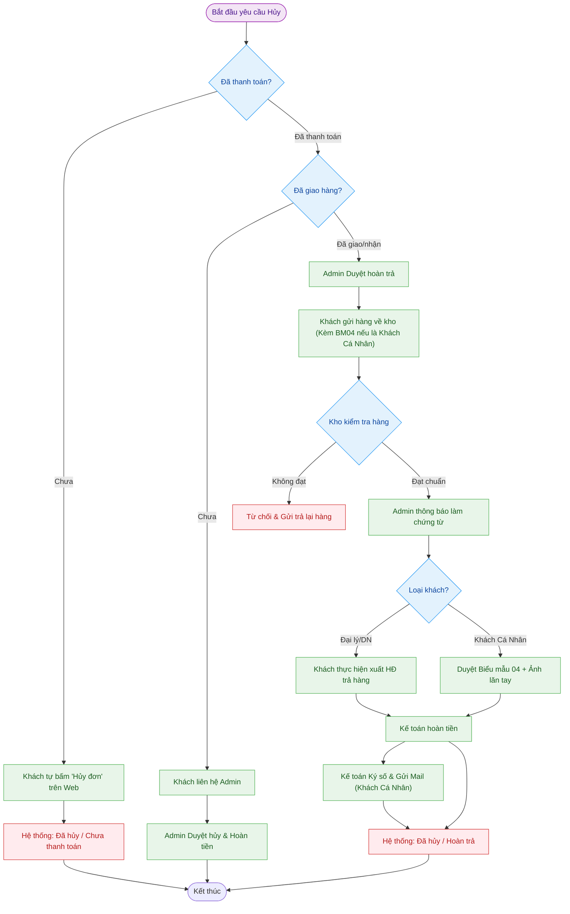

---
{"dg-publish":true,"permalink":"/01-tong-quan-ly-du-an/2-phong-van-hanh/sop-6-huy-don-hang/","title":"SOP 06 — QUY TRÌNH HỦY ĐƠN HÀNG & HOÀN TRẢ","dg-note-properties":{"title":"SOP 06 — QUY TRÌNH HỦY ĐƠN HÀNG & HOÀN TRẢ"}}
---

# 📦 SOP 06 — QUY TRÌNH HỦY ĐƠN HÀNG & HOÀN TRẢ

> **Dự án:** Web ETZ — Khotot.vn
> **Phiên bản:** 1.0 | **Cập nhật:** 2026-04-01
> **Phòng ban:** Phòng Vận Hành / Kế Toán
> **Vùng dữ liệu:** Zone 01 — Tổng Hành Dinh

---

## 🎯 MỤC TIÊU
Đảm bảo quy trình hủy đơn hàng được thực hiện thống nhất, minh bạch về trạng thái thanh toán và bảo vệ quyền lợi của cả khách hàng (SD) lẫn hệ thống ETZ.

---

## 🔄 SƠ ĐỒ QUY TRÌNH (FLOWCHART)

---

##  CHI TIẾT CÁC TRƯỜNG HỢP

### 1. TRƯỜNG HỢP 1: KHÁCH CHƯA THANH TOÁN
Đây là trường hợp đơn giản nhất, khách hàng có toàn quyền quyết định trước khi hệ thống ghi nhận dòng tiền.
- **Thao tác:** Khách hàng chủ động nhấn nút **"Hủy đơn"** trong mục *Quản lý đơn hàng* trên Website.
- **Hệ thống tự động cập nhật:**
    - Trạng thái đơn: **Đã hủy**.
    - Trạng thái thanh toán: **Chưa thanh toán**.
- **Lưu ý:** Không phát sinh bất kỳ quy trình xử lý thủ công nào từ phía Admin hay Kế toán.

---

### 2. TRƯỜNG HỢP 2: KHÁCH ĐÃ THANH TOÁN
Khi đã phát sinh giao dịch tài chính, việc hủy đơn cần sự can thiệp và kiểm soát của Admin để đảm bảo dòng tiền.

#### 2.1. Đơn mới tạo (Chưa xử lý / Chưa xuất kho)
- **Ràng buộc:** Khách không thể tự hủy trên Web, nút hủy sẽ bị ẩn hoặc vô hiệu hóa.
- **Quy trình:**
    1. Khách liên hệ hotline/Zalo OA của Admin/CSKH.
    2. **Admin kiểm tra:** Nếu đơn thực sự chưa đóng gói/chưa xuất kho -> Admin nhấn lệnh **Hủy đơn** trên Dashboard.
    3. **Hoàn tiền:** Admin chuyển thông tin (Mã đơn, Số tiền, TK nhận) cho Kế toán.
    4. **SLA hoàn tiền:** Tối đa **07 ngày làm việc**.
- **Cập nhật hệ thống:** Trạng thái chuyển từ *Chờ hoàn tiền* ➡️ **Đã hoàn tiền**.

#### 2.2. Đơn đã xuất hàng / Đã nhận hàng (Chành xe, Viettel Post, Tại kho)
Trường hợp này phức tạp vì hàng hóa đã lưu thông. 

> [!info] CHÍNH SÁCH ĐỔI TRẢ THÔNG THOÁNG
> **Nguyên tắc:** Hệ thống ETZ cho phép khách hàng yêu cầu hoàn trả hàng hóa đã giao theo sự phê duyệt của Admin.
> **Điều kiện phê duyệt:** Bắt buộc Admin phải xem xét và đồng ý trước khi khách gửi hàng về. Khách hàng phải chịu toàn bộ chi phí vận chuyển phát sinh.
> **Điều kiện hàng hóa:** Hàng trả về bắt buộc phải còn nguyên Seal, nguyên hộp, không có dấu hiệu đã qua sử dụng và đầy đủ chứng từ (Biểu mẫu 04).

> [!CAUTION] QUY ĐỊNH TUYỆT ĐỐI VỀ BIỂU MẪU
> **Biểu mẫu 04 CHỈ dành cho Khách Cá Nhân (không có dấu mộc/không thể xuất hóa đơn).** 
> Đối với khách hàng là Doanh nghiệp/Đại lý: **KHÔNG** cho phép dùng biểu mẫu này. Họ bắt buộc phải tự xuất hóa đơn điện tử trả lại hàng cho ETZ thì mới được duyệt hoàn tiền.

- **Quy trình hoàn trả:**
    1. **Tiếp nhận:** Admin hướng dẫn khách tải **Biểu mẫu 04 (Chỉ dành cho Khách Cá Nhân)**, ký/lăn tay sẵn và **bắt buộc gửi kèm bên trong kiện hàng** khi chuyển về Kho. Admin phải nhắc nhở kỹ bước này để Kho có căn cứ nhận hàng.
    2. **Kiểm tra & Xác thực (Kho & Admin):** 
        - Kho: Kiểm tra hàng nguyên seal, không hư hỏng.
        - **Bảo mật xác thực chữ ký (Chỉ dành cho Khách Cá Nhân):**
            - Do CCCD cũ không có chữ ký, Admin yêu cầu khách hàng: **Lăn vân tay** vào Biểu mẫu 04 và **Chụp 01 tấm hình lúc đang lăn tay** gửi cho Admin. Đây là bằng chứng sống đối soát với vân tay trên CCCD đã có trong hệ thống.
            - Khách Doanh nghiệp: Vẫn bắt buộc có **đóng dấu mộc đỏ** của công ty.
    3. **Kiểm tra tại Kho (🚨 Bước then chốt):**
        - Kho nhận hàng, kiểm tra tình trạng (Seal, tem, hư hỏng).
        - Nếu **ĐẠT CHUẨN**, Admin mới thông báo cho khách hàng thực hiện các bước chứng từ tiếp theo.
    4. **Xử lý chứng từ & Hóa đơn (Kế toán):**
        - **Khách hàng Doanh nghiệp / Đại lý:** Sau khi Kho xác nhận hàng OK, Admin mới yêu cầu khách xuất hóa đơn trả hàng gửi cho ETZ. *Lưu ý: Tuyệt đối không để khách xuất hóa đơn trước khi kiểm kho để tránh sai sót.*
        - **Khách hàng Cá nhân:** Kế toán sử dụng **[[01_TONG_QUAN_LY_DU_AN/8_BIEU_MAU_CHECKLISTS/04_Bien_Ban_Thu_Hoi_Hoa_Don\|Biểu mẫu 04]]** (đã gửi kèm trong thùng hàng) làm căn cứ hủy hóa đơn.
    5. **Hoàn tiền & Chứng từ (Kế toán):** 
        - Kế toán thực hiện chuyển khoản hoàn tiền (SLA 07 ngày).
        - **Ký số & Gửi Mail:** Ký số vào Biên bản Thu hồi và gửi Mail cho Khách Cá Nhân đối soát.
- **Cập nhật hệ thống:** Trạng thái đơn chuyển thành **Đã hủy / Hoàn trả**.

---

#### 2.3. Xử lý trường hợp hàng trả về KHÔNG ĐÚNG QUY ĐỊNH
Trường hợp khách hàng tự ý gửi hàng về kho mà không có sự đồng ý của Admin hoặc hàng không bị lỗi (không thuộc diện VIP/Ngoại lệ):
- **Phía Kho:** Từ chối nhận kiện hàng (Reject) hoặc ký nhận nhưng để sang khu vực chờ xử lý riêng.
- **Phía Admin:** Liên hệ khách hàng thông báo từ chối hoàn trả.
- **Hướng xử lý:** Gửi trả lại hàng cho khách. Mọi chi phí vận chuyển phát sinh (2 đầu) khách hàng phải tự chịu trách nhiệm.
- **Hệ thống:** Giữ nguyên trạng thái đơn hàng là **Đã giao hàng**.

---

## 📊 KPI & LƯU Ý QUAN TRỌNG

- **Admin:** Luôn phải kiểm tra tình trạng vận hành thực tế của Kho trước khi đồng ý hủy đơn đã thanh toán.
- **Kế Toán:** SLA hoàn tiền 07 ngày là thời hạn cam kết với khách hàng, cần cập nhật vào file đối soát tài chính.
- **Hệ thống:** Ghi nhận rõ lịch sử (Log) ai là người thực hiện lệnh hủy và lý do hủy.

---

## 📂 BIỂU MẪU LIÊN QUAN
- [[01_TONG_QUAN_LY_DU_AN/8_BIEU_MAU_CHECKLISTS/04_Bien_Ban_Thu_Hoi_Hoa_Don\|Biểu mẫu 04 — Biên bản Thu hồi hóa đơn]]

---
---
