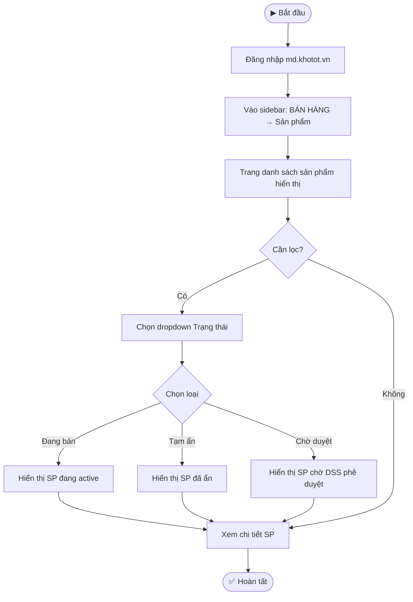
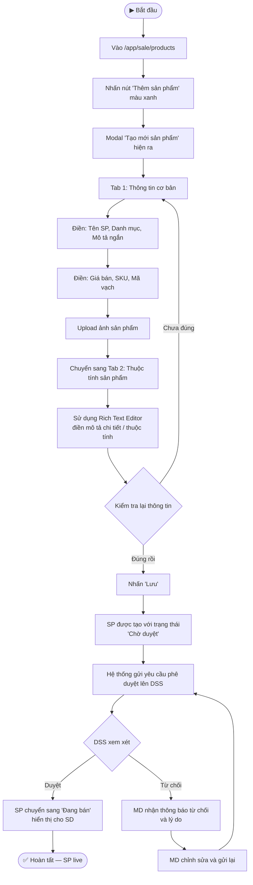
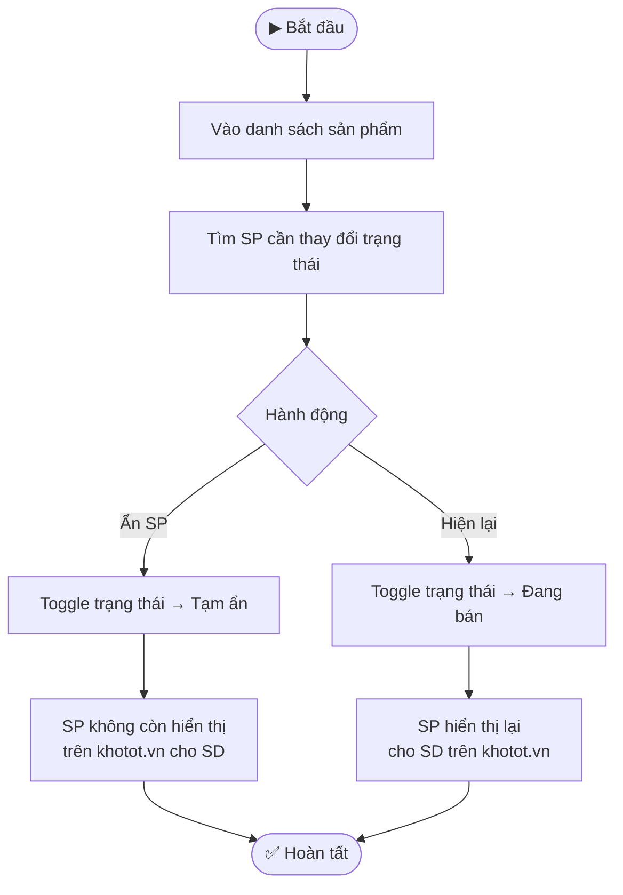

---
{"dg-publish":true,"permalink":"/01-tong-quan-ly-du-an/2-phong-van-hanh/sop-md-khotot-quan-ly-san-pham/","title":"SOP-MD-01 | Quản lý Sản phẩm — md.khotot.vn","dg-note-properties":{"title":"SOP-MD-01 | Quản lý Sản phẩm — md.khotot.vn","cap_nhat":"2026-03-31","loai":"SOP","phong_ban":"Vận Hành","he_thong":"md.khotot.vn"}}
---

# SOP-MD-01 | Quản lý Sản phẩm MD
> **Áp dụng cho:** Nhân viên/Admin vai trò MD tại `md.khotot.vn`
> **Phiên bản:** v1.0 | **Ngày tạo:** 31/03/2026
> **Nguồn:** Tổng hợp từ UAT kiểm thử thực tế

---

## 🎯 Mục đích
Hướng dẫn MD (Nhà phân phối) quản lý danh mục sản phẩm trên hệ thống: xem sản phẩm từ DSS, tạo sản phẩm mới, kiểm soát trạng thái hiển thị.

---

## 📌 Thông tin truy cập
- **URL:** `https://md.khotot.vn/app/sale/products`
- **Sidebar:** BÁN HÀNG → Sản phẩm

---

## 🔄 LUỒNG 1: Xem & Lọc Sản Phẩm

---

## 🔄 LUỒNG 2: Tạo Sản Phẩm Mới & Gửi DSS Phê Duyệt

---

## 🔄 LUỒNG 3: Ẩn / Hiện Sản Phẩm

---

## ⚠️ Lưu ý quan trọng
- **Không trùng tên:** Hệ thống không cho phép tạo SP trùng tên với SP đã có (kể cả SP của DSS)
- **Chờ duyệt:** SP mới tạo sẽ ở trạng thái "Chờ duyệt" — SD chưa thấy cho đến khi DSS duyệt
- **Ẩn tạm thời ≠ Xóa:** Ẩn SP không xóa dữ liệu, chỉ ẩn khỏi kho SD

---

## 📞 Liên quan
- [[01_TONG_QUAN_LY_DU_AN/2_PHONG_VAN_HANH/SOP_MD_KHOTOT_XuLyDonHang\|SOP-MD-03: Xử lý Đơn hàng MD]]
- [[01_TONG_QUAN_LY_DU_AN/9_LUU_TRU_TIEN_DO/UAT_CHECKLIST_MD_KHOTOT_2026-03-31\|📋 UAT Checklist MD (31/03/2026)]]
