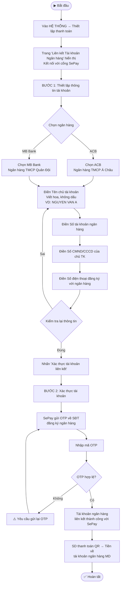
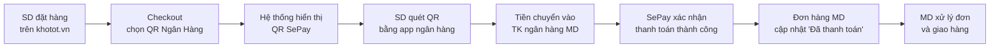

---
{"dg-publish":true,"permalink":"/01-tong-quan-ly-du-an/2-phong-van-hanh/sop-md-khotot-thiet-lap-thanh-toan/","title":"SOP-MD-05 | Thiết Lập Thanh Toán SePay — md.khotot.vn","dg-note-properties":{"title":"SOP-MD-05 | Thiết Lập Thanh Toán SePay — md.khotot.vn","cap_nhat":"2026-03-31","loai":"SOP","phong_ban":"Vận Hành","he_thong":"md.khotot.vn"}}
---

# SOP-MD-05 | Thiết Lập Thanh Toán SePay
> **Áp dụng cho:** Admin vai trò MD tại `md.khotot.vn`
> **Phiên bản:** v1.0 | **Ngày tạo:** 31/03/2026
> **Nguồn:** Tổng hợp từ UAT kiểm thử thực tế

---

## 🎯 Mục đích
Hướng dẫn MD liên kết tài khoản ngân hàng với cổng thanh toán SePay để nhận thanh toán QR từ khách hàng SD.

---

## 📌 Thông tin truy cập
- **URL:** `https://md.khotot.vn/app/administration/payment-configs`
- **Sidebar:** HỆ THỐNG → Thiết lập thanh toán
- **Cổng thanh toán:** SePay (tích hợp sẵn)
- **Ngân hàng hỗ trợ:** ACB | MB Bank

---

## 🔄 LUỒNG: Liên Kết Tài Khoản Ngân Hàng

---

## 📋 Luồng Thanh Toán End-to-End (SD → MD)

---

## 📋 Thông Tin Cần Chuẩn Bị

| Thông tin | Yêu cầu | Ghi chú |
|---|---|---|
| Tên chủ TK | Viết hoa, không dấu | Đúng như tên trên thẻ ngân hàng |
| Số tài khoản | Chính xác | Kiểm tra kỹ trước khi nhập |
| Số CMND/CCCD | Của chủ TK | Đúng như đăng ký với ngân hàng |
| SĐT ngân hàng | Đang active | Dùng nhận OTP xác thực |
| Ngân hàng | ACB hoặc MB Bank | Chỉ 2 ngân hàng được hỗ trợ hiện tại |

---

## ⚠️ Lưu ý quan trọng
- **Chỉ 2 ngân hàng được hỗ trợ:** ACB và MB Bank — nếu MD dùng ngân hàng khác, cần liên hệ DSS để bổ sung
- **Một tài khoản:** Mỗi MD chỉ liên kết được 1 tài khoản ngân hàng
- **Thông tin chính xác:** Tên, số TK, CMND phải khớp với thông tin tại ngân hàng — nếu sai sẽ không xác thực được
- **Không thay đổi thường xuyên:** Sau khi liên kết thành công, hạn chế thay đổi thông tin TK để tránh gián đoạn thanh toán

---

## 🆘 Xử lý sự cố thường gặp

| Vấn đề | Nguyên nhân | Giải pháp |
|---|---|---|
| OTP không về | SĐT ngân hàng sai hoặc hết vùng phủ | Kiểm tra lại SĐT đăng ký ngân hàng |
| Xác thực thất bại | Thông tin không khớp | Liên hệ ngân hàng kiểm tra lại tên/số TK/CMND |
| Không thấy trang | URL bị bookmark sai | Dùng đúng URL: `/app/administration/payment-configs` |
| Ngân hàng không hỗ trợ | Chỉ hỗ trợ ACB, MB Bank | Liên hệ DSS để bổ sung ngân hàng |

---

## 📞 Liên quan
- [[01_TONG_QUAN_LY_DU_AN/9_LUU_TRU_TIEN_DO/UAT_CHECKLIST_MD_KHOTOT_2026-03-31\|📋 UAT Checklist MD (31/03/2026)]]
- [[01_TONG_QUAN_LY_DU_AN/2_PHONG_VAN_HANH/SOP_MD_KHOTOT_XuLyDonHang\|SOP-MD-03: Xử lý Đơn hàng MD]]
