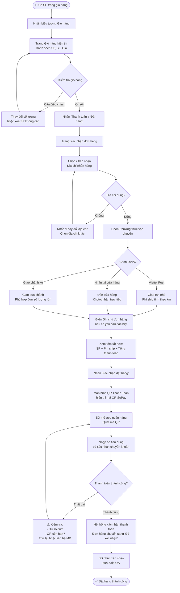
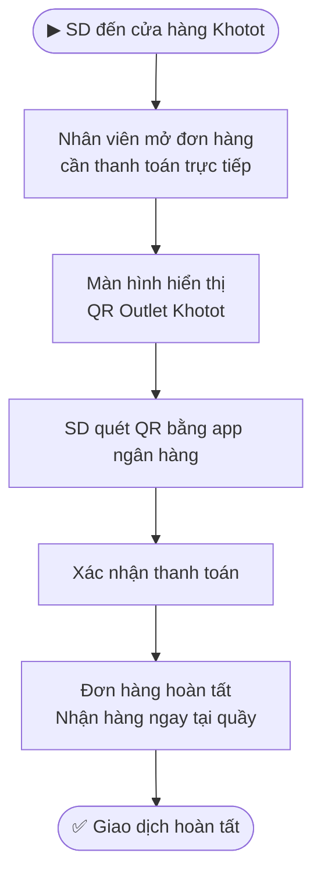

---
{"dg-publish":true,"permalink":"/01-tong-quan-ly-du-an/2-phong-van-hanh/sop-sd-khotot-thanh-toan/","title":"SOP-SD-03 | Thanh Toán (Checkout) — khotot.vn","dg-note-properties":{"title":"SOP-SD-03 | Thanh Toán (Checkout) — khotot.vn","cap_nhat":"2026-03-31","loai":"SOP","phong_ban":"Vận Hành","he_thong":"khotot.vn"}}
---


# SOP-SD-03 | Thanh Toán (Checkout) SD
> **Áp dụng cho:** Đại lý lẻ / Khách hàng (SD) tại `khotot.vn`
> **Phiên bản:** v1.0 | **Ngày tạo:** 31/03/2026
> **Nguồn:** Tổng hợp từ UAT kiểm thử thực tế (Phase 3 SD)

---

## 🎯 Mục đích
Hướng dẫn SD thực hiện quy trình thanh toán đơn hàng từ Giỏ hàng → Xác nhận → Chọn vận chuyển → Thanh toán QR.

---

## 📌 Thông tin truy cập
- **Giỏ hàng:** Biểu tượng 🛒 trên header hoặc `/gio-hang`
- **Thanh toán:** `/xac-nhan-don-hang`
- **Phương thức thanh toán hiện tại:** QR Ngân Hàng (SePay) *(COD chưa hỗ trợ)*
- **Đơn vị vận chuyển:** Viettel Post | Nhận tại cửa hàng | Giao chành xe

---

## 🔄 LUỒNG CHÍNH: Checkout Đầy Đủ



---

## 🔄 LUỒNG PHỤ: Nhận tại Cửa Hàng (Quét QR Outlet)



---

## 📋 Chi Tiết Màn Hình Xác Nhận Đơn Hàng

```
┌─────────────────────────────────────────────────┐
│            XÁC NHẬN ĐƠN HÀNG                    │
├─────────────────────────────────────────────────┤
│ 📍 ĐỊA CHỈ NHẬN HÀNG                            │
│    [Tên] — [SĐT]                                │
│    [Địa chỉ đầy đủ]          [Thay đổi]         │
├─────────────────────────────────────────────────┤
│ 🚚 PHƯƠNG THỨC VẬN CHUYỂN                        │
│    ○ Viettel Post      Phí: [X]đ                │
│    ○ Nhận tại cửa hàng  Phí: 0đ                 │
│    ○ Giao chành xe     Phí: [Thỏa thuận]        │
├─────────────────────────────────────────────────┤
│ 📝 GHI CHÚ ĐƠN HÀNG                             │
│    [Ô nhập ghi chú]                             │
├─────────────────────────────────────────────────┤
│ 💰 TÓM TẮT THANH TOÁN                           │
│    Tổng SP:          [X]đ                       │
│    Phí vận chuyển:   [X]đ                       │
│    Giảm giá:         [X]đ                       │
│    ─────────────────────                        │
│    TỔNG THANH TOÁN:  [X]đ                       │
├─────────────────────────────────────────────────┤
│         [ XÁC NHẬN ĐẶT HÀNG ]                   │
└─────────────────────────────────────────────────┘
```

---

## 📋 Các Phương Thức Vận Chuyển

| ĐVVC | Phí | Thời gian | Phù hợp với |
|---|---|---|---|
| **Viettel Post** | Tính theo km/KG | 1-3 ngày | Đơn hàng thông thường |
| **Nhận tại cửa hàng** | Miễn phí | Ngay lập tức | SD gần cửa hàng Khotot |
| **Giao chành xe** | Thỏa thuận | 1-5 ngày | Đơn số lượng lớn, tỉnh xa |

---

## ⚠️ Lưu ý quan trọng
- **Chỉ QR Ngân Hàng:** Hiện tại khotot.vn chưa hỗ trợ COD — mọi đơn phải thanh toán qua QR SePay
- **QR có thời hạn:** Mã QR thanh toán chỉ có hiệu lực trong thời gian nhất định — quét ngay sau khi đặt hàng
- **Đơn tự hủy:** Nếu không thanh toán trong thời hạn, đơn sẽ tự động hủy
- **Xác nhận Zalo:** Sau khi thanh toán thành công, SD nhận thông báo qua Zalo OA — kiểm tra để chắc chắn

---

## 📞 Liên quan
- [[01_TONG_QUAN_LY_DU_AN/2_PHONG_VAN_HANH/SOP_SD_KHOTOT_TimKiemMuaHang\|SOP-SD-02: Tìm Kiếm & Mua Hàng]]
- [[01_TONG_QUAN_LY_DU_AN/2_PHONG_VAN_HANH/SOP_SD_KHOTOT_QuanLyDonHang\|SOP-SD-04: Quản Lý Đơn Hàng SD]]
- [[01_TONG_QUAN_LY_DU_AN/9_LUU_TRU_TIEN_DO/UAT_CHECKLIST_KHOTOT_2026-03-31\|📋 UAT Checklist khotot.vn SD (31/03/2026)]]
