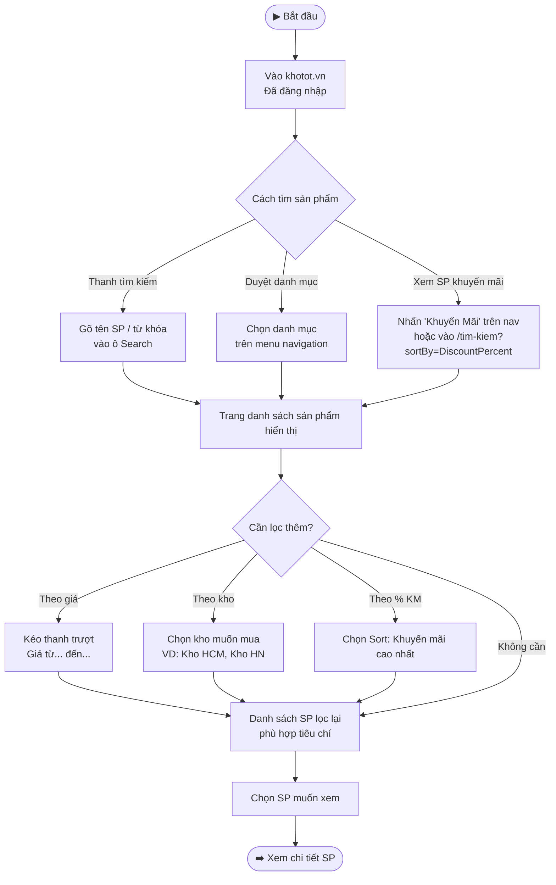
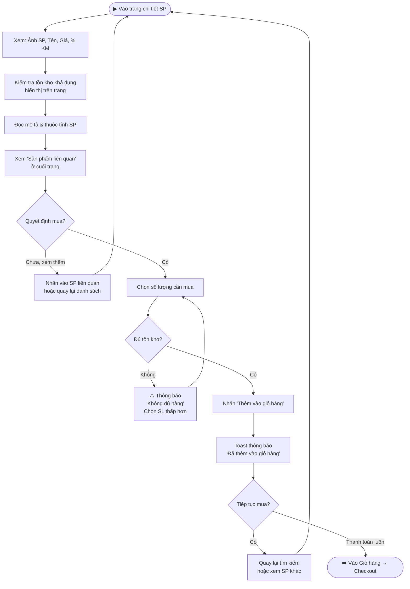
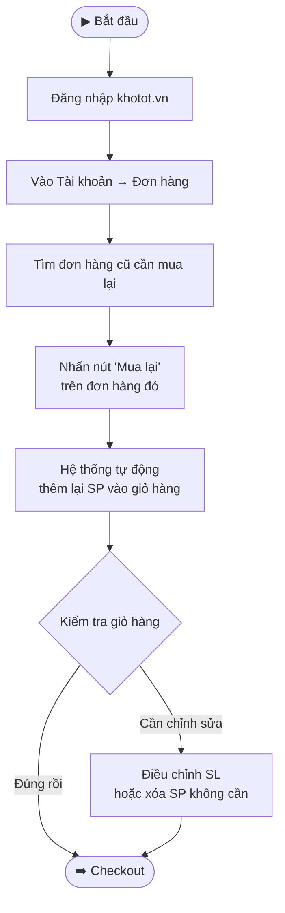

---
{"dg-publish":true,"permalink":"/01-tong-quan-ly-du-an/2-phong-van-hanh/sop-sd-khotot-tim-kiem-mua-hang/","title":"SOP-SD-02 | Tìm Kiếm & Mua Hàng — khotot.vn","dg-note-properties":{"title":"SOP-SD-02 | Tìm Kiếm & Mua Hàng — khotot.vn","cap_nhat":"2026-03-31","loai":"SOP","phong_ban":"Vận Hành","he_thong":"khotot.vn"}}
---

# SOP-SD-02 | Tìm Kiếm & Mua Hàng SD
> **Áp dụng cho:** Đại lý lẻ / Khách hàng (SD) tại `khotot.vn`
> **Phiên bản:** v1.0 | **Ngày tạo:** 31/03/2026
> **Nguồn:** Tổng hợp từ UAT kiểm thử thực tế (Phase 3 SD)

---

## 🎯 Mục đích
Hướng dẫn SD tìm kiếm, lọc và xem chi tiết sản phẩm trên khotot.vn trước khi thêm vào giỏ hàng.

---

## 📌 Thông tin truy cập
- **Trang chủ:** `https://khotot.vn`
- **Tìm kiếm:** `https://khotot.vn/tim-kiem`
- **Sản phẩm KM:** `https://khotot.vn/tim-kiem?sortBy=DiscountPercent`

> ⚠️ **Lưu ý URL:** Đường dẫn `/khuyen-mai` hiện trả về 404 — phải dùng `/tim-kiem?sortBy=DiscountPercent`

---

## 🔄 LUỒNG 1: Tìm Kiếm & Lọc Sản Phẩm

---

## 🔄 LUỒNG 2: Xem Chi Tiết Sản Phẩm & Thêm Giỏ Hàng

---

## 🔄 LUỒNG 3: Mua Lại Nhanh (Reorder)

---

## 📋 Các Tính Năng Lọc Sản Phẩm Trên khotot.vn

| Tính năng lọc | Cách dùng | Ghi chú UAT |
|---|---|---|
| Lọc theo giá | Thanh trượt giá min-max | ✅ PASS |
| Lọc theo kho | Dropdown chọn kho | ✅ PASS |
| Sắp xếp theo KM | Sort by DiscountPercent | ✅ PASS (URL: `/tim-kiem?sortBy=DiscountPercent`) |
| Sản phẩm liên quan | Cuối trang chi tiết SP | ⚠️ Chỉ hiển thị 1 SP (OBS-03) |
| Wishlist (Yêu thích) | Nút tim trên SP | ❌ BUG-02: Nút không có trên trang chi tiết |

---

## ⚠️ Lưu ý quan trọng
- **Wishlist tạm thời lỗi:** Chức năng Wishlist chưa hoạt động ở trang chi tiết SP (BUG-02) — đang chờ Dev sửa
- **SP liên quan:** Hiện chỉ hiển thị 1 sản phẩm — sẽ được cải thiện sau
- **Tồn kho realtime:** Số lượng tồn kho hiển thị được cập nhật theo thời gian thực từ kho MD
- **Chưa đăng nhập:** SD chưa đăng nhập có thể xem SP nhưng không thêm giỏ hàng

---

## 📞 Liên quan
- [[01_TONG_QUAN_LY_DU_AN/2_PHONG_VAN_HANH/SOP_SD_KHOTOT_DangKyDangNhap\|SOP-SD-01: Đăng Ký & Đăng Nhập]]
- [[01_TONG_QUAN_LY_DU_AN/2_PHONG_VAN_HANH/SOP_SD_KHOTOT_ThanhToan\|SOP-SD-03: Thanh Toán (Checkout)]]
- [[01_TONG_QUAN_LY_DU_AN/9_LUU_TRU_TIEN_DO/UAT_CHECKLIST_KHOTOT_2026-03-31\|📋 UAT Checklist khotot.vn SD (31/03/2026)]]
