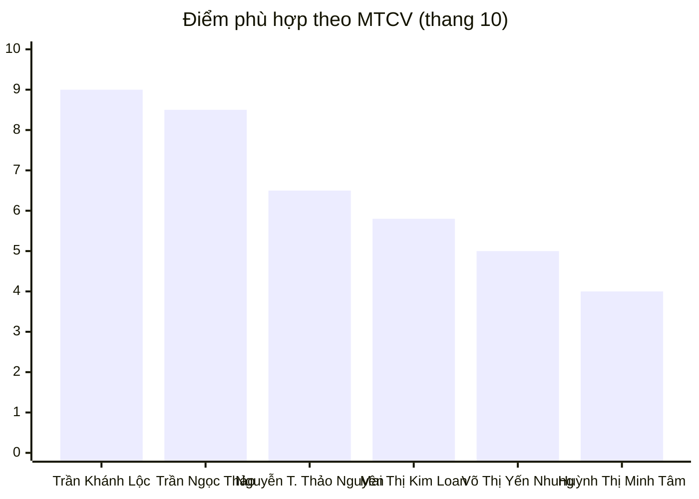

---
{"dg-publish":true,"permalink":"/01-tong-quan-ly-du-an/6-phong-nhan-su/01-ds-ung-vien/bcdg-ung-vien-van-hanh-website-2026-03-30/","title":"BÁO CÁO ĐÁNH GIÁ ỨNG VIÊN — VẬN HÀNH WEBSITE NỘI BỘ (E-COMMERCE)","dg-note-properties":{"title":"BÁO CÁO ĐÁNH GIÁ ỨNG VIÊN — VẬN HÀNH WEBSITE NỘI BỘ (E-COMMERCE)","loai":"Báo cáo Nhân sự","cap_nhat":"2026-03-30","vi_tri":"Nhân viên Vận hành Website Nội bộ","so_ung_vien":6}}
---

# 📊 BÁO CÁO ĐÁNH GIÁ ỨNG VIÊN
## Vị trí: Nhân viên Vận hành Website Nội bộ (E-Commerce) — ETZ Việt Nam

> **Ngày phân tích:** 30/03/2026 | **Tổng ứng viên:** 6 | **Người phân tích:** AI Nhân Sự ETZ

---

## 🏆 I. XẾP HẠNG TỔNG THỂ

| Hạng | Ứng viên | Điện thoại | Điểm | Khuyến nghị |
|:---:|---|---|:---:|---|
| 🥇 1 | **Trần Khánh Lộc** | 0353 603 453 | **9.0/10** | ✅ Mời phỏng vấn ngay |
| 🥈 2 | **Trần Ngọc Thảo** | 0356 944 595 | **8.5/10** | ✅ Mời phỏng vấn ngay |
| 🥉 3 | Nguyễn Thị Thảo Nguyên | 077 892 2296 | **6.5/10** | ⚠️ Dự phòng |
| 4 | **Mai Thị Kim Loan** 🆕 | 0379 063 217 | **5.8/10** | ⚠️ Dự phòng (thiên sàn TMĐT) |
| 5 | Võ Thị Yến Nhung | 0388 394 658 | **5.0/10** | 🔄 Lưu hồ sơ |
| 6 | Huỳnh Thị Minh Tâm | 09355634111 | **4.0/10** | ❌ Chưa phù hợp |

---

## 📋 II. TIÊU CHÍ ĐÁNH GIÁ (Theo MTCV)

| # | Tiêu chí | Trọng số | Mô tả |
|---|---|:---:|---|
| **TC1** | Kinh nghiệm vận hành TMĐT / Website ≥ 2 năm | 25% | Ưu tiên vận hành website bán hàng |
| **TC2** | Hiểu quy trình: Sản phẩm – Đơn hàng – Thanh toán – Tồn kho | 20% | Nắm rõ luồng vận hành end-to-end |
| **TC3** | Tư duy hệ thống, xây dựng SOP / thiết kế quy trình | 20% | Lợi thế lớn nếu đã từng viết SOP thực tế |
| **TC4** | Kỹ năng phối hợp và điều phối đa phòng ban | 15% | Kho – Kế toán – Kinh doanh – IT |
| **TC5** | Thành thạo Excel / Google Sheet; biết dùng AI | 10% | AI là lợi thế cạnh tranh |
| **TC6** | Thái độ: Chủ động, cẩn thận, có trách nhiệm | 10% | Đánh giá qua số liệu & cách trình bày CV |

---

## 🔢 III. MA TRẬN ĐIỂM CHI TIẾT

| Ứng viên | TC1 (25%) | TC2 (20%) | TC3 (20%) | TC4 (15%) | TC5 (10%) | TC6 (10%) | **Tổng** |
|---|:---:|:---:|:---:|:---:|:---:|:---:|:---:|
| Trần Khánh Lộc | 9.5 | 9.0 | **10** | 9.0 | 9.0 | 9.0 | **9.0** |
| Trần Ngọc Thảo | 7.5 | **10** | 8.5 | 8.5 | 9.0 | 9.0 | **8.5** |
| Nguyễn T. Thảo Nguyên | 7.0 | 6.0 | 4.0 | 7.0 | **9.5** | 8.0 | **6.5** |
| **Mai Thị Kim Loan** 🆕 | 6.0 | 6.0 | 3.5 | 6.0 | 5.5 | 7.5 | **5.8** |
| Võ Thị Yến Nhung | 4.0 | 6.0 | 3.0 | 6.0 | 6.5 | 7.0 | **5.0** |
| Huỳnh Thị Minh Tâm | 3.0 | 3.0 | 2.0 | 4.0 | 7.0 | 8.0 | **4.0** |

---

## 👤 IV. PHÂN TÍCH CHI TIẾT TỪNG ỨNG VIÊN

---

### 🥇 1. TRẦN KHÁNH LỘC — 9.0/10
> 📞 0353 603 453 | ✉️ tnitsme@gmail.com

#### Tóm tắt hồ sơ
- **Kinh nghiệm:** 9 năm thực chiến (2017–2026), gần nhất là Phó Phòng KD & Vận hành tại Công ty Thực phẩm Xanh Green Loving (2023–2026).
- **Năng lực tải:** Quản lý **5 điểm bán – 2 kho**, xử lý **300+ đơn hàng/ngày**, kiểm soát **800+ SKUs**.
- **Quản lý nhân sự:** Trực tiếp quản lý **7–10 người**, phân công ca kíp, giải quyết bottleneck liên bộ phận.
- **Dự án tiêu biểu:** Tham gia triển khai **10+ dự án**, mở mới thành công **2 siêu thị**, theo dõi tiến độ dự án xưởng quy mô **35–40 tỷ VNĐ**.
- **Hệ thống:** Sapo, Haravan *(khớp trực tiếp nền tảng ETZ/Khotot)*, Excel, Google Sheets.

#### Đánh giá từng tiêu chí

| Tiêu chí | Bằng chứng từ CV | Điểm |
|---|---|:---:|
| **TC1 – KN ≥ 2 năm** | 9 năm KN thực chiến. 3 năm gần nhất tại Green Loving với vai trò Phó phòng | **9.5** |
| **TC2 – Hiểu quy trình** | Kiểm soát đơn hàng, tồn kho, luân chuyển hàng hóa 5 điểm bán – 2 kho, xử lý trễ đơn/thiếu hàng/sai thông tin | **9.0** |
| **TC3 – SOP / Hệ thống** | Thiết lập SOP & checklist → **giảm 20–30% lỗi vận hành**, tối ưu chi phí phát sinh **5–20%** | **10** |
| **TC4 – Phối hợp phòng ban** | Điều phối 7–10 nhân sự, phối hợp Kho – KT – KD – IT trong mở mới 2 siêu thị | **9.0** |
| **TC5 – Excel / AI** | Thành thạo Excel, Google Sheets. Sapo/Haravan là hệ thống ETZ đang dùng | **9.0** |
| **TC6 – Thái độ** | Hồ sơ có số liệu rõ ràng, có người tham chiếu (PGĐ Green Loving: 0372 150 230) | **9.0** |

#### ✅ Điểm mạnh nổi bật
- **SOP thực chiến cực hiếm** — Không phải ứng viên nào cũng từng đo lường và giảm lỗi vận hành bằng quy trình.
- **Am hiểu Sapo/Haravan** — Bắt nhịp ngay với hệ thống ETZ, không cần onboarding dài.
- **Tư duy lãnh đạo** — Từng đảm nhiệm vai trò Phó phòng, quản lý dự án lớn → phù hợp nếu ETZ cần người có thể phát triển lên Team Lead.

#### ⚠️ Điểm cần làm rõ khi phỏng vấn
- Kinh nghiệm chủ yếu **offline/chuỗi bán lẻ vật lý** → cần đánh giá khả năng thích nghi với môi trường website TMĐT thuần.
- Có sẵn sàng làm nhân viên (không phải quản lý) trong giai đoạn đầu không?

#### 🎯 Câu hỏi phỏng vấn gợi ý
1. Anh đã trực tiếp vận hành website bán hàng (backend, dashboard đơn hàng online) chưa? Mô tả chi tiết.
2. Khi SOP bị nhân viên không tuân thủ, anh xử lý thế nào?
3. Kỳ vọng mức lương và lộ trình phát triển tại ETZ?

---

### 🥈 2. TRẦN NGỌC THẢO — 8.5/10
> 📞 0356 944 595 | ✉️ thaot5072@gmail.com

#### Tóm tắt hồ sơ
- **Kinh nghiệm:** ~17 tháng tại Cennos eCommerce (10/2024–03/2026) — BPO cho khách hàng Mỹ.
- **Quy mô vận hành:** **1.000+ SKUs** trên Shopify và Wayfair.
- **Học vấn:** Đại học Cần Thơ — **CNTT, GPA 3.2/4.0** → nền tảng IT hiểu sâu logic hệ thống.
- **Công cụ thành thạo:** Shopify Admin, Wayfair Portal, Matrixify (bulk tool), Figma, Excel Advanced, AI tools.
- **Ngôn ngữ:** Tiếng Anh Intermediate — trao đổi email với US client hàng ngày.

#### Đánh giá từng tiêu chí

| Tiêu chí | Bằng chứng từ CV | Điểm |
|---|---|:---:|
| **TC1 – KN ≥ 2 năm** | ~17 tháng — Chưa đủ 2 năm nhưng **chất lượng và độ phức tạp cao hơn mức trung bình** | **7.5** |
| **TC2 – Hiểu quy trình** | Vận hành 1.000+ SKUs: listing, backend admin, collections, sales channels, bulk import/export, Post QA | **10** |
| **TC3 – SOP / Hệ thống** | Workflow Planning có ETD, Data Framework Design bằng Figma, Progress Tracking báo cáo tuần | **8.5** |
| **TC4 – Phối hợp phòng ban** | Cross-team với Photoshop, IT; báo cáo tiến độ thực thời với US client qua Outlook | **8.5** |
| **TC5 – Excel / AI** | Excel **Advanced** + dùng AI viết SEO description, tối ưu nội dung sản phẩm | **9.0** |
| **TC6 – Thái độ** | Hồ sơ chi tiết, có số liệu, kinh nghiệm BPO cho khách hàng khó tính → kỷ luật cao | **9.0** |

#### ✅ Điểm mạnh nổi bật
- **Kỹ năng website chuyên sâu nhất pool** — Shopify backend, Matrixify bulk ops, HTML/CSS, Technical SEO, UX/UI Figma.
- **Background CNTT** (ĐH Cần Thơ) → hiểu được logic backend, dễ phối hợp với bộ phận IT của ETZ.
- **Quen tiêu chuẩn BPO quốc tế** → deadline nghiêm ngặt, báo cáo minh bạch, xử lý ticket chuẩn.
- **Excel Advanced** — Có thể tự xây báo cáo vận hành, không phụ thuộc bộ phận khác.

#### ⚠️ Điểm cần làm rõ khi phỏng vấn
- Kinh nghiệm toàn nền tảng quốc tế (Shopify/Wayfair) → cần thẩm định khả năng adapt Sapo/Haravan.
- Chưa đủ 2 năm → cần xem xét chất lượng KN để offset.
- Kỳ vọng mức lương (BPO quốc tế thường có mức lương cao hơn thị trường).

#### 🎯 Câu hỏi phỏng vấn gợi ý
1. Chị đã từng dùng Sapo hay Haravan chưa? Nếu chưa, ước tính bao lâu để thành thạo so với Shopify?
2. Trong 1.000+ SKUs chị vận hành, chị gặp vấn đề data sai lệch lớn nhất là gì và xử lý thế nào?
3. Tại sao chị muốn chuyển từ BPO quốc tế sang môi trường nội địa như ETZ?
4. Kỳ vọng mức lương?

---

### 🥉 3. NGUYỄN THỊ THẢO NGUYÊN — 6.5/10
> 📞 077 892 2296 | ✉️ Nttnguyen14.cv@gmail.com

#### Tóm tắt hồ sơ
- **Kinh nghiệm:** ~2 năm tại Dkpower (T3/2023–T9/2025) — thiên về Marketing.
- **Thành tích nổi bật:** YouTube 20.4M views / 37K subscribers, SEO website 368K impressions Top 10 Google (CTR 1.2%), chiến dịch CSR đạt 77.7K tương tác.
- **Vận hành TMĐT:** Shopee, TikTok Shop, Lazada (ở góc độ content & marketing, không phải vận hành thuần).
- **Công cụ AI:** GPT-4, Gemini, Claude, AI Studio → mạnh nhất pool.
- **Ngoại ngữ:** Tiếng Trung 4 kỹ năng — lợi thế nếu ETZ mở rộng nguồn hàng Trung Quốc.

#### Đánh giá từng tiêu chí

| Tiêu chí | Bằng chứng từ CV | Điểm |
|---|---|:---:|
| **TC1 – KN ≥ 2 năm** | ~2 năm tại Dkpower nhưng **role là Marketing Executive**, không phải Vận hành | **7.0** |
| **TC2 – Hiểu quy trình** | Có vận hành sàn TMĐT + phối hợp kho vận, nhưng ở mức hỗ trợ marketing, không phụ trách chính | **6.0** |
| **TC3 – SOP / Hệ thống** | Không đề cập đến xây dựng SOP hay thiết kế quy trình vận hành | **4.0** |
| **TC4 – Phối hợp phòng ban** | Phối hợp Sales + Kho vận triển khai khuyến mãi, phân phối hàng đại lý | **7.0** |
| **TC5 – Excel / AI** | **Xuất sắc về AI** — 4 tools (GPT, Gemini, Claude, AI Studio). Tăng CTR 1.2% bằng AI | **9.5** |
| **TC6 – Thái độ** | Số liệu kết quả rõ ràng, hoàn thành >95% KPI trong 3 tháng liên tiếp | **8.0** |

#### ✅ Điểm mạnh nổi bật
- **AI Tools vượt trội** — Thực tế đã dùng AI để tối ưu SEO và tăng CTR → tư duy ứng dụng AI vào công việc thực tế.
- **SEO thực chiến** — 368K impressions, Top 10 Google, vị trí TB 7.2 → có thể hỗ trợ tối ưu nội dung website ETZ.
- **Tiếng Trung 4 kỹ năng** — Lợi thế lớn nếu ETZ mở rộng nhập hàng từ Trung Quốc.

#### ⚠️ Điểm cần làm rõ khi phỏng vấn
- **Định hướng nghề nghiệp rõ ràng là Marketing** (ghi rõ trong CV) → cần hỏi thẳng về sự sẵn sàng chuyển hướng.
- Chưa từng phụ trách quy trình sản phẩm–đơn hàng–tồn kho.
- Bằng Cao đẳng (không phải Đại học) — cần đánh giá nếu ETZ có tiêu chí học vấn.

#### 🎯 Câu hỏi phỏng vấn gợi ý
1. CV của em ghi mục tiêu là Digital Marketing — tại sao em apply vị trí Vận hành Website?
2. Em đã từng trực tiếp xử lý đơn hàng bị lỗi (sai giá, tồn kho ảo) chưa? Quy trình xử lý thế nào?
3. Nếu được giao xây dựng SOP cho quy trình cập nhật sản phẩm trên website, em sẽ bắt đầu từ đâu?

---

### 4. MAI THỊ KIM LOAN — 5.8/10 🆕
> 📞 0379 063 217 | ✉️ kimloann0411@gmail.com | 📍 Thủ Đức, TP.HCM

#### Tóm tắt hồ sơ
- **Học vấn:** ĐH Công nghiệp TP.HCM — TMĐT, GPA 3.34/4, học bổng trường 2022–2024 + học bổng Khí Cà Mau.
- **VNET Media (08/2024–11/2025):** Chuyên viên Vận hành TikTok/Shopee/Lazada — doanh thu tăng từ **408tr → 616tr/tháng**. Khởi tạo shop TikTok từ 0 đạt 161tr; Shopee đạt 158tr.
- **MOCHA (01/2024–08/2024):** Sale & Telesales Facebook/TikTok — doanh thu **200–300tr/tháng**.
- **Tổng KN:** ~23 tháng, thiên về **vận hành sàn TMĐT** (TikTok, Shopee, Lazada), chưa có kinh nghiệm website backend.

#### Đánh giá từng tiêu chí

| Tiêu chí | Bằng chứng từ CV | Điểm |
|---|---|:---:|
| **TC1 – KN ≥ 2 năm** | ~23 tháng tổng, nhưng toàn bộ là vận hành sàn TMĐT — **chưa có KN website nội bộ** | **6.0** |
| **TC2 – Hiểu quy trình** | Xử lý đơn hàng, CSKH, bảo hành, theo dõi KPI — đủ cơ bản nhưng ở góc độ sàn, không phải website backend | **6.0** |
| **TC3 – SOP / Hệ thống** | Không đề cập xây SOP. Có lập báo cáo định kỳ và đề xuất cải thiện chi phí | **3.5** |
| **TC4 – Phối hợp phòng ban** | Phối hợp phòng Content, booking KOL/KOC, xử lý khiếu nại khách hàng | **6.0** |
| **TC5 – Excel / AI** | Excel/Google Sheet cơ bản, phân tích dữ liệu. Không đề cập AI tools | **5.5** |
| **TC6 – Thái độ** | GPA 3.34, học bổng nhiều năm, số liệu doanh thu cụ thể trong CV | **7.5** |

#### ✅ Điểm mạnh nổi bật
- **Doanh thu thực chiến ấn tượng** — Tăng trưởng doanh thu TikTok liên tục 3 tháng (408tr → 549tr → 616tr) cho thấy khả năng vận hành và tối ưu hiệu quả.
- **Khởi tạo shop từ 0** — Kinh nghiệm build shop TikTok và Shopee từ đầu, hiểu toàn bộ vòng đời sản phẩm trên sàn.
- **Nền tảng TMĐT chính quy** — IUH TMĐT + học bổng → có lý thuyết hỗ trợ thực hành.
- **Kỹ năng Booking KOL/KOC** — Hữu ích nếu ETZ muốn kết hợp chiến lược website và sàn TMĐT.

#### ⚠️ Điểm cần làm rõ khi phỏng vấn
- Chưa từng vận hành **website backend** (admin panel, Sapo, Haravan) → cần đánh giá khả năng adapt.
- Chưa có kinh nghiệm xây dựng SOP hay quy trình hệ thống.
- Mục tiêu lâu dài trong CV ghi **"trở thành chuyên viên Marketing"** → cần xác nhận định hướng thực sự.

#### 🎯 Câu hỏi phỏng vấn gợi ý
1. Em đã từng vào backend admin website (Sapo/Haravan/WooCommerce) để quản lý sản phẩm hay đơn hàng chưa?
2. Khi doanh thu tháng 7 tăng lên 616tr, em đã tối ưu những điểm nào cụ thể (giá, content, ads, combo)?
3. Tại sao em muốn chuyển từ vận hành sàn TMĐT sang vận hành website nội bộ?
4. Nếu giao em quản lý catalog 500 sản phẩm trên website, em sẽ tổ chức công việc như thế nào?

#### 💡 Ghi chú chiến lược
> Loan phù hợp hơn nếu ETZ mở **kênh bán sàn TMĐT song song** với website. Có thể cân nhắc vị trí **"Vận hành Sàn TMĐT"** nếu ETZ có nhu cầu mở rộng TikTok/Shopee.

---

### 5. VÕ THỊ YẾN NHUNG — 5.0/10
> 📞 0388 394 658 | ✉️ yennhung.work@gmail.com

#### Tóm tắt hồ sơ
- **Kinh nghiệm thực tế:** ~9 tháng vận hành TMĐT (LC Baby 4 tháng + IPP Group 5 tháng) — **chưa đủ 2 năm**.
- **Học vấn:** HUFLIT — Marketing. **TOEIC 615**, Chứng chỉ MOS Word + Excel.
- **Thực tế công việc:** Cập nhật sản phẩm, vận hành sàn, xử lý đơn hàng cơ bản, tìm kiếm nhà cung cấp.
- **Thiết kế:** Canva, CapCut — có thể tự làm banner sàn.

#### Đánh giá từng tiêu chí

| Tiêu chí | Bằng chứng từ CV | Điểm |
|---|---|:---:|
| **TC1 – KN ≥ 2 năm** | ~9 tháng thực tế — **thiếu ~1 năm** so với yêu cầu tối thiểu | **4.0** |
| **TC2 – Hiểu quy trình** | Cập nhật tồn kho, xử lý đơn hàng, tìm nhà cung cấp — đủ cơ bản nhưng chưa sâu | **6.0** |
| **TC3 – SOP / Hệ thống** | Không đề cập | **3.0** |
| **TC4 – Phối hợp phòng ban** | Phối hợp kho, team Design (IPP Group) | **6.0** |
| **TC5 – Excel / AI** | MOS Excel đạt. TOEIC 615 là điểm cộng. Chứng chỉ Digital Marketing (UEH) | **6.5** |
| **TC6 – Thái độ** | Chủ động học thêm chứng chỉ, có định hướng nghề nghiệp rõ | **7.0** |

#### 💡 Tiềm năng & Khuyến nghị
- Ứng viên trẻ (sinh 2002), nền tảng tốt, chủ động học thêm chứng chỉ.
- **TOEIC 615** là lợi thế hiếm có trong pool ứng viên Vận hành TMĐT.
- 🔄 **Lưu hồ sơ** — Xét lại sau khi tích lũy thêm ~1 năm kinh nghiệm, hoặc nếu ETZ có vị trí Junior phù hợp.

---

### 6. HUỲNH THỊ MINH TÂM — 4.0/10
> 📞 09355634111 | ✉️ minhtamm14122003@gmail.com
> ⚠️ *Cần xác minh: Tên file "Phạm Thị Minh Tâm" nhưng CV ghi "Huỳnh Thị Minh Tâm"*

#### Tóm tắt hồ sơ
- **Kinh nghiệm:** Kiểm duyệt nội dung Shopee 13 tháng (Mắt Bão BPO), Digital Marketing 8 tháng (5S Media), TTS TMĐT 5 tháng (Net Group).
- **Học vấn:** ĐH Công Nghiệp TP.HCM — TMĐT, **tốt nghiệp Loại Giỏi 2025**, học bổng 2 lần.
- **Công cụ:** Photoshop, Canva, CapCut, AI (content), Word/Excel/PPT (Chứng chỉ Xuất sắc).

#### Đánh giá từng tiêu chí

| Tiêu chí | Bằng chứng từ CV | Điểm |
|---|---|:---:|
| **TC1 – KN ≥ 2 năm** | 13 tháng kiểm duyệt — **không đúng loại kinh nghiệm** yêu cầu | **3.0** |
| **TC2 – Hiểu quy trình** | Kiểm duyệt nội dung, không có kinh nghiệm xử lý đơn hàng/tồn kho/thanh toán | **3.0** |
| **TC3 – SOP / Hệ thống** | Không đề cập | **2.0** |
| **TC4 – Phối hợp phòng ban** | Làm việc độc lập theo ca, ít phối hợp liên phòng ban | **4.0** |
| **TC5 – Excel / AI** | Chứng chỉ Tin học Xuất sắc (Word, Excel, PPT). Biết dùng AI cho content | **7.0** |
| **TC6 – Thái độ** | Tốt nghiệp Loại Giỏi, học bổng 100% × 2 → thể hiện năng lực học tập | **8.0** |

#### 💡 Tiềm năng & Khuyến nghị
- Học vấn xuất sắc, có nền tảng TMĐT tốt từ trường.
- ❌ **Không phù hợp vị trí Vận hành Website** tại thời điểm này.
- Phù hợp hơn với: **Content/Kiểm duyệt nội dung sàn TMĐT** hoặc **Digital Marketing** nếu ETZ có nhu cầu.

---

## 📊 V. BẢNG SO SÁNH KỸ NĂNG TRỰC QUAN

| Kỹ năng | Khánh Lộc | Ngọc Thảo | Thảo Nguyên | Kim Loan 🆕 | Yến Nhung | Minh Tâm |
|---|:---:|:---:|:---:|:---:|:---:|:---:|
| Vận hành website bán hàng | ⚠️ | ✅✅ | ⚠️ | ❌ | ❌ | ❌ |
| Vận hành sàn TMĐT (TikTok/Shopee) | ⚠️ | ✅ | ✅ | ✅✅ | ✅ | ⚠️ |
| Quản lý dữ liệu sản phẩm / tồn kho | ✅✅ | ✅✅ | ⚠️ | ✅ | ✅ | ❌ |
| Xây dựng SOP / Quy trình | ✅✅ | ✅ | ❌ | ❌ | ❌ | ❌ |
| Phối hợp đa phòng ban | ✅✅ | ✅✅ | ✅ | ✅ | ✅ | ❌ |
| Excel / Google Sheet | ✅✅ | ✅✅ | ✅ | ✅ | ✅ | ✅ |
| Công cụ AI | ✅ | ✅ | ✅✅ | ❌ | ❌ | ✅ |
| Hệ thống Sapo / Haravan | ✅✅ | ❌ | ❌ | ❌ | ❌ | ❌ |
| Shopify / Wayfair Backend | ❌ | ✅✅ | ❌ | ❌ | ❌ | ❌ |
| SEO Website | ❌ | ✅✅ | ✅✅ | ⚠️ | ❌ | ✅ |
| Chạy Ads (TikTok/Shopee) | ❌ | ❌ | ⚠️ | ✅✅ | ❌ | ❌ |
| Tiếng Anh | ⚠️ | ✅✅ | ❌ | ❌ | ✅ | ❌ |
| Tiếng Trung | ❌ | ❌ | ✅✅ | ❌ | ❌ | ❌ |
| Kinh nghiệm ≥ 2 năm | ✅✅ | ⚠️ | ✅ | ⚠️ | ❌ | ❌ |

*✅✅ Xuất sắc | ✅ Tốt | ⚠️ Cơ bản / Cần xác nhận | ❌ Chưa có*

---

## 🎯 VI. KẾT LUẬN & HÀNH ĐỘNG ĐỀ XUẤT

> [!success] ✅ HÀNH ĐỘNG NGAY — Liên hệ mời phỏng vấn 2 ứng viên sau:
>
> **1. Trần Khánh Lộc** — 📞 0353 603 453
> Ưu tiên #1. SOP thực chiến, Sapo/Haravan, tư duy hệ thống vượt trội. Cần xác nhận kinh nghiệm website online.
>
> **2. Trần Ngọc Thảo** — 📞 0356 944 595
> Ưu tiên #2. Kỹ năng website chuyên sâu nhất, Excel Advanced, Background IT. Cần xác nhận adapt hệ thống VN và kỳ vọng lương.

> [!warning] ⚠️ DỰ PHÒNG — Liên hệ nếu 2 UV trên không phù hợp:
>
> **3. Nguyễn Thị Thảo Nguyên** — 📞 077 892 2296
> AI tools mạnh, SEO tốt, tiếng Trung. Cần hỏi rõ định hướng có sẵn sàng chuyển sang Vận hành không.
>
> **4. Mai Thị Kim Loan** — 📞 0379 063 217
> Doanh thu sàn TMĐT ấn tượng, có nền tảng TMĐT tốt. Phù hợp hơn nếu ETZ mở kênh TikTok/Shopee song song website.

> [!note] 🔄 LƯU HỒ SƠ — Xét đợt tuyển dụng sau:
>
> **5. Võ Thị Yến Nhung** — 📞 0388 394 658 | Cần thêm ~1 năm KN, tiềm năng dài hạn tốt, TOEIC 615.
>
> **6. Huỳnh Thị Minh Tâm** — 📞 09355634111 | Phù hợp vị trí Content/Kiểm duyệt hơn. *Lưu ý xác minh tên.*

---

## 📌 VII. GHI CHÚ QUAN TRỌNG

1. **Trần Khánh Lộc** — Có người tham chiếu: Vũ Văn Huân (PGĐ Green Loving) – 0372 150 230. Nên gọi xác minh trước phỏng vấn vòng 2.
2. **Huỳnh Thị Minh Tâm** — Cần xác minh tên thật (file "Phạm Thị Minh Tâm" vs CV "Huỳnh Thị Minh Tâm") trước khi liên hệ.
3. **Trần Ngọc Thảo** — Kinh nghiệm BPO quốc tế thường đi kèm mức lương kỳ vọng cao hơn thị trường nội địa. Nên trao đổi lương sớm trong vòng 1.
4. **Mai Thị Kim Loan** — Nếu ETZ có kế hoạch mở kênh bán trên sàn TMĐT (TikTok Shop/Shopee), đây là ứng viên phù hợp hàng đầu cho vai trò đó.
5. Báo cáo này tổng hợp **6 ứng viên** tính đến ngày 30/03/2026.

---

*📌 Báo cáo được tạo & cập nhật bởi AI Nhân Sự ETZ — 30/03/2026*
*[[01_TONG_QUAN_LY_DU_AN/6_PHONG_NHAN_SU/MTCV_Nhan_Vien_Van_Hanh_Website_ETZ\|Xem MTCV đầy đủ]]*
