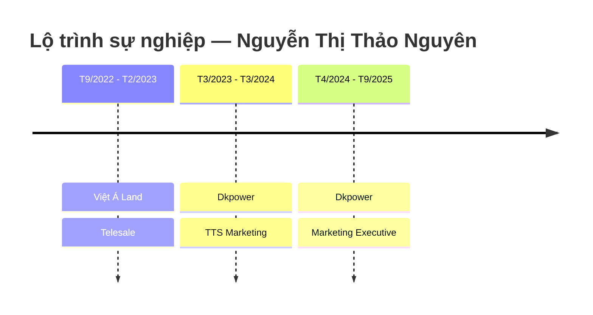

---
{"dg-publish":true,"permalink":"/01-tong-quan-ly-du-an/6-phong-nhan-su/01-ds-ung-vien/cv-30-03-2026-nguyen-thi-thao-nguyen/","title":"CV — NGUYỄN THỊ THẢO NGUYÊN","tags":["ung-vien","marketing","tmdt","ai-tools"],"dg-note-properties":{"title":"CV — NGUYỄN THỊ THẢO NGUYÊN","ngay_nop":"2026-03-30","vi_tri":"Chuyên viên Marketing / Vận hành TMĐT","trang_thai":"Chờ xét duyệt","diem_danh_gia":"6.5/10","uu_tien_pv":"Dự phòng","tags":["ung-vien","marketing","tmdt","ai-tools"]}}
---

# NGUYỄN THỊ THẢO NGUYÊN
**Chuyên viên Marketing / Vận hành TMĐT**

---

## 📇 THÔNG TIN CÁ NHÂN

| Trường | Thông tin |
|---|---|
| **Ngày sinh** | 14/05/2003 |
| **Điện thoại** | 077 892 2296 |
| **Email** | Nttnguyen14.cv@gmail.com |
| **Địa chỉ** | Phường Hiệp Bình, TP. Thủ Đức, TP.HCM |
| **Ngày nộp CV** | 30/03/2026 |

---

## 🎯 MỤC TIÊU NGHỀ NGHIỆP

**Ngắn hạn:** Ứng dụng kiến thức Marketing để phát triển và quản lý các kênh Social Media, triển khai nội dung và chiến dịch marketing hiệu quả.

**Dài hạn:** Phát triển chuyên sâu về Digital Marketing, tối ưu hiệu suất nội dung và quảng cáo, đồng thời đóng góp vào tăng trưởng thương hiệu và doanh thu doanh nghiệp.

---

## 💼 KINH NGHIỆM LÀM VIỆC

---

### ✦ Marketing Executive
**Công ty TNHH TM&DV Dkpower** | T4/2024 – T9/2025 *(18 tháng)*

**Chiến dịch CSR:**
- Triển khai chiến dịch "Boss Đẹp – Việt Nam Xanh": đạt **77.700 lượt tương tác**.
- Hỗ trợ **4.500+ chó mèo hoang**, quy đổi **777 phần quà** cho **16 trạm cứu hộ** (tổng giá trị **106 triệu VNĐ**).

**Quản lý chiến dịch Marketing:**
- Lên ý tưởng, lập kế hoạch và triển khai chiến dịch marketing.
- Tỷ lệ hoàn thành **>95%** trong **3 tháng liên tiếp**.

**Quản lý kênh nội dung:**
- Sản xuất và phân phối nội dung đa kênh: Facebook, TikTok, YouTube.
- YouTube đạt **20.4 triệu lượt xem** và **37.000 subscribers**.
- Video TikTok đạt **10.000–15.000+ lượt xem/video**.

**SEO Website:**
- Tối ưu SEO đạt **368.000 lượt hiển thị** và **4.430 lượt nhấp tự nhiên** trong 3 tháng.
- Đưa nhiều từ khóa lên **Top 10 Google** (vị trí trung bình **7.2**).
- Tăng **CTR lên 1.2%** bằng công cụ AI.

**Phối hợp vận hành:**
- Phối hợp sales và kho vận triển khai chương trình khuyến mãi và phân phối hàng cho đại lý.

---

### ✦ Thực tập sinh Marketing (TTS Marketing)
**Công ty TNHH TM&DV Dkpower** | T3/2023 – T3/2024 *(12 tháng)*

- Sáng tạo nội dung: Blog, PR, Kịch bản, bài đăng MXH.
- Quản lý kênh truyền thông: Facebook, TikTok, Website, YouTube.
- Vận hành sàn TMĐT: Shopee, TikTok Shop, Lazada.
- Tối ưu SEO trên sàn TMĐT và website.
- Chạy quảng cáo Facebook Ads, TikTok Ads.
- Hỗ trợ livestream bán hàng.
- Thực hiện chiến dịch Seeding.
- Lên kế hoạch và thực hiện chiến dịch truyền thông sản phẩm.

---

### ✦ Telesale
**Công ty Cổ phần Đầu tư Việt Á Land** | T9/2022 – T2/2023 *(6 tháng)*

- Tìm kiếm khách hàng tiềm năng từ data có sẵn.
- Tư vấn sản phẩm bất động sản.
- Lên lịch hẹn và mời khách tham dự sự kiện mở bán.

---

## 🎓 HỌC VẤN

| Trường | Cao đẳng Kinh tế Đối ngoại TP.HCM |
|---|---|
| **Thời gian** | 2022 – 2025 |
| **Chuyên ngành** | Marketing Thương mại |
| **GPA** | 3.25 / 4.0 |

---

## 🛠️ KỸ NĂNG

### Kỹ năng chuyên môn
- ✅ Lập kế hoạch và triển khai chiến dịch Marketing tổng thể.
- ✅ Phân tích dữ liệu và đo lường hiệu quả chiến dịch (ROI, CTR, ROAS).
- ✅ Sáng tạo nội dung và quản lý kênh mạng xã hội (Facebook, TikTok, YouTube, Instagram).
- ✅ Quảng cáo: Facebook Ads, TikTok Ads, Instagram Ads (cơ bản).
- ✅ Vận hành sàn TMĐT: TikTok Shop, Shopee, Lazada (bao gồm livestream).
- ✅ SEO website và SEO sàn TMĐT.
- ✅ Thiết kế cơ bản: Canva.
- ✅ Quay chụp và dựng video: CapCut.

### Công cụ AI
- ✅ ChatGPT (GPT-4)
- ✅ Google Gemini
- ✅ Claude (Anthropic)
- ✅ AI Studio (Google)

### Kỹ năng mềm
- ✅ Quản lý thời gian và ưu tiên công việc.
- ✅ Làm việc nhóm và phối hợp liên phòng ban.
- ✅ Tư duy sáng tạo trong nội dung.

---

## 🌐 NGÔN NGỮ

| Ngôn ngữ | Trình độ |
|---|---|
| Tiếng Trung | 4 kỹ năng (Nghe, Nói, Đọc, Viết) |
| Tiếng Anh | Cơ bản |

---

## 📝 GHI CHÚ ĐÁNH GIÁ (ETZ Internal)

> **Điểm phù hợp MTCV Vận hành Website:** 6.5/10
>
> **Điểm mạnh:** Kỹ năng AI vượt trội, SEO thực chiến, kinh nghiệm vận hành TMĐT ~2 năm, tiếng Trung là lợi thế.
>
> **Điểm yếu:** Định hướng nghề nghiệp rõ ràng là **Marketing**, chưa có tư duy SOP/hệ thống vận hành.
>
> **Khuyến nghị:** Phỏng vấn dự phòng — cần hỏi rõ mức độ sẵn sàng chuyển hướng sang Vận hành.
