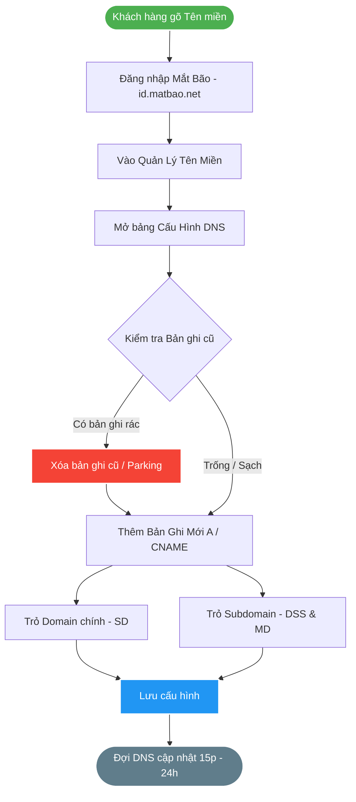

# 🌐 SOP KỸ THUẬT: ĐỔI TÊN MIỀN & TRỎ DOMAIN (MẮT BÃO)
> **Bộ phận:** IT / Vận Hành Hệ Thống
> **Chủ đề:** Thay đổi / Cập nhật hệ thống Tên miền (Domain Name System - DNS) trên hệ quản trị Mắt Bão để kết nối với cụm 3 Website ETZ.

Tài liệu này là quy chuẩn thao tác để phòng Kỹ thuật hoặc cá nhân quản lý IT có thể tự tay chuyển đổi qua lại giữa các tên miền (ví dụ: `khotot.vn`, `brain.khotot.vn`) mà không cần nhờ đến Support của nhà cung cấp Mắt Bão.

---

## 🗺️ LUỒNG THAO TÁC CƠ BẢN (FLOWCHART)

---

## ⚙️ CÁC BƯỚC THỰC HIỆN CHI TIẾT DÀNH CHO ADMIN

### Bước 1: Đăng nhập hệ thống Mắt Bão
1. Truy cập trang quản trị ID của Mắt Bão: `https://id.matbao.net/`
2. Nhập tài khoản và Mật khẩu (hoặc Mã khách hàng) do người đứng tên đăng ký nắm giữ.

### Bước 2: Truy cập khu vực Cấu hình DNS
1. Ở danh mục bên trái, tìm và nhấn vào **Tên Miền** (hoặc Dịch Vụ Tên Miền).
2. Tìm tên miền mới muốn sử dụng (ví dụ: `khotot.vn` hoặc một domain khác).
3. Nhấp vào cột hành động (hình bánh răng hoặc 3 chấm) -> Chọn **Cấu hình DNS / Quản lý DNS**.

> [!danger] LƯU Ý DỌN DẸP RÁC
> Trước khi thực hiện trỏ IP mới, hãy **XÓA BỎ LẬP TỨC** các bản ghi `A` có Value kiểu dạng "Parking Page của Mắt Bão" (thường là 1 IP lạ hoắc của Mắt Bão gắn sẵn) để tránh xung đột hệ thống.

### Bước 3: Trỏ Tên Miền Chính (Website Khách Hàng - SD)
Để chạy được trang chủ chính thức (web SD) trên trình duyệt, sếp cần thêm 2 bản ghi sau vào bảng Mắt bão:

*Trường hợp 1: Trực tiếp vào máy chủ IP (VPS)*
*   **Loại (Type):** `A` | **Tên (Host):** `@` | **Giá trị (Value):** `[Nhập Số IP của Máy Chủ (Ví dụ: 103.xxx.xx.xx)]`
*   **Loại (Type):** `A` (hoặc `CNAME`) | **Tên (Host):** `www` | **Giá trị (Value):** `[Nhập Số IP / Hoặc điền tên miền gốc (tuỳ A hay CNAME)]`

*Trường hợp 2: Trỏ qua Vercel (Nếu sếp dùng kiến trúc như Second Brain)*
*   **Loại (Type):** `A` | **Tên (Host):** `@` | **Giá trị (Value):** `76.76.21.21` (Đây là IP gốc của Vercel thế giới).
*   **Loại (Type):** `CNAME` | **Tên (Host):** `www` | **Giá trị (Value):** `cname.vercel-dns.com`

### Bước 4: Trỏ các Subdomain (Web Quản Trị - DSS & MD)
Web ETZ là mô hình 3 Domain. Khi đã khai báo gốc xong, sếp phải sinh ra các subdomain phụ:

1. Dành cho trang Tổng quản trị kho bãi (DSS Space):
   *   **Loại (Type):** `A` | **Tên (Host):** `dss` | **Giá trị (Value):** `[Số IP Máy Chủ]` *(Kết quả sẽ sinh ra link: dss.tên-miền-của-sếp)*
2. Dành cho trang Đại lý phân phối (MD Space):
   *   **Loại (Type):** `A` | **Tên (Host):** `md` | **Giá trị (Value):** `[Số IP Máy Chủ]` *(Kết quả sẽ sinh ra link: md.tên-miền-của-sếp)*

### Bước 5: Ổn định hệ thống
- Tuyệt đối không xóa các bản ghi `MX` hay `TXT` nếu đang dùng Mail Công Ty (ví dụ dùng Google Workspace đuôi `@tênmiền`).
- Bấm **Lưu** bảng DNS.
- Tiến trình quảng bá bản ghi (DNS Propagation) sẽ mất từ **15 phút đến tối đa 24 giờ**. Trong thời gian đó sếp truy cập có thể lúc được lúc không. Đừng hoảng loạn, cứ bình tĩnh uống trà chờ đợi! Mấy gã nhà mạng Việt Nam FPT/VNPT cập nhật cache hơi chậm tẹo.
