---
{"dg-publish":true,"permalink":"/01-tong-quan-ly-du-an/dai-tu-dien-sop-etz/","title":"📖 ĐẠI TỪ ĐIỂN SOP — WEB ETZ","dg-note-properties":{"title":"📖 ĐẠI TỪ ĐIỂN SOP — WEB ETZ","version":"1.0","last_updated":"2026-05-07","auto_synced_section":"I. Bảng Master SOP","type":"DICTIONARY","status":"active"}}
---

# 📖 ĐẠI TỪ ĐIỂN SOP — WEB ETZ (KHOTOT.VN)

> **Single Source of Truth** cho toàn bộ SOP, thuật ngữ và quy trình của Web ETZ — Khotot.vn.
>
> ⚠️ **Bảng Master SOP (§ I) được TỰ ĐỘNG cập nhật** bởi `sync_dictionary.py`. Đừng sửa tay đoạn giữa hai marker `<!-- AUTO_SOP_TABLE_START -->

> *Auto-generated lần cuối: 2026-05-08 04:21 — bởi `sync_dictionary.py`*
> *Tổng số SOP đã có: **28 file** (28 active, 0 draft)*

### 🏢 Phòng Vận hành (VH) — Nội bộ

| Mã | Tiêu đề | Status | Version | File |
| :--- | :--- | :---: | :---: | :--- |
| **SOP 1** | SOP QUY TRÌNH ĐĂNG KÝ & XÁC THỰC TÀI KHOẢN SD | 🟢 active | 1.0 | [[01_TONG_QUAN_LY_DU_AN/2_PHONG_VAN_HANH/SOP_1_Quy_Trinh_Dang_Ky_Xac_Thuc_SD\|SOP_1_Quy_Trinh_Dang_Ky_Xac_Thuc_SD]] |
| **SOP 1.1** | QUY TRÌNH DUYỆT TÀI KHOẢN ĐẠI LÝ SD (SALE ADMIN) | 🟢 active | 1.0 | [[01_TONG_QUAN_LY_DU_AN/2_PHONG_VAN_HANH/SOP_1.1_Quy_Trinh_Duyet_Tai_Khoan_SD\|SOP_1.1_Quy_Trinh_Duyet_Tai_Khoan_SD]] |
| **SOP 2** | QUY TRÌNH XỬ LÝ ĐƠN HÀNG (ĐA LUỒNG) | 🟢 active | 1.0 | [[01_TONG_QUAN_LY_DU_AN/2_PHONG_VAN_HANH/SOP_2_Quy_Trinh_Xuly_Don_Chuan_Khotot\|SOP_2_Quy_Trinh_Xuly_Don_Chuan_Khotot]] |
| **SOP 2.1** | QUY TRÌNH XỬ LÝ ĐƠN HÀNG (ĐA LUỒNG) | 🟢 active | 1.0 | [[01_TONG_QUAN_LY_DU_AN/2_PHONG_VAN_HANH/SOP_2.1_Xu_Ly_Don_Hang_API_Nang_Cap_Sau\|SOP_2.1_Xu_Ly_Don_Hang_API_Nang_Cap_Sau]] |
| **SOP 2.10.2** | QUY TRÌNH VẬN HÀNH WEBSITE THỰC TẾ (WEB ETZ - v3.7) | 🟢 active | 1.0 | [[01_TONG_QUAN_LY_DU_AN/2_PHONG_VAN_HANH/SOP_2_Quy_Trinh_Xuly_Don_Chuan_Khotot\|SOP_2_Quy_Trinh_Xuly_Don_Chuan_Khotot]] |
| **SOP 2.10.3** | QUY TRÌNH XỬ LÝ ĐƠN HÀNG THỰC TẾ (VẬN HÀNH THỦ CÔNG) | 🟢 active | 1.0 | [[01_TONG_QUAN_LY_DU_AN/2_PHONG_VAN_HANH/SOP_2.10.3_Quy_Trinh_XuLy_Don_Hang_Truyen_Thong_Chi_Tiet\|SOP_2.10.3_Quy_Trinh_XuLy_Don_Hang_Truyen_Thong_Chi_Tiet]] |
| **SOP 2.10.3** | QUY TRÌNH XỬ LÝ ĐƠN HÀNG THỰC TẾ (VẬN HÀNH THỦ CÔNG) | 🟢 active | 1.0 | [[01_TONG_QUAN_LY_DU_AN/2_PHONG_VAN_HANH/SOP_2.10.3_Quy_Trinh_XuLy_Don_Hang_Truyen_Thong_Chi_Tiet\|SOP_2.10.3_Quy_Trinh_XuLy_Don_Hang_Truyen_Thong_Chi_Tiet]] |
| **SOP 3** | QUY TRÌNH HỦY ĐƠN VÌ HẾT HÀNG THỰC TẾ | 🟢 active | 1.0 | [[01_TONG_QUAN_LY_DU_AN/2_PHONG_VAN_HANH/SOP_3_Huy_Don_Het_Hang\|SOP_3_Huy_Don_Het_Hang]] |
| **SOP 4** | QUY TRÌNH TIẾP NHẬN BẢO HÀNH (XỬ LÝ NGOÀI LUỒNG) | 🟢 active | 1.0 | [[01_TONG_QUAN_LY_DU_AN/2_PHONG_VAN_HANH/SOP_4_Bao_Hanh_Xy_Ly_Ngoai_Luong\|SOP_4_Bao_Hanh_Xy_Ly_Ngoai_Luong]] |
| **SOP 5** | Tạo Khuyến Mãi (Giảm Giá Theo Thời Gian) | 🟢 active | 1.0 | [[01_TONG_QUAN_LY_DU_AN/2_PHONG_VAN_HANH/SOP_5_Tao_Khuyen_Mai_Theo_Thoi_Gian\|SOP_5_Tao_Khuyen_Mai_Theo_Thoi_Gian]] |
| **SOP 6** | QUY TRÌNH HỦY ĐƠN HÀNG & HOÀN TRẢ | 🟢 active | 1.0 | [[01_TONG_QUAN_LY_DU_AN/2_PHONG_VAN_HANH/SOP_6_Huy_Don_Hang\|SOP_6_Huy_Don_Hang]] |
| **SOP 07** ⚠️ | QUY TRÌNH XỬ LÝ KHIẾU NẠI & HOÀN TRẢ | 🟢 active | 1.0 | [[01_TONG_QUAN_LY_DU_AN/2_PHONG_VAN_HANH/SOP_07_Xu_Ly_Khieu_Nai_Hoan_Tra\|SOP_07_Xu_Ly_Khieu_Nai_Hoan_Tra]] |
| **SOP 8** | Quy Trình Cập Nhật Giá và Tồn Kho | 🟢 active | 1.0 | [[01_TONG_QUAN_LY_DU_AN/2_PHONG_VAN_HANH/SOP_8_Quy_Trinh_Cap_Nhat_Gia_Ton_Kho\|SOP_8_Quy_Trinh_Cap_Nhat_Gia_Ton_Kho]] |
| **SOP 9** | Quy Trình Cập Nhật Sản Phẩm Mới | 🟢 active | 1.0 | [[01_TONG_QUAN_LY_DU_AN/2_PHONG_VAN_HANH/SOP_9_Quy_Trinh_Cap_Nhat_San_Pham_Moi\|SOP_9_Quy_Trinh_Cap_Nhat_San_Pham_Moi]] |
| **SOP 10** | Quản lý Mã Voucher — Khotot.vn | 🟢 active | 1.0 | [[01_TONG_QUAN_LY_DU_AN/2_PHONG_VAN_HANH/SOP_10_Quan_Ly_Ma_Voucher\|SOP_10_Quan_Ly_Ma_Voucher]] |
| **SOP 12** | QUY TRÌNH ĐỐI SOÁT KẾ TOÁN HÀNG THÁNG | 🟢 active | 1.0 | [[01_TONG_QUAN_LY_DU_AN/2_PHONG_VAN_HANH/SOP_12_Quy_Trinh_Doi_Soat_Ke_Toan_Hang_Thang\|SOP_12_Quy_Trinh_Doi_Soat_Ke_Toan_Hang_Thang]] |

### 🏪 Phòng Vận hành — Phía MD (Main Distributor / md.khotot.vn)

| Mã | Tiêu đề | Status | Version | File |
| :--- | :--- | :---: | :---: | :--- |
| **SOP-MD-01** | Quản lý Sản phẩm — md.khotot.vn | 🟢 active | 1.0 | [[01_TONG_QUAN_LY_DU_AN/2_PHONG_VAN_HANH/MD/SOP_MD_KHOTOT_QuanLySanPham\|SOP_MD_KHOTOT_QuanLySanPham]] |
| **SOP-MD-02** | Quản lý Kho hàng — md.khotot.vn | 🟢 active | 1.0 | [[01_TONG_QUAN_LY_DU_AN/2_PHONG_VAN_HANH/MD/SOP_MD_KHOTOT_QuanLyKho\|SOP_MD_KHOTOT_QuanLyKho]] |
| **SOP-MD-03** | Xử lý Đơn hàng — md.khotot.vn | 🟢 active | 1.0 | [[01_TONG_QUAN_LY_DU_AN/2_PHONG_VAN_HANH/MD/SOP_MD_KHOTOT_XuLyDonHang\|SOP_MD_KHOTOT_XuLyDonHang]] |
| **SOP-MD-04** | Mã Giảm Giá & Khuyến Mãi — md.khotot.vn | 🟢 active | 1.0 | [[01_TONG_QUAN_LY_DU_AN/2_PHONG_VAN_HANH/MD/SOP_MD_KHOTOT_MaGiamGia\|SOP_MD_KHOTOT_MaGiamGia]] |
| **SOP-MD-05** | Thiết Lập Thanh Toán SePay — md.khotot.vn | 🟢 active | 1.0 | [[01_TONG_QUAN_LY_DU_AN/2_PHONG_VAN_HANH/MD/SOP_MD_KHOTOT_ThietLapThanhToan\|SOP_MD_KHOTOT_ThietLapThanhToan]] |
| **SOP-MD-?** ⚠️ | SOP XỬ LÝ ĐƠN HÀNG KHO MD | 🟢 active | 1.0 | [[01_TONG_QUAN_LY_DU_AN/2_PHONG_VAN_HANH/MD/SOP_XuLyDonHang_KhoMD\|SOP_XuLyDonHang_KhoMD]] |

### 🛒 Phòng Vận hành — Phía SD (Sub-Distributor / khotot.vn)

| Mã | Tiêu đề | Status | Version | File |
| :--- | :--- | :---: | :---: | :--- |
| **SOP-SD-01** | Đăng Ký & Đăng Nhập — khotot.vn | 🟢 active | 1.0 | [[01_TONG_QUAN_LY_DU_AN/2_PHONG_VAN_HANH/SD/SOP_SD_KHOTOT_DangKyDangNhap\|SOP_SD_KHOTOT_DangKyDangNhap]] |
| **SOP-SD-02** | Tìm Kiếm & Mua Hàng — khotot.vn | 🟢 active | 1.0 | [[01_TONG_QUAN_LY_DU_AN/2_PHONG_VAN_HANH/SD/SOP_SD_KHOTOT_TimKiemMuaHang\|SOP_SD_KHOTOT_TimKiemMuaHang]] |
| **SOP-SD-03** | Thanh Toán (Checkout) — khotot.vn | 🟢 active | 1.0 | [[01_TONG_QUAN_LY_DU_AN/2_PHONG_VAN_HANH/SD/SOP_SD_KHOTOT_ThanhToan\|SOP_SD_KHOTOT_ThanhToan]] |
| **SOP-SD-04** | Quản Lý Đơn Hàng — khotot.vn | 🟢 active | 1.0 | [[01_TONG_QUAN_LY_DU_AN/2_PHONG_VAN_HANH/SD/SOP_SD_KHOTOT_QuanLyDonHang\|SOP_SD_KHOTOT_QuanLyDonHang]] |
| **SOP-SD-?** ⚠️ | SOP: ĐIỀU KHOẢN & ĐIỀU KIỆN SỬ DỤNG SD (KÈM FLOWCHART) | 🟢 active | 1.0 | [[01_TONG_QUAN_LY_DU_AN/2_PHONG_VAN_HANH/SD/SOP_SD_KHOTOT_DieuKhoanFlowchart_Cham_Lam\|SOP_SD_KHOTOT_DieuKhoanFlowchart_Cham_Lam]] |

### 🔧 Phòng Kỹ thuật (KT)

| Mã | Tiêu đề | Status | Version | File |
| :--- | :--- | :---: | :---: | :--- |
| **SOP-KT-01** | SOP KỸ THUẬT: Cấu hình tên miền Mắt Bão cho Web ETZ | 🟢 active | 1.0 | [[01_TONG_QUAN_LY_DU_AN/7_PHONG_KY_THUAT/SOP_Tro_Ten_Mien_Mat_Bao\|SOP_Tro_Ten_Mien_Mat_Bao]] |

<!-- AUTO_SOP_TABLE_END -->`.

---

## 📑 MỤC LỤC

- [§ I. Bảng Master SOP (auto-sync)](#i-bảng-master-sop-auto-sync)
- [§ II. Glossary — Từ điển thuật ngữ](#ii-glossary--từ-điển-thuật-ngữ)
- [§ III. Sơ đồ phụ thuộc SOP](#iii-sơ-đồ-phụ-thuộc-sop)
- [§ IV. SOP cần viết (TODO)](#iv-sop-cần-viết-todo)
- [§ V. Vấn đề phát hiện & Cần Sếp quyết](#v-vấn-đề-phát-hiện--cần-sếp-quyết)
- [§ VI. Mapping Phòng ban ↔ SOP](#vi-mapping-phòng-ban--sop)
- [§ VII. Changelog Đại Từ Điển](#vii-changelog-đại-từ-điển)

---

## I. BẢNG MASTER SOP (AUTO-SYNC)

<!-- AUTO_SOP_TABLE_START -->

> *Auto-generated lần cuối: 2026-05-08 04:21 — bởi `sync_dictionary.py`*
> *Tổng số SOP đã có: **28 file** (28 active, 0 draft)*

### 🏢 Phòng Vận hành (VH) — Nội bộ

| Mã | Tiêu đề | Status | Version | File |
| :--- | :--- | :---: | :---: | :--- |
| **SOP 1** | SOP QUY TRÌNH ĐĂNG KÝ & XÁC THỰC TÀI KHOẢN SD | 🟢 active | 1.0 | [[01_TONG_QUAN_LY_DU_AN/2_PHONG_VAN_HANH/SOP_1_Quy_Trinh_Dang_Ky_Xac_Thuc_SD\|SOP_1_Quy_Trinh_Dang_Ky_Xac_Thuc_SD]] |
| **SOP 1.1** | QUY TRÌNH DUYỆT TÀI KHOẢN ĐẠI LÝ SD (SALE ADMIN) | 🟢 active | 1.0 | [[01_TONG_QUAN_LY_DU_AN/2_PHONG_VAN_HANH/SOP_1.1_Quy_Trinh_Duyet_Tai_Khoan_SD\|SOP_1.1_Quy_Trinh_Duyet_Tai_Khoan_SD]] |
| **SOP 2** | QUY TRÌNH XỬ LÝ ĐƠN HÀNG (ĐA LUỒNG) | 🟢 active | 1.0 | [[01_TONG_QUAN_LY_DU_AN/2_PHONG_VAN_HANH/SOP_2_Quy_Trinh_Xuly_Don_Chuan_Khotot\|SOP_2_Quy_Trinh_Xuly_Don_Chuan_Khotot]] |
| **SOP 2.1** | QUY TRÌNH XỬ LÝ ĐƠN HÀNG (ĐA LUỒNG) | 🟢 active | 1.0 | [[01_TONG_QUAN_LY_DU_AN/2_PHONG_VAN_HANH/SOP_2.1_Xu_Ly_Don_Hang_API_Nang_Cap_Sau\|SOP_2.1_Xu_Ly_Don_Hang_API_Nang_Cap_Sau]] |
| **SOP 2.10.2** | QUY TRÌNH VẬN HÀNH WEBSITE THỰC TẾ (WEB ETZ - v3.7) | 🟢 active | 1.0 | [[01_TONG_QUAN_LY_DU_AN/2_PHONG_VAN_HANH/SOP_2_Quy_Trinh_Xuly_Don_Chuan_Khotot\|SOP_2_Quy_Trinh_Xuly_Don_Chuan_Khotot]] |
| **SOP 2.10.3** | QUY TRÌNH XỬ LÝ ĐƠN HÀNG THỰC TẾ (VẬN HÀNH THỦ CÔNG) | 🟢 active | 1.0 | [[01_TONG_QUAN_LY_DU_AN/2_PHONG_VAN_HANH/SOP_2.10.3_Quy_Trinh_XuLy_Don_Hang_Truyen_Thong_Chi_Tiet\|SOP_2.10.3_Quy_Trinh_XuLy_Don_Hang_Truyen_Thong_Chi_Tiet]] |
| **SOP 2.10.3** | QUY TRÌNH XỬ LÝ ĐƠN HÀNG THỰC TẾ (VẬN HÀNH THỦ CÔNG) | 🟢 active | 1.0 | [[01_TONG_QUAN_LY_DU_AN/2_PHONG_VAN_HANH/SOP_2.10.3_Quy_Trinh_XuLy_Don_Hang_Truyen_Thong_Chi_Tiet\|SOP_2.10.3_Quy_Trinh_XuLy_Don_Hang_Truyen_Thong_Chi_Tiet]] |
| **SOP 3** | QUY TRÌNH HỦY ĐƠN VÌ HẾT HÀNG THỰC TẾ | 🟢 active | 1.0 | [[01_TONG_QUAN_LY_DU_AN/2_PHONG_VAN_HANH/SOP_3_Huy_Don_Het_Hang\|SOP_3_Huy_Don_Het_Hang]] |
| **SOP 4** | QUY TRÌNH TIẾP NHẬN BẢO HÀNH (XỬ LÝ NGOÀI LUỒNG) | 🟢 active | 1.0 | [[01_TONG_QUAN_LY_DU_AN/2_PHONG_VAN_HANH/SOP_4_Bao_Hanh_Xy_Ly_Ngoai_Luong\|SOP_4_Bao_Hanh_Xy_Ly_Ngoai_Luong]] |
| **SOP 5** | Tạo Khuyến Mãi (Giảm Giá Theo Thời Gian) | 🟢 active | 1.0 | [[01_TONG_QUAN_LY_DU_AN/2_PHONG_VAN_HANH/SOP_5_Tao_Khuyen_Mai_Theo_Thoi_Gian\|SOP_5_Tao_Khuyen_Mai_Theo_Thoi_Gian]] |
| **SOP 6** | QUY TRÌNH HỦY ĐƠN HÀNG & HOÀN TRẢ | 🟢 active | 1.0 | [[01_TONG_QUAN_LY_DU_AN/2_PHONG_VAN_HANH/SOP_6_Huy_Don_Hang\|SOP_6_Huy_Don_Hang]] |
| **SOP 07** ⚠️ | QUY TRÌNH XỬ LÝ KHIẾU NẠI & HOÀN TRẢ | 🟢 active | 1.0 | [[01_TONG_QUAN_LY_DU_AN/2_PHONG_VAN_HANH/SOP_07_Xu_Ly_Khieu_Nai_Hoan_Tra\|SOP_07_Xu_Ly_Khieu_Nai_Hoan_Tra]] |
| **SOP 8** | Quy Trình Cập Nhật Giá và Tồn Kho | 🟢 active | 1.0 | [[01_TONG_QUAN_LY_DU_AN/2_PHONG_VAN_HANH/SOP_8_Quy_Trinh_Cap_Nhat_Gia_Ton_Kho\|SOP_8_Quy_Trinh_Cap_Nhat_Gia_Ton_Kho]] |
| **SOP 9** | Quy Trình Cập Nhật Sản Phẩm Mới | 🟢 active | 1.0 | [[01_TONG_QUAN_LY_DU_AN/2_PHONG_VAN_HANH/SOP_9_Quy_Trinh_Cap_Nhat_San_Pham_Moi\|SOP_9_Quy_Trinh_Cap_Nhat_San_Pham_Moi]] |
| **SOP 10** | Quản lý Mã Voucher — Khotot.vn | 🟢 active | 1.0 | [[01_TONG_QUAN_LY_DU_AN/2_PHONG_VAN_HANH/SOP_10_Quan_Ly_Ma_Voucher\|SOP_10_Quan_Ly_Ma_Voucher]] |
| **SOP 12** | QUY TRÌNH ĐỐI SOÁT KẾ TOÁN HÀNG THÁNG | 🟢 active | 1.0 | [[01_TONG_QUAN_LY_DU_AN/2_PHONG_VAN_HANH/SOP_12_Quy_Trinh_Doi_Soat_Ke_Toan_Hang_Thang\|SOP_12_Quy_Trinh_Doi_Soat_Ke_Toan_Hang_Thang]] |

### 🏪 Phòng Vận hành — Phía MD (Main Distributor / md.khotot.vn)

| Mã | Tiêu đề | Status | Version | File |
| :--- | :--- | :---: | :---: | :--- |
| **SOP-MD-01** | Quản lý Sản phẩm — md.khotot.vn | 🟢 active | 1.0 | [[01_TONG_QUAN_LY_DU_AN/2_PHONG_VAN_HANH/MD/SOP_MD_KHOTOT_QuanLySanPham\|SOP_MD_KHOTOT_QuanLySanPham]] |
| **SOP-MD-02** | Quản lý Kho hàng — md.khotot.vn | 🟢 active | 1.0 | [[01_TONG_QUAN_LY_DU_AN/2_PHONG_VAN_HANH/MD/SOP_MD_KHOTOT_QuanLyKho\|SOP_MD_KHOTOT_QuanLyKho]] |
| **SOP-MD-03** | Xử lý Đơn hàng — md.khotot.vn | 🟢 active | 1.0 | [[01_TONG_QUAN_LY_DU_AN/2_PHONG_VAN_HANH/MD/SOP_MD_KHOTOT_XuLyDonHang\|SOP_MD_KHOTOT_XuLyDonHang]] |
| **SOP-MD-04** | Mã Giảm Giá & Khuyến Mãi — md.khotot.vn | 🟢 active | 1.0 | [[01_TONG_QUAN_LY_DU_AN/2_PHONG_VAN_HANH/MD/SOP_MD_KHOTOT_MaGiamGia\|SOP_MD_KHOTOT_MaGiamGia]] |
| **SOP-MD-05** | Thiết Lập Thanh Toán SePay — md.khotot.vn | 🟢 active | 1.0 | [[01_TONG_QUAN_LY_DU_AN/2_PHONG_VAN_HANH/MD/SOP_MD_KHOTOT_ThietLapThanhToan\|SOP_MD_KHOTOT_ThietLapThanhToan]] |
| **SOP-MD-?** ⚠️ | SOP XỬ LÝ ĐƠN HÀNG KHO MD | 🟢 active | 1.0 | [[01_TONG_QUAN_LY_DU_AN/2_PHONG_VAN_HANH/MD/SOP_XuLyDonHang_KhoMD\|SOP_XuLyDonHang_KhoMD]] |

### 🛒 Phòng Vận hành — Phía SD (Sub-Distributor / khotot.vn)

| Mã | Tiêu đề | Status | Version | File |
| :--- | :--- | :---: | :---: | :--- |
| **SOP-SD-01** | Đăng Ký & Đăng Nhập — khotot.vn | 🟢 active | 1.0 | [[01_TONG_QUAN_LY_DU_AN/2_PHONG_VAN_HANH/SD/SOP_SD_KHOTOT_DangKyDangNhap\|SOP_SD_KHOTOT_DangKyDangNhap]] |
| **SOP-SD-02** | Tìm Kiếm & Mua Hàng — khotot.vn | 🟢 active | 1.0 | [[01_TONG_QUAN_LY_DU_AN/2_PHONG_VAN_HANH/SD/SOP_SD_KHOTOT_TimKiemMuaHang\|SOP_SD_KHOTOT_TimKiemMuaHang]] |
| **SOP-SD-03** | Thanh Toán (Checkout) — khotot.vn | 🟢 active | 1.0 | [[01_TONG_QUAN_LY_DU_AN/2_PHONG_VAN_HANH/SD/SOP_SD_KHOTOT_ThanhToan\|SOP_SD_KHOTOT_ThanhToan]] |
| **SOP-SD-04** | Quản Lý Đơn Hàng — khotot.vn | 🟢 active | 1.0 | [[01_TONG_QUAN_LY_DU_AN/2_PHONG_VAN_HANH/SD/SOP_SD_KHOTOT_QuanLyDonHang\|SOP_SD_KHOTOT_QuanLyDonHang]] |
| **SOP-SD-?** ⚠️ | SOP: ĐIỀU KHOẢN & ĐIỀU KIỆN SỬ DỤNG SD (KÈM FLOWCHART) | 🟢 active | 1.0 | [[01_TONG_QUAN_LY_DU_AN/2_PHONG_VAN_HANH/SD/SOP_SD_KHOTOT_DieuKhoanFlowchart_Cham_Lam\|SOP_SD_KHOTOT_DieuKhoanFlowchart_Cham_Lam]] |

### 🔧 Phòng Kỹ thuật (KT)

| Mã | Tiêu đề | Status | Version | File |
| :--- | :--- | :---: | :---: | :--- |
| **SOP-KT-01** | SOP KỸ THUẬT: Cấu hình tên miền Mắt Bão cho Web ETZ | 🟢 active | 1.0 | [[01_TONG_QUAN_LY_DU_AN/7_PHONG_KY_THUAT/SOP_Tro_Ten_Mien_Mat_Bao\|SOP_Tro_Ten_Mien_Mat_Bao]] |

<!-- AUTO_SOP_TABLE_END -->

---

## II. GLOSSARY — TỪ ĐIỂN THUẬT NGỮ

### 🏛️ Tổ chức & Vai trò

| Thuật ngữ | Đầy đủ | Mô tả |
| :--- | :--- | :--- |
| **ADMIN** | Administrator | Chủ quản dự án — Khotot.vn (cấp cao nhất). |
| **MD** | Main Distributor | Nhà phân phối tỉnh, vận hành trên `md.khotot.vn`. Vd: DSS Miền Nam. |
| **SD** | Sub-Distributor | Đại lý bán hàng / Khách hàng B2B, mua trên `khotot.vn`. |
| **Sale Admin** | — | Nhân sự nội bộ điều phối đơn hàng qua Misa/Zalo. |
| **Sếp** | — | Cách AI Antigravity gọi User (chủ dự án). |

### 💼 Sản phẩm & Hệ thống

| Thuật ngữ | Đầy đủ | Mô tả |
| :--- | :--- | :--- |
| **ETZ** | — | Tên thương hiệu Web bán hàng đang xây dựng. |
| **Khotot.vn** | — | Domain chính (B2B). Có 2 sub: `md.khotot.vn` (MD) và `khotot.vn` (SD). |
| **Kholink** | — | Tên cũ/đối tác của hệ thống — xuất hiện trong file giá. |
| **Misa** | — | Phần mềm kế toán — quản lý tồn kho, công nợ, hóa đơn. |
| **SePay** | — | Cổng thanh toán tích hợp cho MD. |
| **Lark** | — | Nền tảng trao đổi nội bộ (chat + storage). |
| **Viettel Post** | — | Đối tác giao vận (tích hợp API). |
| **Dahua** / **IMOU** | — | 2 thương hiệu sản phẩm chính (camera giám sát). |

### 📦 Tài liệu & Quy trình

| Thuật ngữ | Đầy đủ | Mô tả |
| :--- | :--- | :--- |
| **SOP** | Standard Operating Procedure | Quy trình thao tác chuẩn. |
| **BCDG** | Báo cáo Đánh giá | Tài liệu đánh giá ứng viên/đối tác. |
| **MTCV** | Mô tả Công việc | JD (Job Description). |
| **HSUV** | Hồ sơ Ứng viên | Hồ sơ chi tiết ứng viên đã CV. |
| **CV** | Curriculum Vitae | Sơ yếu lý lịch. |
| **BB / BBH** | Biên bản (Họp) | Biên bản cuộc họp / nghiệm thu. |
| **BC** | Báo cáo | Báo cáo định kỳ (tuần/tháng). |
| **UAT** | User Acceptance Testing | Kiểm thử nghiệm thu (đã quy định không dùng UAT_CHECKLIST trong SOP). |

### 🧠 Kiến trúc Tri thức (Hybrid 3+1)

| Thuật ngữ | Mô tả |
| :--- | :--- |
| **Layer 1 / RAW** | Tài liệu gốc nguyên bản — `02_KHO_DU_LIEU_THO_RAW/`. |
| **Layer 2 / DETAIL** | Văn bản trích 100% (Soi gương) — `01_TONG_QUAN_LY_DU_AN/`. |
| **Layer 3 / SUMMARY / BRAIN** | Tóm tắt 1 trang — `00_BO_NAO_AI_INTERNAL/02_Context_Dictionaries/Entity_*.md`. |
| **Layer 4 / METADATA** | *(Tùy chọn)* JSON thẻ số — `*.metadata.json` cùng vị trí Layer 2. |
| **Verify Before Assert** | Nguyên tắc: đối chiếu Wiki ↔ RAW trước khi khẳng định. |
| **Wikilink** | Cú pháp `[[Tên_File]]` hoặc `[[Tên|Hiển_thị]]` (escape `\|` trong table). |
| **Soi gương** | Trích 100% nội dung file gốc — không tóm tắt, không lược bỏ. |

---

## III. SƠ ĐỒ PHỤ THUỘC SOP

```mermaid
flowchart TD
    classDef admin fill:#FFE0B2,stroke:#FF9800,color:#E65100;
    classDef md fill:#C8E6C9,stroke:#4CAF50,color:#1B5E20;
    classDef sd fill:#BBDEFB,stroke:#2196F3,color:#0D47A1;
    classDef todo fill:#FFCDD2,stroke:#F44336,color:#B71C1C;

    SOP1[SOP 1 — Đăng ký SD]
    SOP1_1[SOP 1.1 — Duyệt SD]
    SOP1 --> SOP1_1

    SOP2[SOP 2 — Xử lý Đơn hàng Chuẩn]
    SOP2_1[SOP 2.1 — API Nâng cấp]
    SOP2 -.->|sub-flow| SOP2_1

    SOP2_10_2[SOP 2.10.2 — Vận hành Web]
    SOP2_10_3[SOP 2.10.3 — Đơn hàng truyền thông]
    SOP2_10_2 --> SOP2_10_3

    SOP3[SOP 3 — Hủy Hết hàng]
    SOP6[SOP 6 — Hủy & Hoàn trả]
    SOP07[SOP 07 — Khiếu nại]
    SOP2 -.->|sự cố| SOP3
    SOP2 -.->|sự cố| SOP6
    SOP6 --> SOP07

    SOP4[SOP 4 — Bảo hành]
    SOP07 -.->|nếu cần| SOP4

    SOP8[SOP 8 — Cập nhật Giá/Tồn kho]
    SOP9[SOP 9 — Sản phẩm mới]
    SOP9 --> SOP8

    SOP12[SOP 12 — Đối soát Kế toán]
    SOP2 -.->|cuối tháng| SOP12

    %% MD chain
    MD1[SOP-MD-01 — Sản phẩm]:::md
    MD2[SOP-MD-02 — Kho]:::md
    MD3[SOP-MD-03 — Đơn hàng]:::md
    MD4[SOP-MD-04 — Khuyến mãi]:::md
    MD5[SOP-MD-05 — Thanh toán]:::md
    MD1 --> MD2 --> MD3
    MD4 -.->|ưu đãi| MD3
    MD5 -.->|gateway| MD3

    %% SD chain
    SD1[SOP-SD-01 — Đăng ký]:::sd
    SD2[SOP-SD-02 — Tìm/Mua]:::sd
    SD3[SOP-SD-03 — Thanh toán]:::sd
    SD4[SOP-SD-04 — Quản lý đơn]:::sd
    SD1 --> SD2 --> SD3 --> SD4

    %% TODO
    TODO22[SOP 2.2 — Công nợ ⏳]:::todo
    TODO24[SOP 2.4 — Trả/Đổi hàng ⏳]:::todo
    SOP2 -.-> TODO22
    SOP2 -.-> TODO24

    class SOP1,SOP1_1,SOP2,SOP2_1,SOP2_10_2,SOP2_10_3,SOP2_10_4,SOP3,SOP4,SOP5,SOP6,SOP07,SOP8,SOP9,SOP12 admin;
```

---

## IV. SOP CẦN VIẾT (TODO)

> Theo yêu cầu của Sếp, các link tới SOP này được **giữ nguyên** trong file `SOP_2.10.3` để nhắc nhở.

| Mã đề xuất | Tên SOP | Phòng | Ưu tiên | Ghi chú |
| :--- | :--- | :---: | :---: | :--- |
| **SOP 2.2** | Quy trình Kiểm soát Công nợ | VH | 🔴 Cao | Liên quan Misa, đối soát hàng tháng |
| **SOP 2.4** | Quy trình Trả hàng & Đổi hàng | VH | 🟠 Trung | Liên quan SOP 6 (Hủy đơn) và SOP 07 (Khiếu nại) |
| **SOP 11** | (Trống — đang skip từ 10 → 12) | VH | 🟡 Thấp | Sếp quyết: dùng cho mục đích gì hay cố ý bỏ trống |

---

## V. VẤN ĐỀ PHÁT HIỆN & CẦN SẾP QUYẾT

| # | Vấn đề | Mô tả | Đề xuất |
| :---: | :--- | :--- | :--- |
| 1 | ⚠️ Mã không nhất quán | `SOP 6` vs `SOP 07` (số 0 đầu) | Đổi `SOP_07` → `SOP_7` để đồng bộ |
| 2 | ⚠️ Có thể trùng nội dung | `SOP 2` và `SOP 2.1` có cùng tiêu đề frontmatter "QUY TRÌNH XỬ LÝ ĐƠN HÀNG (ĐA LUỒNG)" | Sếp xác nhận: 2.1 là phiên bản nâng cấp của 2 hay là 1 nhánh khác? |
| 3 | ⚠️ Skip số | Có SOP 10, SOP 12 nhưng **không có SOP 11** | Sếp quyết: tạo SOP 11 cho mục đích gì hoặc đánh dấu "RESERVED" |
| 4 | ⚠️ 2 file không có mã | `SOP_XuLyDonHang_KhoMD`, `SOP_SD_KHOTOT_DieuKhoanFlowchart_Cham_Lam` | Đề xuất cấp mã: SOP-MD-06 và SOP-SD-05 |
| 5 | ⚠️ Tham chiếu chéo gãy | `SOP 2.10.3` có `[[SOP 2.1]]`, `[[SOP 2.2]]`, `[[SOP 2.4]]` — chỉ có 2.1 tồn tại | Giữ nguyên (Sếp đã chỉ thị) — nhắc nhở viết tiếp |

---

## VI. MAPPING PHÒNG BAN ↔ SOP

| Phòng | Mã | Số SOP | Files |
| :--- | :---: | :---: | :--- |
| Vận hành (nội bộ) | VH | 16 | SOP 1 → SOP 12 |
| Vận hành — MD | VH-MD | 6 | SOP-MD-01 → 05 + 1 chưa mã |
| Vận hành — SD | VH-SD | 5 | SOP-SD-01 → 04 + 1 Điều khoản |
| Kỹ thuật | KT | 1 | SOP-KT-01 (Mắt Bão) |
| Chiến lược | CL | 0 | *(chưa có SOP)* |
| Pháp chế | PC | 0 | *(chưa có SOP)* |
| Marketing | MK | 0 | *(chưa có SOP)* |
| Nhân sự | NS | 0 | *(chưa có SOP)* |

---

## VII. CHANGELOG ĐẠI TỪ ĐIỂN

| Phiên bản | Ngày | Thay đổi | Tác giả |
| :---: | :--- | :--- | :--- |
| **v1.0** | 2026-05-07 | Khởi tạo: Master Table tự động (28 SOP) + Glossary 30+ thuật ngữ + Sơ đồ phụ thuộc + 5 vấn đề phát hiện | AI Antigravity (theo lệnh Sếp) |

---

## 🔗 LIÊN KẾT

- 🏛️ Bộ luật: [[00_BO_NAO_AI_INTERNAL/03_System_Config/PROJECT_INSTRUCTIONS\|PROJECT_INSTRUCTIONS]]
- 🗺️ Bản đồ: [[00_BO_NAO_AI_INTERNAL/03_System_Config/MAP\|MAP]]
- 📋 Mục lục: [[00_BO_NAO_AI_INTERNAL/03_System_Config/INTERNAL_INDEX\|INTERNAL_INDEX]]
- 📊 Dashboard: [[index\|index]]
- 📘 Trung tâm: [[README_HE_THONG\|README_HE_THONG]]
- 📝 Nhật ký: [[01_TONG_QUAN_LY_DU_AN/log\|log]]

---

*Auto-sync bởi `.agents/skills/tieu-hoa/scripts/sync_dictionary.py` — chạy bằng lệnh `/sync-dict` hoặc khi `/lint`.*
