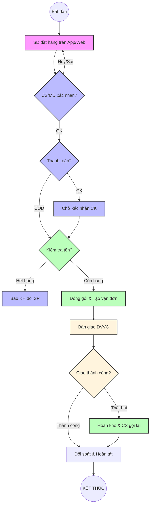
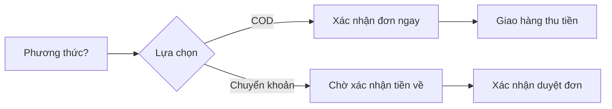
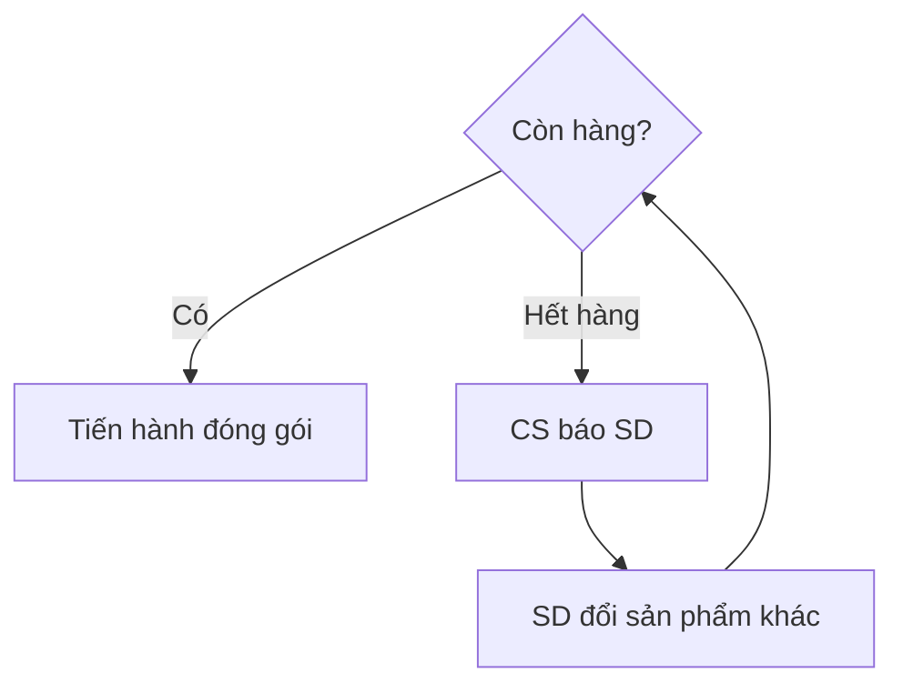
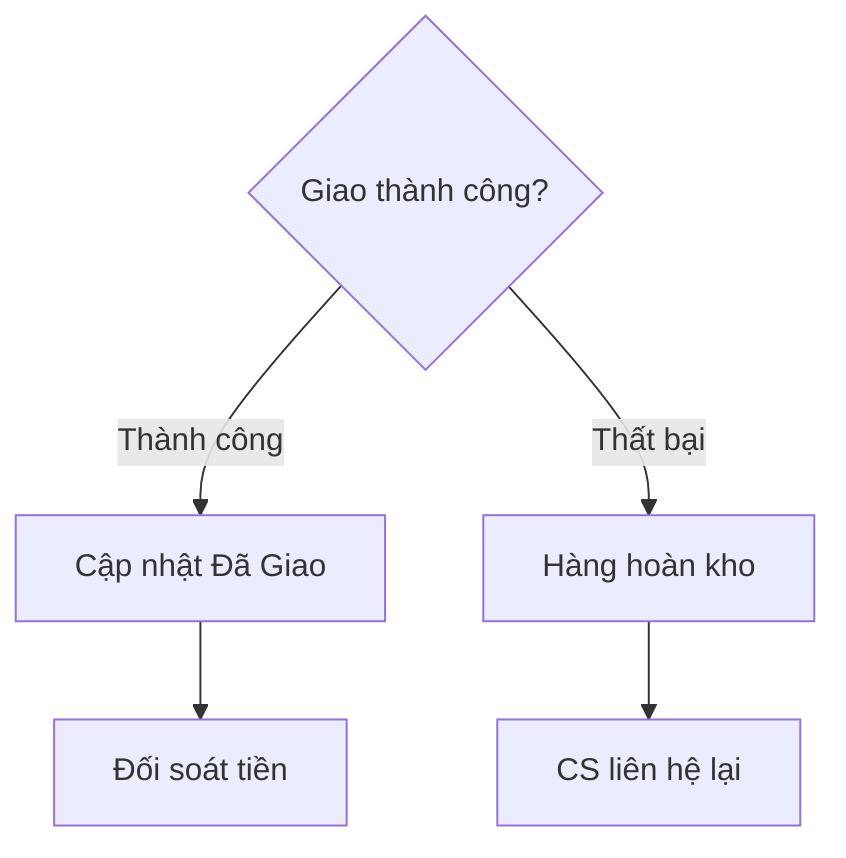

---
{"dg-publish":true,"permalink":"/2026-03-30-sop-don-hang-hoan-chinh-etz/","dg-note-properties":{}}
---

# 📦 SOP ĐƠN HÀNG HOÀN CHỈNH — KHOTOT.VN (WEB ETZ)

> **Phiên bản:** 1.0 | **Cập nhật:** 2026-03-30 | **Soạn bởi:** Antigravity AI
> **Nguồn:** Flowchart `sop_don_hang_hoan_chinh_etz.svg` + `DAI_TU_DIEN_SOP_ETZ.md`
> **Phạm vi áp dụng:** DSS Admin · MD (Main Distributor) · CS (Customer Service) · Kho · Vận chuyển

---

## 🎯 MỤC TIÊU

Đảm bảo mọi đơn hàng từ khi SD đặt mua đến khi giao tới tay khách được xử lý **đúng quy trình, đúng thời gian, không sót bước**.

---

## 👥 PHÂN CÔNG TRÁCH NHIỆM (SWIM LANE)

| Làn | Vai trò | Trách nhiệm chính |
|---|---|---|
| 🟣 **Khách hàng (SD)** | Sub-Distributor | Đặt hàng, xác nhận địa chỉ, thanh toán, nhận hàng, đánh giá |
| 🔵 **Kinh doanh / CS** | CS / MD | Tiếp nhận, xác nhận đơn, xử lý ngoại lệ, đối soát, CSKH |
| 🟢 **Kho / Hàng hóa** | Kho MD | Kiểm tra tồn, đóng gói, xử lý hàng hoàn |
| 🟡 **Vận chuyển / GH** | ĐVVC (GHN/GHTK/SPX) | Tạo vận đơn, bàn giao, vận chuyển, xác nhận giao |

---

## 🔄 QUY TRÌNH TỔNG QUAN

## 🔄 QUY TRÌNH CHI TIẾT

### GIAI ĐOẠN 1 — KHÁCH ĐẶT HÀNG
> **Làn:** 🟣 Khách hàng

**Bước 1.1 — SD đặt hàng trên App/Web ETZ**
- SD đăng nhập → chọn sản phẩm → thêm vào giỏ hàng
- Xác nhận địa chỉ giao hàng (mặc định hoặc nhập mới)
- Ghi chú đặc biệt nếu cần *(ví dụ: "Cần gấp", "Gọi trước khi giao")*
- Chọn phương thức thanh toán: **COD / Chuyển khoản / Tại cửa hàng**
- Nhấn **Đặt hàng** → Hệ thống gửi OTP xác nhận qua Zalo OA

**Bước 1.2 — Hệ thống tự động xử lý**
- Tạo mã đơn hàng duy nhất
- Hiển thị đơn trong bảng **"Chờ xử lý"** tại màn hình MD
- Gửi **thông báo Zalo** tới MD (tối đa 3 SĐT đã cài đặt)
- SD nhận thông báo xác nhận đơn qua Zalo OA

> ⏱️ **KPI:** Thông báo Zalo phải đến MD trong vòng **< 1 phút** sau khi đặt hàng.

---

### GIAI ĐOẠN 2 — TIẾP NHẬN & XÁC NHẬN ĐƠN
> **Làn:** 🔵 Kinh doanh / CS

**Bước 2.1 — Tiếp nhận đơn — Nhập CRM / Lark**
- Vào màn hình **Quản lý đơn hàng** → Tab **"Chờ xử lý"**
- Kiểm tra thông tin: Tên SD, SĐT, địa chỉ, sản phẩm, số lượng, ghi chú

**Bước 2.2 — Xác nhận đơn — Gọi / nhắn KH**
- Liên hệ SD xác nhận thông tin (nếu cần)
- SD xác nhận lại thông tin → ghi nhận phía KH

**Bước 2.3 — Phân nhánh thanh toán**

| Phương thức | Hành động |
|---|---|
| **COD** | Xác nhận đơn ngay, giao hàng thu tiền sau |
| **Chuyển khoản trước** | Kiểm tra tài khoản ngân hàng → xác nhận CK → mới duyệt đơn |
| **Tại cửa hàng** | Xác nhận đơn, SD đến quét mã QR hoặc báo mã đơn |

**Bước 2.4 — Tạo phiếu xuất kho — Gửi kho xử lý**
- Tạo phiếu xuất kho trên hệ thống
- Chuyển sang bộ phận kho để xử lý tiếp

> ⏱️ **KPI:** CS phải xác nhận đơn trong vòng **< 30 phút** giờ hành chính.

---

### GIAI ĐOẠN 3 — KHO XỬ LÝ
> **Làn:** 🟢 Kho / Hàng hóa

**Bước 3.1 — Kiểm tra tồn kho — Xác nhận hàng**
- Vào **Quản lý kho** → Kiểm tra SKU tương ứng
- Hệ thống cảnh báo nếu tồn kho thấp

**Bước 3.2 — Phân nhánh tồn kho**

**Bước 3.3 — Đóng gói hàng — Dán tem, kiểm tra**
- Lấy hàng đúng SKU, đúng số lượng theo phiếu xuất kho
- Kiểm tra chất lượng sản phẩm trước khi đóng gói
- Dán tem nhãn: Mã đơn · Tên SD · Địa chỉ giao · SĐT
- In **phiếu giao hàng** từ hệ thống ETZ

---

### GIAI ĐOẠN 4 — VẬN CHUYỂN & GIAO HÀNG
> **Làn:** 🟡 Vận chuyển / GH

**Bước 4.1 — Tạo vận đơn — GHN / GHTK / SPX**
- Chọn ĐVVC phù hợp theo khu vực giao
- Hệ thống tạo mã vận đơn tự động qua API

**Bước 4.2 — Bàn giao ĐVVC — Ký biên bản nhận**
- Kiểm đếm hàng với nhân viên ĐVVC
- Ký biên bản bàn giao
- CS/Hệ thống gửi **mã tracking** cho SD qua Zalo / SMS / Web

**Bước 4.3 — Đang vận chuyển — Theo dõi trạng thái**
- Theo dõi trạng thái vận đơn trên hệ thống ĐVVC
- SD theo dõi trong App ETZ: *Đã xác nhận → Đang giao → Đã giao*

**Bước 4.4 — Phân nhánh kết quả giao hàng**

> ⏱️ **KPI:** Bàn giao ĐVVC trong ngày với đơn xác nhận trước 15:00.

---

### GIAI ĐOẠN 5 — HOÀN TẤT ĐƠN HÀNG
> **Làn:** 🔵 Kinh doanh / CS + 🟡 Vận chuyển

**Bước 5.1 — Giao thành công — Xác nhận giao / COD**
- ĐVVC xác nhận giao thành công
- Hệ thống tự động cập nhật trạng thái → **"Đã giao"**
- Tự động trừ tồn kho thực tế
- SD nhận xác nhận: **Nhận hàng ✓**

**Bước 5.2 — Đối soát / Thu tiền COD về kế toán**
- Theo lịch đối soát ĐVVC (thường 3–7 ngày/lần)
- Kiểm tra số tiền COD thu về khớp với đơn hàng
- Cập nhật vào kế toán

---

### GIAI ĐOẠN 6 — XỬ LÝ NGOẠI LỆ GIAO THẤT BẠI
> **Làn:** 🟢 Kho + 🔵 CS

**Bước 6.1 — Hàng hoàn kho — Kiểm tra, xử lý**
- Nhập lại kho: Tạo phiếu nhập kho hoàn với ghi chú lý do
- Kiểm tra chất lượng hàng hoàn

**Bước 6.2 — CS liên hệ lại — GH lại / hoàn tiền**
- CS liên hệ SD trong **< 2 giờ**
- Xác định nguyên nhân và hướng xử lý

| Nguyên nhân | Hướng xử lý |
|---|---|
| SD không nghe máy | Giao lại lần 2, báo trước lịch |
| Địa chỉ sai | Cập nhật địa chỉ mới, tạo đơn giao lại |
| SD từ chối nhận | Hủy đơn, hoàn tiền (nếu đã CK) |
| Hàng bị hư hỏng | Hoàn kho, đổi hàng mới, giao lại |

---

### GIAI ĐOẠN 7 — CHĂM SÓC SAU BÁN
> **Làn:** 🔵 Kinh doanh / CS + 🟣 Khách hàng

**Bước 7.1 — Chăm sóc sau bán — Review / Bảo hành**
- Sau 1–2 ngày giao thành công: Gửi tin Zalo mời SD đánh giá
- Thu thập phản hồi về chất lượng sản phẩm & dịch vụ

**Bước 7.2 — Khách hàng để lại đánh giá**
- SD để lại đánh giá trên App/Web ETZ
- CS theo dõi, ghi nhận khiếu nại nếu có

---

## ✅ KẾT THÚC — ĐƠN HÀNG HOÀN TẤT

Đơn hàng được đánh dấu **HOÀN TẤT** khi:
- Hàng đã giao thành công đến tay SD ✓
- Tiền COD đã đối soát về kế toán ✓
- Tồn kho đã được cập nhật chính xác ✓

---

## ⚠️ CÁC LỖI PHỔ BIẾN & CÁCH TRÁNH

| Lỗi | Nguyên nhân | Cách phòng |
|---|---|---|
| Đơn bị sót, không xử lý | MD tắt thông báo Zalo | Cài 2–3 SĐT nhận thông báo |
| Giao sai hàng | Không kiểm tra SKU khi đóng gói | Đối chiếu phiếu xuất kho trước khi đóng |
| Tồn kho lệch thực tế | Không cập nhật sau hoàn hàng | Tạo phiếu nhập hoàn ngay khi hàng về |
| Đối soát COD sai | Không theo dõi đơn thất bại | Báo cáo đối soát theo tuần, không để tồn |
| Xác nhận chậm | CS không để ý thông báo | Bật pop-up cảnh báo đơn chưa xử lý trên hệ thống |

---

## 📊 KPI THEO DÕI

| Chỉ số | Mục tiêu |
|---|---|
| Thông báo đến MD sau khi SD đặt | < 1 phút |
| Thời gian CS xác nhận đơn | < 30 phút (giờ hành chính) |
| Bàn giao ĐVVC trong ngày | Đơn xác nhận trước 15:00 |
| Tỷ lệ giao thành công | ≥ 95% |
| Thời gian xử lý đơn giao thất bại | < 2 giờ |
| Tỷ lệ SD đánh giá sau mua | ≥ 30% |

---

## 📎 TÀI LIỆU LIÊN QUAN

- `DAI_TU_DIEN_SOP_ETZ.md` — Quy tắc vận hành tổng quát
- `DSS_Web_Sale_Function_Checklist.xlsx.md` — Checklist chức năng hệ thống
- `sop_don_hang_hoan_chinh_etz.svg` — Flowchart trực quan (nguồn gốc tài liệu này)

---

*📅 Cập nhật: 2026-03-30 | Soạn bởi: Antigravity AI | Dự án: Web ETZ — khotot.vn*
