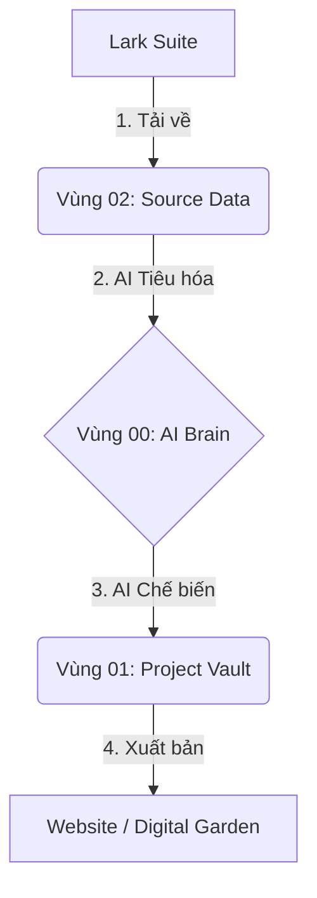

---
{"dg-publish":true,"permalink":"/01-project-vault-workspace/00-dashboard/readme-he-thong/","title":"🤖 HƯỚNG DẪN VẬN HÀNH \"CỖ MÁY\" ANTIGRAVITY","dg-note-properties":{"title":"🤖 HƯỚNG DẪN VẬN HÀNH \"CỖ MÁY\" ANTIGRAVITY"}}
---

# 🤖 HƯỚNG DẪN VẬN HÀNH HỆ THỐNG ANTIGRAVITY

Chào mừng sếp đã sở hữu hệ thống **AI Digital Garden** chuyên nghiệp. Tài liệu này giúp sếp hiểu cỗ máy đang "nhai" dữ liệu và "nhả" ra kết quả như thế nào.

---

## 🏗️ 1. CẤU TRÚC 3 VÙNG KIẾN THỨC (THE 3-ZONE MODEL)

Hệ thống được chia thành 3 zone để đảm bảo **Tốc độ - Bảo mật - Chuyên nghiệp**:

### 🧠 Vùng 00: `00_AI_BRAIN` (Bộ não - BẢO MẬT)
- **Nhiệm vụ:** Chứa "Đại từ điển SOP" và các quy tắc ngầm.
- **AI có đọc không?** **CÓ**. Đây là file đầu tiên AI đọc mỗi khi sếp mở chat để "ôn bài".
- **Có hiện lên Web không?** **KHÔNG**. Đây là vùng riêng tư tuyệt đối của sếp và AI.

### 📁 Vùng 01: `01_PROJECT_VAULT` (Thực thi - CÔNG KHAI)
- **Nhiệm vụ:** Chứa các SOP chuẩn, Checklist, Biểu mẫu và MoM (Biên bản họp).
- **AI có đọc không?** Có, khi sếp hỏi về một quy trình cụ thể nằm trong này.
- **Có hiện lên Web không?** **CÓ**. Đây là dữ liệu chuẩn để sếp gửi link cho nhân viên xem qua Digital Garden/Vercel.

### 📦 Vùng 02: `02_SOURCE_DATA` (Dữ liệu thô - LƯU TRỮ)
- **Nhiệm vụ:** Chứa file gốc từ Lark (.docx, .xlsx, .pdf, .png).
- **AI có đọc không?** Chỉ đọc khi sếp yêu cầu "Cập nhật kiến thức mới" để AI nén thông tin sang Vùng 00.
- **Có hiện lên Web không?** **KHÔNG**. Đây chỉ là kho chứa bằng chứng.

---

## 🔄 2. LUỒNG DỮ LIỆU (DATA FLOW)

---

## 🚀 3. CÁCH RA LỆNH CHO "CỖ MÁY"

Sếp hãy dùng các câu lệnh "quyền năng" này để điều khiển:

1.  **Cập nhật kiến thức:** *"Đọc file X trong Source Data và cập nhật vào Đại từ điển cho tôi."*
2.  **Tạo quy trình:** *"Dựa trên Đại từ điển, hãy viết SOP đóng gói hàng hóa vào Project Vault."*
3.  **Kiểm tra vận hành:** *"Báo cáo tiến độ các task trên Lark hiện nay."*
4.  **Tổ chức họp:** *"Ghi biên bản họp hôm nay và cập nhật vào Index."*

---

## ⚠️ LƯU Ý QUAN TRỌNG
- **Đừng xóa file trong `00_AI_BRAIN`**: Nếu sếp xóa, AI sẽ "mất trí nhớ" về các luật chơi của sếp.
- **Sửa Đại từ điển:** Sếp có thể tự tay sửa nội dung trong file `DAI_TU_DIEN_SOP_ETZ.md` nếu muốn AI thay đổi tư duy theo ý sếp.

---
> [!TIP]
> **Mẹo:** Luôn giữ file `index.md` ở root sạch sẽ. Nó chính là "Bảng điều khiển trung tâm" (Dashboard) của sếp.
